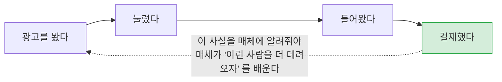
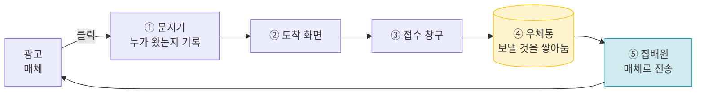
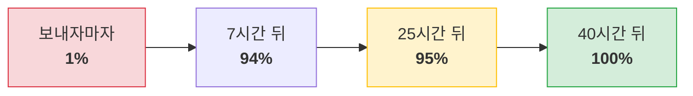
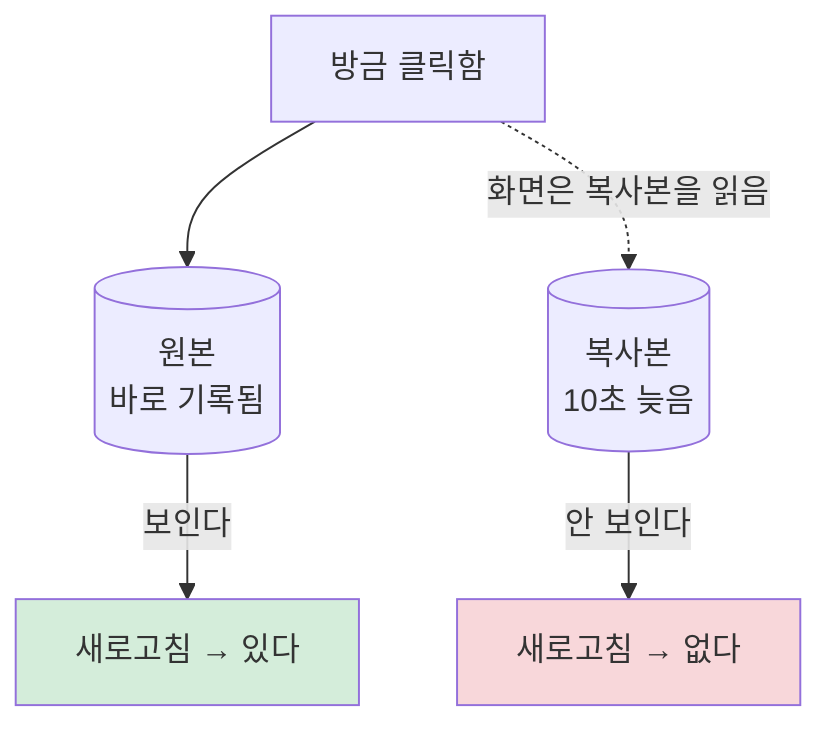
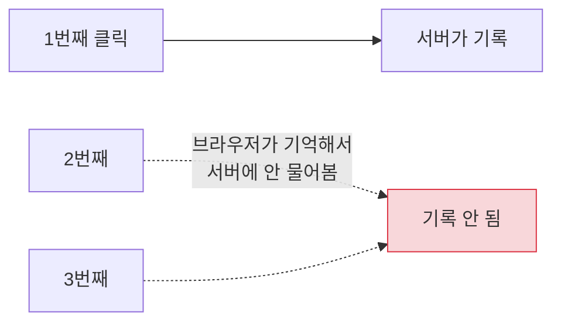
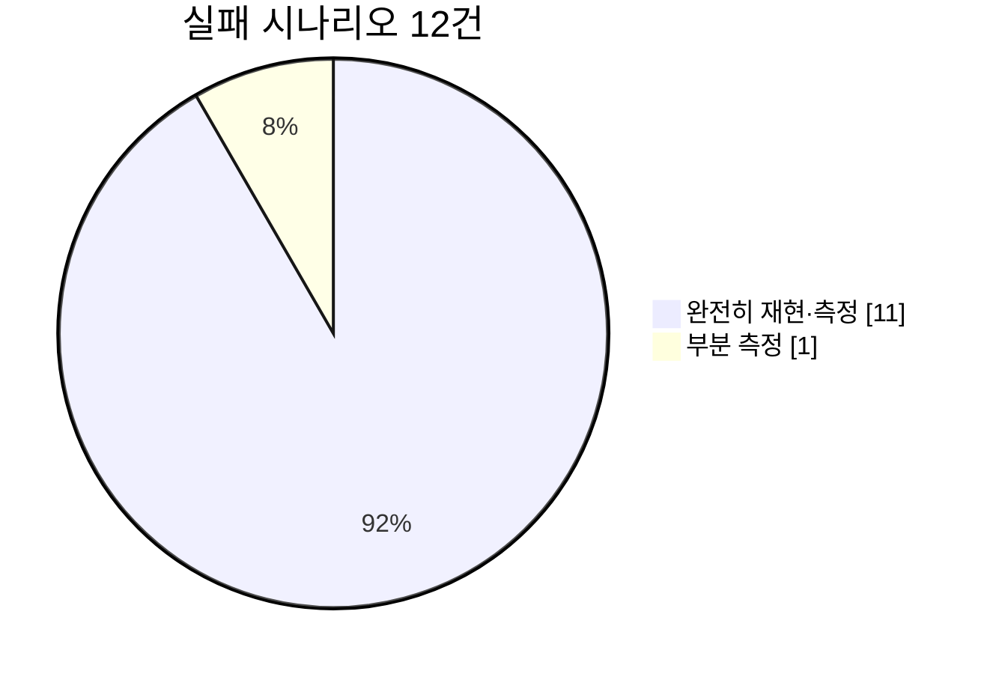

# touchpoint

**광고를 보고 들어온 사람이 결제까지 가는 길을 추적해서, 그 결과를 광고 매체에 되돌려 보내는 시스템입니다.**

지금 실제로 돌아가고 있습니다 → **[시연 안내](https://sshwan.com/tour)**(여기부터) · **[결제 해 보기](https://sshwan.com/tour#pay)** · [웹툰 홈](https://sshwan.com/) · [광고 랜딩](https://lp.sshwan.com/l/1) · [지표 화면](https://app.sshwan.com/metrics)

*2026-09-19 기준*

### 30초 안에 확인하기

1. [시연 안내의 결제 칸](https://sshwan.com/tour#pay)에서 **입장권 받고 결제 화면으로**
2. **카드 없이 끝까지** — 가짜 결제대행사가 "결제됐다" 알림을 **같은 것으로 두 번** 보냅니다. 돈은 움직이지 않고, 휴대폰에서도 됩니다
3. 결과 화면에서 장부를 그대로 봅니다 — 확정 한 번 · **두 번째 알림은 무시** · 코인 지급 · 매체(GA4·Meta) 전송 상태

실제 결제대행사(이니시스 테스트 상점)의 카드 결제창도 같은 화면에서 PC 로 열어 볼 수 있습니다. 카드를 넣지 않고 닫으면 "청구되지 않았음" 결과 화면으로 갑니다.

---

## 이게 왜 필요한가요

광고비를 쓰는 회사는 이걸 알아야 합니다.

**점선이 이 프로젝트입니다.** 결제가 일어났다는 걸 광고 매체(구글·메타)에 정확히 알려주는 일이고, 여기가 새면 **광고비를 어디에 썼는지 모르게 됩니다.**

---

## 어떻게 생겼나요

| | 무엇 | 왜 |
|---|---|---|
| ① | **문지기** | 광고에서 바로 들여보내면 **누가 왔는지 기록할 기회가 없습니다.** 한 번 거쳐 갑니다 |
| ② | 도착 화면 | 사용자가 실제로 보는 페이지 |
| ③ | 접수 창구 | "이 사람이 결제했다" 를 받는 곳 |
| ④ | **우체통** | 결제 기록과 "보내야 함" 메모를 **같은 순간에** 남깁니다 |
| ⑤ | 집배원 | 우체통을 비우며 매체로 보냅니다. 실패하면 **시간을 두고 다시** 시도합니다 |

> **④가 이 설계의 핵심입니다.** 결제를 기록하면서 "매체에 알려야 함" 메모를 같이 남깁니다. 그래서 *"결제는 됐는데 매체에 안 알려짐"* 이나 *"매체엔 알렸는데 결제는 취소됨"* 이 **구조적으로 불가능**합니다.

---

## 여기서 실제로 발견한 것들

교과서를 옮겨 적은 게 아니라 **돌려 보고 틀린 것을 기록했습니다.** 네 가지가 특히 예상과 달랐습니다.

### 1. "보냈다" 는 "전달됐다" 가 아니었습니다 — 그리고 "안 왔다" 도 "사라졌다" 가 아니었습니다

구글에 543건을 보냈고 **543건 모두 "받았다" 는 응답**을 받았습니다. 그런데 구글 쪽에서 되읽어 보니 시간에 따라 이렇게 달랐습니다.

**결국 전부 들어왔습니다.** 구글이 집계하는 데 **최대 40시간**이 걸리는 것이었습니다.

> **이 과정에서 두 번 틀렸습니다.** 보내자마자 1%를 보고 *"매체가 99%를 버린다"* 고 할 뻔했고, 25시간 뒤 들어오는 속도가 거의 멈춘 걸 보고 *"4.8%는 영구히 사라졌다"* 고 **문서에 적기까지 했습니다.** 둘 다 **너무 일찍 판정한 것**이었습니다. 느려진 것은 멈춘 것이 아니었습니다.
>
> 그래서 남은 교훈은 *"5%가 사라진다"* 가 아니라 **"'받았다' 는 응답과 실제 집계 사이에는 시간이 있고, 그 시간을 다 기다려야 결론을 낼 수 있다"** 입니다.

### 2. 같은 주소가 같은 순간에 다른 답을 줬습니다

데이터베이스를 원본과 복사본 둘로 나눠 쓰는데, 복사본이 늦으면 이렇게 됩니다.

사용자에게는 **"방금 한 게 사라졌다"** 로 보이고, 새로고침하면 다시 나타납니다. **재현이 안 되는 버그의 전형적인 모양**입니다.

### 3. 한 번 잘못 보낸 주소는 되돌릴 수 없었습니다

주소를 옮길 때 "영구 이전" 이라고 알리면 브라우저가 **그걸 기억해 버립니다.**

3번 눌렀는데 **서버는 1번만 받았습니다.** 광고 클릭 수가 그만큼 사라집니다.

**더 나쁜 건 그 다음입니다.** 서버를 고친 뒤 같은 주소를 2번 더 눌렀는데 **한 번도 서버에 오지 않았습니다.** 보통의 사고는 고치면 멈추는데, **이미 기억한 브라우저는 돌아오지 않습니다.**

### 4. 일꾼을 늘렸더니 느려진 곳이 생겼습니다

전송 일꾼을 1명에서 4명으로 늘렸습니다.

| | 전체 처리 속도 | 느린 쪽 5% 요청 |
|---|---|---|
| 1명 | 초당 21건 | 43밀리초 |
| 4명 | 초당 **37건** (1.7배 빨라짐) | **83밀리초** (2배 느려짐) |

**전체는 빨라졌는데 느린 요청은 더 느려졌습니다.** 평균만 보면 안 보이는 현상입니다.

---

## 무엇을 얼마나 확인했나

- 전부 **실제 운영 중인 서버**에서 쟀습니다. 로컬이나 가짜 데이터가 아닙니다
- 못 한 것은 **못 했다고 적혀 있습니다** (`sendBeacon` 성공 여부는 클라이언트가 알 수 없어 B-3 은 부분 측정)
- **틀린 예상을 지우지 않고 그대로 남겼습니다** — 그게 이 저장소에서 제일 볼 만한 부분입니다

---

## 더 보기

| 궁금한 것 | 어디로 |
|---|---|
| **틀린 예상 4가지**를 자세히 | [실패 시나리오](docs/failure-scenarios.md) |
| **실제 결제대행사를 붙이며** 깨진 설계와 숨은 리스크 — 웹훅이 없는 PG, 브라우저가 실어 오는 승인 주소, 원문과 다른 매뉴얼 예시 | [멀티 PG 계획](docs/plan-multi-pg.md) |
| **숫자와 측정 방법** | [계측 기록](docs/benchmarks.md) |
| **왜 이렇게 만들었나** — 결정 19건, 그중 3건은 뒤집음 | [설계 결정](docs/decisions/) |
| **데이터 구조를 어떻게 정했나** — 공개 자료 조사로 역추론 | [조사 요약](docs/research-method.md) |
| **직접 돌려 보려면** | [구축 절차](docs/setup.md) |
| 매일 무엇에 막혔나 | [작업 기록](docs/worklog.md) |
| **말이 헷갈릴 때** — 접점 · 귀속 · 도달률 · 반영률이 각각 무엇인지 | [용어](docs/glossary.md) |
| 시스템 구조를 더 깊이 | [아키텍처](docs/architecture.md) · [API 규격](docs/api-spec.md) · [데이터 모델](docs/data-model.md) |

**만든 것**: PHP 8.2 · CodeIgniter 3 · MySQL 8.0(원본+복사본) · OpenResty(Nginx+Lua) · Docker · AWS EC2

최신 스택이 아니라 **지원하는 회사가 쓰는 스택**을 일부러 골랐습니다 → [ADR-014](docs/decisions/ADR-014-stack-alignment.md)

---

## 아직 없는 것

거짓말하지 않기 위해 적습니다.

| | |
|---|---|
| 실제 PG 연동 | **이니시스 테스트 상점(카드) 하나**입니다. [시연 안내](https://sshwan.com/tour#pay)의 버튼으로 누구나 해 볼 수 있고, 카드 승인은 실제로 일어나고 자정 전에 자동 취소됩니다. 운영에서 확인한 것은 결제창이 우리 서명을 받아 열리는 것, 닫으면 "청구되지 않음" 결과로 가는 것, 위조된 승인 주소를 거절하는 것, 환불 API 인증까지입니다. **실카드 승인 · 망취소 · 환불 성공 경로는 운영에서 확인하지 않았습니다**(단위 테스트로만). **카드 결제창은 PC 에서만** 열립니다 — 이니시스 모바일은 별도 규격이라 붙이지 않았고, 모바일에서는 안내와 "카드 없이 끝까지" 만 보입니다. 페이팔은 **보류**했습니다(숨은 리스크와 설계만) → [계획](docs/plan-multi-pg.md) |
| 시연 결제의 매체 전송 | **구분 없이 보냅니다.** "카드 없이 끝까지" 한 번마다 운영 GA4·Meta 에 3,300원 구매 전환이 쌓입니다 — 파이프라인이 끝까지 돈다는 것을 그대로 보이려고 받아들인 대가입니다 → [계획 6장](docs/plan-multi-pg.md) |
| 메타 채널 | **보내고 있습니다.** 결제·전환 때 브라우저 정보를 3개월만 따로 보관해 메타에 보냅니다. 광고 픽셀도 켰고, [개인정보처리방침](https://sshwan.com/privacy)에서 언제든 거부할 수 있습니다 |
| 결제 알림 | **없습니다.** |
| 환불을 **요청하는 화면** | 없습니다. 환불 자체는 **웹훅으로 처리합니다** — 코인 회수, `refund` 전환 적재, 매체 전송까지 한 트랜잭션. 캡처보다 먼저 온 환불은 `409` 로 되돌려 PG 가 다시 보내게 합니다. 이니시스 환불은 CLI(`cli/pg refund`)입니다 — 인증이 없는 웹 환불 버튼은 누구나 누를 수 있는 버튼이 됩니다 |
| 가입 화면 | 없습니다. 가입은 시드로 만들고 `signup` 전환만 기록합니다 |
| 웹툰 뷰어 · 검색 | 없습니다. 홈은 **측정할 대상**으로 만든 서비스 모형이고, 그 스키마가 무엇을 담고 있는지는 [시연 안내](https://sshwan.com/tour)에 적었습니다 |
| 지표 화면 로그인 | 없습니다. 대신 개인정보는 화면에 내지 않습니다 |
