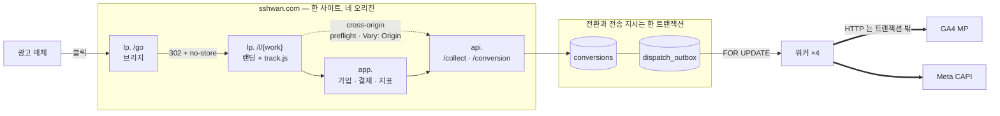

# touchpoint

[](https://github.com/http1220/touchpoint/actions/workflows/ci.yml)

**광고 유입부터 결제 전환까지를 추적해 매체로 되돌려 보내는 파이프라인.**

> 이건 웹툰 서비스가 아닙니다. 어트리뷰션 파이프라인이고, 도메인(회원·코인·회차)은 **전환을 측정할 대상이 필요해서** 최소한만 두었습니다. 그 도메인은 상상해서 만든 것이 아니라 **공개 자료를 조사해 역추론**했습니다 → [조사 요약](docs/research-method.md)

- **상태**: **파이프라인 관통** — 광고 클릭 → 방문·접점 적재 → 수집(CORS) → 전환 → 아웃박스 → 워커 → **GA4 도달 확인** (2026-09-12) · GA4 운영 엔드포인트로 **500건 실전송 · 500/500** (2026-09-13)
- **실측**: 실패 시나리오 **12건 중 10건**, 계측 **7장 중 5장**. 전부 운영 중인 t3.small 에서 잰 값입니다
- **읽을 것이 하나라면**: [예상이 틀린 곳 셋](#5-실패-시나리오와-대응) — 301이 위험한 진짜 이유, `SKIP LOCKED` 가 처리량을 안 벌어 준 이유, 오픈 리다이렉트의 과녁이 `Host` 였던 이유
- **스택**: PHP 8.2 · **CodeIgniter 3** · MySQL 8.0(프라이머리+복제본) · **OpenResty(Nginx+Lua)** · Docker · AWS EC2 t3.small
- **왜 이 스택인가**: 대상 조직이 쓰는 것에 맞췄습니다 → [ADR-014](docs/decisions/ADR-014-stack-alignment.md)
- **로드맵**: [docs/roadmap.md](docs/roadmap.md) — 의도 → 기획 → 계획 3층 구조

---

## 1. 아키텍처



**① 사이트는 하나, 오리진은 넷입니다.** CORS는 오리진 기준이라 그대로 걸리고(점선), 쿠키 차단은 사이트(eTLD+1) 기준이라 걸리지 않습니다. 그 경계를 구분하는 것이 이 배치의 산출물입니다 → [ADR-018](docs/decisions/ADR-018-single-registered-domain.md)

**② 전환을 기록하는 트랜잭션 안에서 전송 지시도 같이 적재합니다.** 커밋이 곧 "보내기로 확정됨"이고, 롤백되면 둘 다 사라집니다 — *전환은 없는데 전송은 나갔다* 가 구조적으로 불가능해집니다 → [ADR-003](docs/decisions/ADR-003-mysql-outbox.md)

**③ 외부 HTTP(굵은 선)는 트랜잭션 밖입니다.** 매체가 느린 만큼 잠금이 길어지면 워커를 넷으로 늘린 의미가 사라집니다. 이 선택 때문에 잠금 대기가 마이크로초로 끝나고, 그래서 `SKIP LOCKED` 가 처리량을 벌어 주지 **않습니다** → [D-1](docs/failure-scenarios.md)

상세 → [docs/architecture.md](docs/architecture.md)

---

## 2. 실행 방법

```bash
cp .env.example .env      # SHOP_DOMAIN · DB·복제 비밀번호 (TRACK_DOMAIN 은 비워 둡니다)
docker compose up -d      # openresty · app · mysql-primary · mysql-replica
docker compose exec app php public/index.php cli/migrate latest
```

기본 기동은 컨테이너 4개입니다. 워커는 아웃박스에 적재가 생긴 뒤부터 필요하므로 프로파일로 분리해 두었습니다.

```bash
docker compose --profile worker up -d --scale worker=4   # SKIP LOCKED 동시성 검증
```

마이그레이션은 CLI 로만 돕니다. 스키마를 바꾸는 경로를 브라우저 요청으로 열어두지 않습니다.

```bash
docker compose exec app php public/index.php cli/migrate current
docker compose exec app php public/index.php cli/migrate to 20260909000600   # 인덱스 없는 상태로
```

동작 확인:

```bash
curl -s https://app.<SHOP_DOMAIN>/readyz     # 쓰기·읽기 커넥션과 배정된 복제본
open https://lp.<SHOP_DOMAIN>/diag           # 호스트 라우팅·TLS·쿠키 속성
```

**도메인·EC2·TLS 구축 절차 → [docs/setup.md](docs/setup.md)**

> ⚠️ **로컬에서는 실험 조건이 달라집니다.** 인증서가 없어 `Secure` 쿠키와 HTTP/2 조건이 성립하지 않습니다. 실제 호스트에서 확인합니다.
>
> ⚠️ **ACME는 반드시 스테이징으로 먼저 검증하세요.** Let's Encrypt 프로덕션은 도메인당 주 5회 제한이라, 설정 시행착오로 소모하면 일주일을 기다려야 합니다.

---

## 3. 데이터 흐름

| # | 단계 | 기술적 쟁점 |
|---|---|---|
| 1 | `lp./go` 브리지 | **302** 리다이렉트 — 301 은 롤백이 안 됩니다([C-1](docs/failure-scenarios.md)). 파라미터 전달 2방식은 **둘 다 틀리고 방향이 다릅니다**([C-2](docs/failure-scenarios.md)) |
| 2 | `visits` + `touchpoints(first)` | 쿠키에는 `visit_uid`만. 본체는 서버 |
| 3 | `api./collect` | **cross-origin** — preflight, `Allow-Credentials`, `Vary: Origin` |
| 4 | `app./signup` | 유입 경로를 `users`에 **스냅샷** (원본은 3개월 후 파기) |
| 5 | `app./purchase` | `captured`에서만 전환 발화. 코인은 **원장(lot)** 에 적립 |
| 6 | 워커 | 선점+상태변경 한 트랜잭션, HTTP 는 트랜잭션 밖. 지수 백오프+지터, 구간별 계측, 좀비 회수 |
| 7 | 채널 어댑터 | GA4 / Meta. **신규 매체 = 클래스 1개 + 설정 1줄** |

상세 → [docs/api-spec.md](docs/api-spec.md) · [docs/data-model.md](docs/data-model.md)

6·7번 구현 방법 → [docs/outbox-and-channels.md](docs/outbox-and-channels.md)

---

## 4. 계측 결과

전부 운영 중인 t3.small 에서 잰 값입니다 → [docs/benchmarks.md](docs/benchmarks.md)

| 측정 | 결과 | 읽을 것 |
|---|---|---|
| **워커 동시성** | 워커 4개 · 2000건 · **중복 전송 0** | `SKIP LOCKED` 를 **꺼도** 중복 0이고 처리량도 안 떨어졌습니다 |
| **구간별 시간** | Noop: total 4.9 / db 4.8 · **GA4: total 51.3 / db 6.4 / send 44.9** | 실제 채널을 붙이자 **네트워크가 87%** — 비용의 주인이 바뀝니다 |
| **인덱스** | 분포에 따라 `ix_poll` ↔ PRIMARY | "인덱스 걸었더니 빨라졌다" 를 쓸 수 없었습니다 (아래 6장) |
| **리소스** | MySQL 2대가 메모리 90% · CPU 84% | 부하 중 **swap 증가 0MB**, load average 2.29 / vCPU 2 |
| **복제본 CPU** | 프라이머리 42.2% vs 복제본 **42.1%** | 읽기를 거의 안 받는데도 같은 CPU — **읽기 분산은 공짜가 아닙니다** |
| **GA4 지연 분포** | 워커 1개 p95 **43ms** → 워커 4개 p95 **83ms** | 동시성을 올리면 처리량 1.7배, **꼬리 지연 2배** |
| **지터** | 같은 배치 두 건이 33.894s · 35.908s | 회복한 매체를 다시 넘어뜨리지 않게 흩뿌립니다 |

### 지표는 아직 지표가 아닙니다

| 지표 | 목표 | 실측 | |
|---|---|---|---|
| 워커 중복 전송 | 0 | **0** (9303 시도) | ✅ |
| 중복 전환 차단 | 유실 0 | **막힘** (`dedup_key` UNIQUE) | ✅ |
| 어트리뷰션 보존율 | ≥ 95% | 20 / 20 | ◐ 표본 20 |
| 매체 전송 성공률 | ≥ 99% | GA4 **500 / 500** | ◐ 도달했을 뿐 |

> **매체 전송 성공률 — 표본은 채웠습니다. 남은 문제는 "성공"의 뜻입니다.** 처음엔 실제 매체로 나간 게 3건뿐이라(나머지는 항상 204를 주는 `NoopChannel`) 비율을 낼 수 없었습니다. 그래서 GA4 운영 엔드포인트로 **500건을 실제로 보냈고 500/500, `429`도 없었습니다.** 그런데도 ✅ 를 못 붙입니다 — **운영 엔드포인트는 페이로드가 틀려도 204를 주기 때문입니다.** 이 지표가 재는 건 *도달*이지 *집계 반영*이 아닙니다. 뒤를 재려면 GA4 Data API 로 되읽어 대조해야 하고, 거기까진 안 했습니다.
>
> **어트리뷰션 보존율은 정의가 틀려 있었습니다.** 처음 정의(*접점이 남은 방문 ÷ 전체 방문*)로 재면 529/530 = 99.8%가 나오는데, 직접 유입도 `last` 접점을 하나 받기 때문에 뭘 재든 100%에 붙습니다. *광고 유입 방문 중 보존된 비율* 로 고쳐 20/20 입니다. **목표치를 처음부터 넘고 있는 지표는 대개 분모를 잘못 고른 것입니다.**

---

## 5. 실패 시나리오와 대응

> **범위 안 12건 중 10건 실측** → [docs/failure-scenarios.md](docs/failure-scenarios.md)

| 시나리오 | 무엇이 깨지는가 | 어떻게 막았는가 |
|---|---|---|
| `Allow-Origin: *` + credentials | 브라우저는 차단, **서버는 기록** → 재시도 시 전환 중복 | 오리진 정확 반향 + `Vary: Origin`, 테스트 16건 |
| `sendBeacon` 의 헤더 제약 | 헤더 불가 + **성공 확인 불가**. 대신 CORS 오설정에도 통과 | 두 경로 모두 구현, `transport` 로 구분 적재 |
| **캐시 헤더 없는 301** | 3회 클릭 → 서버 도달 **1회**. 게다가 **302로 고쳐도 이미 캐시한 브라우저는 안 돌아옵니다**(같은 URL 2회 → 0회) | 302 고정 + `no-store`. 301은 `.env` 스위치로만 재현 |
| **랜딩 URL 공유** | passthru 는 클릭 1회가 **유입 2건**으로. vid 는 건수는 맞지만 **두 사람이 한 방문**이 됨 | 기본값 vid. 둘 다 틀리되 **건수 쪽이 정산에 걸립니다** |
| **오픈 리다이렉트** | 위험한 입력은 `?return=`(없음)이 아니라 **`Host` 헤더**. 막혀 있었지만 **서버 블록 순서에 기댄 우연**이었습니다 | 목적지를 입력으로 받지 않음. 엣지 443에 `default_server` 명시 |
| **워커 중복 실행** | 같은 건이 두 번 전송되면 전환이 부풀려짐 | 선점과 상태 변경을 한 트랜잭션에. **네 조건 모두 중복 0** |
| **매체 장애** | 5xx·타임아웃은 사다리 끝(attempt 6)에서 `dead`, **4xx 는 attempt 1 에서 즉시 `dead`** | `shouldRetry` 가 4xx/5xx/무응답을 가름. 실패 주입 스위치로 재현 |
| **복제 지연** | **같은 URL 이 같은 순간에 다른 답**을 줍니다 — 쓴 직후 `rdb1` 1개 / `rdb2` 0개 | 쓴 직후 읽기는 프라이머리. 배정 쿠키 고정은 **완화지 해결이 아닙니다** |
| **보존기간 파기** | 방문·접점은 사라지고 **회원 스냅샷은 남습니다**. 조인은 `NULL`, `signup_pid` 는 그대로 | 스냅샷 비정규화 + `signup_visit_id` 에 **FK 없음** — FK 세 옵션 다 틀린 자리 |

**범위에서 뺀 것**: 서드파티 쿠키 차단과 `SameSite=None` 누락. 등록 도메인이 하나라 브라우저가 그 경로를 차단할 조건 자체가 만들어지지 않습니다. 설계와 이유는 [failure-scenarios A장](docs/failure-scenarios.md)에 남겨 뒀습니다 — **못 한 것과 모르는 것은 다릅니다.**

### 예상이 틀린 곳 셋 — 이 저장소에서 제일 볼 만한 부분

| 예상 | 실제 |
|---|---|
| "301이 위험하다" | **301 자체는 아니었습니다.** `no-store` 붙인 301은 매번 서버에 옵니다. 위험한 건 *영구 캐시를 허용하는* 301이고, 그건 **롤백이 안 됩니다** |
| "`SKIP LOCKED` 를 끄면 처리량이 급감한다" | **안 떨어졌고 오히려 조금 빨랐습니다.** 잠금 구간에 외부 I/O 가 없어 대기가 마이크로초라서입니다. `SKIP LOCKED` 는 처리량 장치가 아니라 보험입니다 |
| "`?return=` 오픈 리다이렉트를 막자" | **그런 파라미터가 없었습니다.** 과녁은 `Host` 헤더였습니다 |

---

## 6. 인덱스 최적화 — "빨라졌다"를 쓸 수 없었던 이야기

```sql
SELECT id FROM dispatch_outbox
 WHERE status = 'pending' AND next_retry_at <= NOW(3)
 ORDER BY id LIMIT 100
 FOR UPDATE SKIP LOCKED;
```

**복합 인덱스 `(status, next_retry_at, id)`** — 등호 → 범위 → 정렬 순서. 범위 조건 뒤의 컬럼은 인덱스로 정렬에 쓸 수 없으므로 `id` 가 마지막입니다.

`EXPLAIN` 을 두 가지 분포에서 찍었더니 답이 갈렸습니다.

| 분포 | 옵티마이저 선택 | `rows` | `Extra` |
|---|---|---|---|
| pending 2000 / sent 0 (**큐가 밀린 상태**) | **PRIMARY** | 100 | `Using where` |
| pending 20 / sent 2000 (**정상 운영**) | **`ix_poll`** | 20 | `Using index` (커버링) |

밀렸을 때는 거의 모든 행이 조건을 만족하므로 **PK 를 순서대로 걸어가다 100건에서 멈추는 것**이 가장 쌉니다. 보조 인덱스를 타면 1924건을 훑고 filesort 까지 해야 합니다.

> **그래서 "인덱스를 걸었더니 빨라졌다" 는 문장을 쓸 수 없었습니다.** `ix_poll` 이 값을 하는 건 워커가 큐를 따라잡고 있을 때고, 밀려 있을 때 옵티마이저가 인덱스를 버리는 건 **틀린 게 아니라 맞는 판단**입니다.

그리고 좀비 회수용으로 `ix_zombie (status, claimed_at)` 를 추가한 직후 **폴링 쿼리의 계획이 흔들렸습니다.** 둘 다 `status` 로 시작해서 옵티마이저가 더 좁은 쪽을 골랐는데, 그쪽은 `next_retry_at` 을 걸러 주지 못해 2002건을 훑습니다.

> **인덱스를 추가하는 일은 기존 쿼리의 계획을 바꾸는 일입니다.** 추가할 때 그 인덱스를 쓸 쿼리만 보면 안 되고, **같은 선두 컬럼을 가진 기존 인덱스가 있는지** 봐야 합니다.

상세 → [docs/benchmarks.md 1장](docs/benchmarks.md)

---

## 7. 기술 선택과 근거 — 채택하지 않은 것 포함

**18개 결정을 ADR로 기록했습니다** → [docs/decisions/](docs/decisions/)

| # | 결정 | 왜 |
|---|---|---|
| [018](docs/decisions/ADR-018-single-registered-domain.md) | **등록 도메인 1개** | 002 철회. 잃는 것은 쿠키 차단 실험 둘뿐 — CORS는 오리진 기준이라 그대로 걸림 |
| [003](docs/decisions/ADR-003-mysql-outbox.md) | Redis·SQS **안 씀** | 전환과 전송 지시를 한 트랜잭션에. 브로커는 정합성 구멍 |
| [004](docs/decisions/ADR-004-skip-locked.md) | `SKIP LOCKED` | 중복 전송을 사후 차단이 아니라 DB가 **예방** |
| [005](docs/decisions/ADR-005-channel-adapter.md) | 채널 어댑터 | 대상 서비스에 매체가 **10종 이상** 붙어 있음 (실측) |
| [006](docs/decisions/ADR-006-coin-ledger.md) | 코인 **원장** | 약관의 유료 5년 / 무료 1년은 잔액 컬럼으로 구현 불가 |
| [009](docs/decisions/ADR-009-no-spa.md) | React **안 씀** | 백엔드 포지션 + 추적 스니펫은 프레임워크가 없어야 배포됨 |
| [014](docs/decisions/ADR-014-stack-alignment.md) | **스택 정렬** | 최신 스택보다 **대상 조직과 같은 스택**에서 부딪히는 편이 값어치가 큼 |
| [016](docs/decisions/ADR-016-payment-and-notification.md) | PG **2개** + 알림 | 어댑터의 값어치는 구현체가 2개 이상일 때만 증명됨 |
| [017](docs/decisions/ADR-017-ci3-application-structure.md) | CI3 + **PSR-4 병용** | 컨트롤러는 관용구대로, 도메인 로직은 프레임워크 밖으로 빼서 테스트 가능하게 |
| [010](docs/decisions/ADR-010-no-kubernetes.md) | K8s **안 씀** | 컨테이너 4개 |

### 리서치가 뒤집은 것 3개

| | 처음 생각 | 조사 후 |
|---|---|---|
| 도메인 | 서브도메인 3개면 충분 | **사이트와 오리진은 다른 축.** CORS는 걸리고 쿠키 차단은 안 걸림 |
| 워커 중복 | `dedup_key`로 사후 차단 | **전송 중복은 `dedup_key` 로 못 막음** — 잠금이 필요 |
| 서드파티 쿠키 | "곧 사라진다" | **Chrome이 2025년에 폐지 철회.** 문제는 *브라우저 편차* |

### 그리고 실측이 그 조사를 다시 뒤집었습니다

| | 조사 후 | 재 보고 나서 |
|---|---|---|
| 도메인 | 등록 도메인 2개가 필요하다 ([ADR-002](docs/decisions/ADR-002-two-registered-domains.md)) | **1개로 되돌림.** 잃는 건 4개가 아니라 2개였습니다 ([ADR-018](docs/decisions/ADR-018-single-registered-domain.md)) |
| 워커 중복 | `SKIP LOCKED` 가 답이다 | **중복을 막는 건 잠금과 "한 트랜잭션" 규칙**입니다. `SKIP LOCKED` 는 기다릴지 건너뛸지만 정합니다 ([D-1](docs/failure-scenarios.md)) |

> **첫 번째 오해는 조사로 잡혔고, 두 번째 오해는 재 봐야 잡혔습니다.** 그 차이가 이 저장소에 계측 문서가 따로 있는 이유입니다.

---

## 8. 한계와 다음 단계

### 의도적으로 포기한 것

AWS Well-Architected 6기둥 기준입니다.

| 기둥 | 이 프로젝트 |
|---|---|
| 운영 우수성 | GitHub Actions CI + 구조화 로깅 |
| 보안 | TLS, 최소권한, 시크릿 분리 |
| **신뢰성** | **단일 인스턴스·단일 AZ — 의도적 포기** |
| 성능 효율 | 인덱스 실습으로 증명 |
| 비용 최적화 | t3.small. MySQL 2대가 t3.micro(1GB)에 올라가지 않습니다 |

### 흉내가 아닌 것 · 흉내인 것

정렬 원칙([ADR-014](docs/decisions/ADR-014-stack-alignment.md))을 세운 뒤 "일정이 빠듯하니 흉내로 대체하자"고 했던 결정 두 개를 되돌렸습니다.

| 항목 | 실제 |
|---|---|
| **읽기 복제본** | **실물.** MySQL 프라이머리 + 복제본을 GTID로 띄우고, Lua가 요청마다 읽기 대상을 배정합니다. 지연은 `SOURCE_DELAY`로 키웁니다 → [ADR-007](docs/decisions/ADR-007-read-write-split.md) |
| **PG 결제** | **테스트 모듈 2개.** 어댑터의 값어치는 구현체가 2개 이상일 때만 증명됩니다. 결제 완료 알림까지 붙입니다 → [ADR-016](docs/decisions/ADR-016-payment-and-notification.md) |
| 콘텐츠 도메인 | 전환 측정에 필요한 최소 필드만. 뷰어·랭킹·검색 없음 |
| 광고 매체 | GA4·Meta는 실제 전송(테스트 이벤트 코드). 매체 3번째는 어댑터 주장 검증용 |

### 다음 단계

측정이 안 끝난 것부터입니다. 순서는 **아직 모르는 것이 큰 순**입니다.

| | 무엇 | 왜 아직인가 |
|---|---|---|
| A-3 | same-site · cross-origin 대조 | 범위 안에 남은 실패 시나리오 둘 중 하나 |
| D-3 | 중복 전환 | `dedup_key` 는 확인했지만 동시 요청 두 개로는 안 쳐 봤습니다 |
| 지표 | **GA4 Data API 로 되읽기** | 500건 보내 500건 `204` 를 받았지만, `204` 는 "받았다"지 "집계했다"가 아닙니다. 되읽어 대조해야 **도달률**이 **반영률**이 됩니다 |
| 운영 | 파기 배치 **스케줄러** | `cli/purge` 는 만들었지만 손으로 돕니다. 무인 삭제 전에 `plan` 을 며칠 지켜볼 생각입니다 |
| — | 커스텀 수집 `/impression` · `/click` | 광고 태그 없이 자체 계측 |
| — | Meta CAPI `event_id` 중복 제거 | 픽셀과 서버 전송이 겹칠 때 |
| — | 채널 3번째 추가 | "변경 파일 2개" 주장([ADR-005](docs/decisions/ADR-005-channel-adapter.md))의 검증 |

---

## 9. 설계 근거는 어디서 나왔나

스키마와 아키텍처는 상상해서 만든 게 아니라 **비로그인 공개 자료를 조사해 역추론**했습니다.

**→ [docs/research-method.md](docs/research-method.md)** — 조사 방법과 결론

거기서 다루는 것:

| | |
|---|---|
| **조사가 바꾼 설계 결정 9개** | 사이트(eTLD+1)와 오리진의 구분, "서드파티 쿠키가 사라진다" 전제 붕괴, 매체 10종 이상 → 채널 어댑터, 약관의 재화 만료 규칙 → 원장, 보존기간 20배 차이 → 테이블 분리, 읽기 복제본 운영 흔적 → 복제 지연 재현 … |
| **대조군에서 얻은 스키마 판단** | 다대다 작가·role, 연재요일 배열, 연령등급 enum, 전역 ID + 순번, 표시용 문자열 날짜의 반면교사, 개인화 필드와 캐시 |
| **반박된 전제** | "웹툰이면 조회수·별점이 기본" — **두 플랫폼 모두 조회수 비공개** |
| **표준은 기억이 아니라 확인으로** | 서드파티 쿠키 현황, PCI DSS v4.0.1, IAB TCF v2.3, CHIPS |
| **버린 것 24개 / 남긴 것 9개** | 범위 축소의 기준 |

> **조사 범위**: 공개 페이지·공개 응답 헤더·공개 약관·공개 API만. 로그인·결제·자동 수집·CAPTCHA 우회는 하지 않았습니다.
> **익명 처리**: 조사 대상은 실제 운영 서비스라 `플랫폼 A·B·C`로 표기하고, 추적 식별자·서버 주소 같은 특정 값은 싣지 않았습니다. 원본 조사 기록은 비공개로 두고 요약만 공개합니다.
