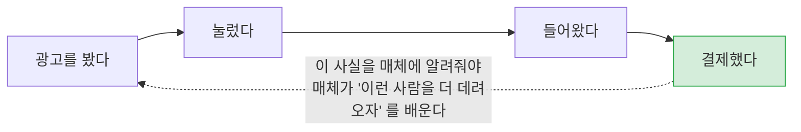
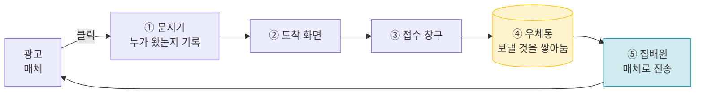
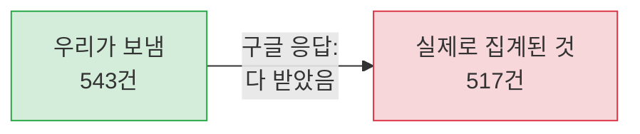
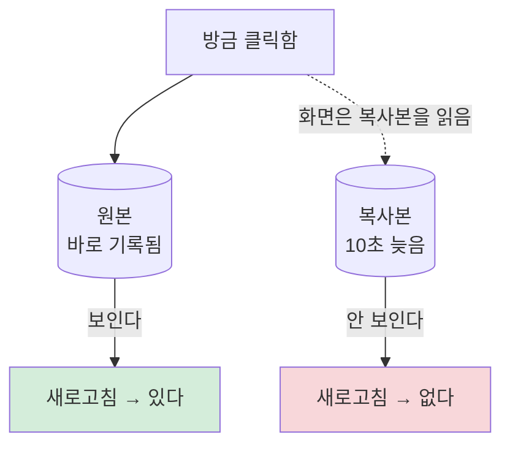
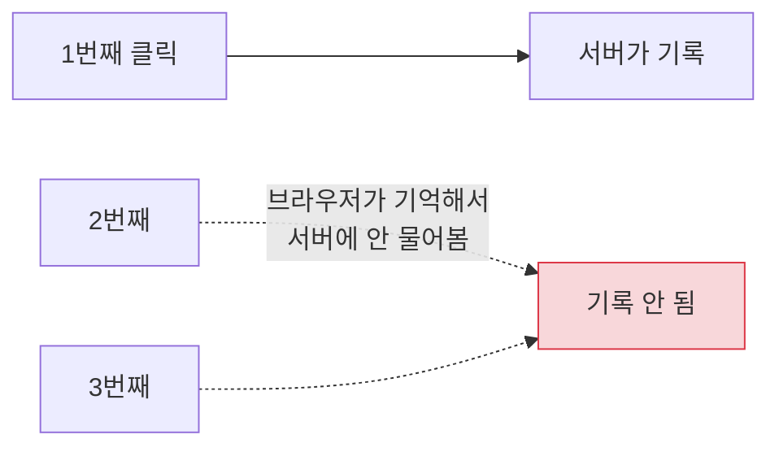
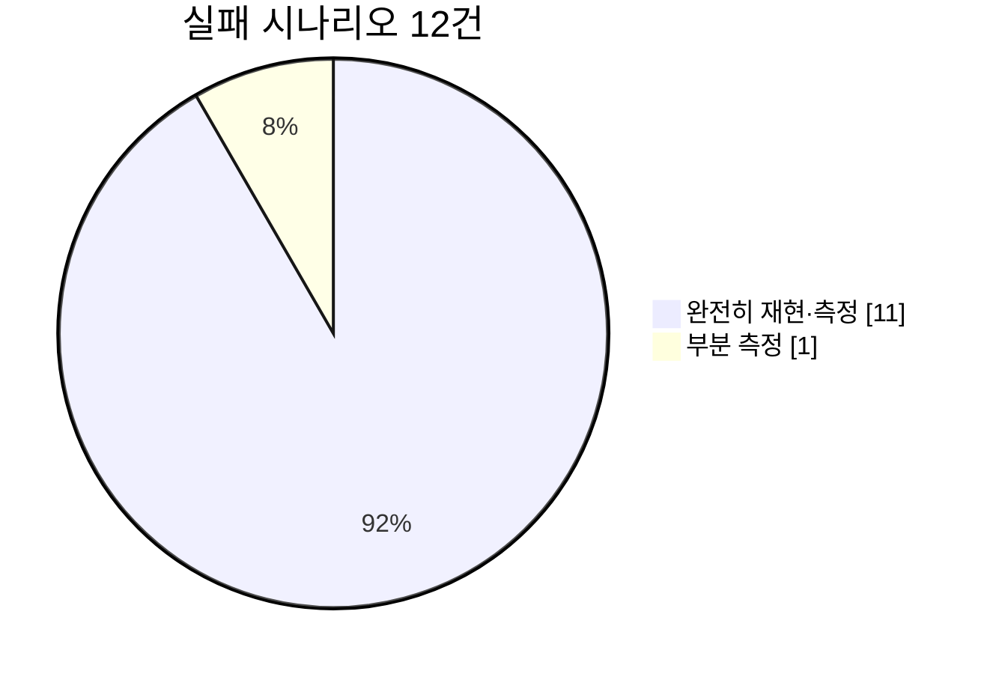

# touchpoint

**광고를 보고 들어온 사람이 결제까지 가는 길을 추적해서, 그 결과를 광고 매체에 되돌려 보내는 시스템입니다.**

지금 실제로 돌아가고 있습니다 → **[웹툰 홈](https://sshwan.com/)** · **[광고 랜딩](https://lp.sshwan.com/l/8733)** · **[지표 화면](https://app.sshwan.com/metrics)**

*2026-09-14 기준*

---

## 이게 왜 필요한가요

광고비를 쓰는 회사는 이걸 알아야 합니다.

**점선이 이 프로젝트입니다.** 결제가 일어났다는 걸 광고 매체(구글·메타)에 정확히 알려주는 일이고, 여기가 새면 **광고비를 어디에 썼는지 모르게 됩니다.**

---

## 어떻게 생겼나요

| | 무엇 | 왜 |
|---|---|---|
| ① | **문지기** | 광고에서 바로 들여보내면 **누가 왔는지 기록할 기회가 없습니다.** 한 번 거쳐 갑니다 |
| ② | 도착 화면 | 사용자가 실제로 보는 페이지 |
| ③ | 접수 창구 | "이 사람이 결제했다" 를 받는 곳 |
| ④ | **우체통** | 결제 기록과 "보내야 함" 메모를 **같은 순간에** 남깁니다 |
| ⑤ | 집배원 | 우체통을 비우며 매체로 보냅니다. 실패하면 **시간을 두고 다시** 시도합니다 |

> **④가 이 설계의 핵심입니다.** 결제를 기록하면서 "매체에 알려야 함" 메모를 같이 남깁니다. 그래서 *"결제는 됐는데 매체에 안 알려짐"* 이나 *"매체엔 알렸는데 결제는 취소됨"* 이 **구조적으로 불가능**합니다.

---

## 여기서 실제로 발견한 것들

교과서를 옮겨 적은 게 아니라 **돌려 보고 틀린 것을 기록했습니다.** 네 가지가 특히 예상과 달랐습니다.

### 1. "보냈다" 는 "전달됐다" 가 아니었습니다

구글에 543건을 보냈고 **543건 모두 "받았다" 는 응답**을 받았습니다. 성공률 100%입니다. 그런데 하루 뒤 구글 쪽에서 되읽어 보니—

**26건이 사라졌습니다(4.8%).** "받았다" 는 응답만 믿었으면 영영 몰랐을 일입니다.

> 게다가 **보내자마자 확인하면 1.0%** 로 나옵니다. 그 숫자를 믿었으면 *"매체가 99%를 버린다"* 고 결론 낼 뻔했는데, 알고 보니 **구글이 집계하는 데 6~7시간**이 걸리는 것이었습니다. 그래서 **네 번에 나눠 재고** 값이 멈추는 걸 확인한 뒤에 결론을 냈습니다.

### 2. 같은 주소가 같은 순간에 다른 답을 줬습니다

데이터베이스를 원본과 복사본 둘로 나눠 쓰는데, 복사본이 늦으면 이렇게 됩니다.

사용자에게는 **"방금 한 게 사라졌다"** 로 보이고, 새로고침하면 다시 나타납니다. **재현이 안 되는 버그의 전형적인 모양**입니다.

### 3. 한 번 잘못 보낸 주소는 되돌릴 수 없었습니다

주소를 옮길 때 "영구 이전" 이라고 알리면 브라우저가 **그걸 기억해 버립니다.**

3번 눌렀는데 **서버는 1번만 받았습니다.** 광고 클릭 수가 그만큼 사라집니다.

**더 나쁜 건 그 다음입니다.** 서버를 고친 뒤 같은 주소를 2번 더 눌렀는데 **한 번도 서버에 오지 않았습니다.** 보통의 사고는 고치면 멈추는데, **이미 기억한 브라우저는 돌아오지 않습니다.**

### 4. 일꾼을 늘렸더니 느려진 곳이 생겼습니다

전송 일꾼을 1명에서 4명으로 늘렸습니다.

| | 전체 처리 속도 | 느린 쪽 5% 요청 |
|---|---|---|
| 1명 | 초당 21건 | 43밀리초 |
| 4명 | 초당 **37건** (1.7배 빨라짐) | **83밀리초** (2배 느려짐) |

**전체는 빨라졌는데 느린 요청은 더 느려졌습니다.** 평균만 보면 안 보이는 현상입니다.

---

## 무엇을 얼마나 확인했나

- 전부 **실제 운영 중인 서버**에서 쟀습니다. 로컬이나 가짜 데이터가 아닙니다
- 못 한 것은 **못 했다고 적혀 있습니다** (환불 처리·결제의 유입 귀속)
- **틀린 예상을 지우지 않고 그대로 남겼습니다** — 그게 이 저장소에서 제일 볼 만한 부분입니다

---

## 더 보기

| 궁금한 것 | 어디로 |
|---|---|
| **틀린 예상 4가지**를 자세히 | [실패 시나리오](docs/failure-scenarios.md) |
| **숫자와 측정 방법** | [계측 기록](docs/benchmarks.md) |
| **왜 이렇게 만들었나** — 결정 19건, 그중 3건은 뒤집음 | [설계 결정](docs/decisions/) |
| **데이터 구조를 어떻게 정했나** — 공개 자료 조사로 역추론 | [조사 요약](docs/research-method.md) |
| **직접 돌려 보려면** | [구축 절차](docs/setup.md) |
| 매일 무엇에 막혔나 | [작업 기록](docs/worklog.md) |
| 시스템 구조를 더 깊이 | [아키텍처](docs/architecture.md) · [API 규격](docs/api-spec.md) · [데이터 모델](docs/data-model.md) |

**만든 것**: PHP 8.2 · CodeIgniter 3 · MySQL 8.0(원본+복사본) · OpenResty(Nginx+Lua) · Docker · AWS EC2

최신 스택이 아니라 **지원하는 회사가 쓰는 스택**을 일부러 골랐습니다 → [ADR-014](docs/decisions/ADR-014-stack-alignment.md)

---

## 아직 없는 것

거짓말하지 않기 위해 적습니다.

| | |
|---|---|
| 실제 PG 연동 | 없습니다. **가짜 PG** 로 결제·웹훅을 끝까지 돌려 보는 데까지입니다 |
| 메타 채널 · 결제 알림 | **없습니다.** 설계만 있고 실제 매체는 구글 하나뿐입니다 |
| 가입 화면 · 환불 처리 | 없습니다 |
| 웹툰 뷰어 · 검색 | 없습니다. 홈은 **스키마가 도메인을 담고 있다는 것**만 보여 줍니다 |
| 지표 화면 로그인 | 없습니다. 대신 개인정보는 화면에 내지 않습니다 |
| 사라진 4.8%의 원인 | **매체 내부 일이라 밖에서는 알 수 없습니다.** 규모를 아는 것까지가 저희 몫입니다 |
