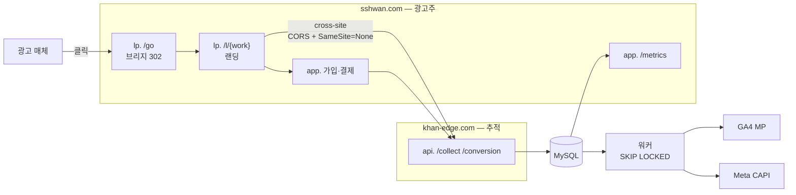

# touchpoint

[](https://github.com/http1220/touchpoint/actions/workflows/ci.yml)

**광고 유입부터 결제 전환까지를 추적해 매체로 되돌려 보내는 파이프라인.**

> 이건 웹툰 서비스가 아닙니다. 어트리뷰션 파이프라인이고, 도메인(회원·코인·회차)은 **전환을 측정할 대상이 필요해서** 최소한만 두었습니다. 그 도메인은 상상해서 만든 것이 아니라 **공개 자료를 조사해 역추론**했습니다 → [조사 요약](docs/research-method.md)

- **상태**: **배포 완료** — https://lp.sshwan.com 가동 중. CI3 · 스키마 18테이블 · MySQL 복제 · 읽기 분리 동작 확인 (2026-09-09)
- **스택**: PHP 8.2 · **CodeIgniter 3** · MySQL 8.0(프라이머리+복제본) · **OpenResty(Nginx+Lua)** · Docker · AWS EC2 t3.small
- **왜 이 스택인가**: 대상 조직이 쓰는 것에 맞췄습니다 → [ADR-014](docs/decisions/ADR-014-stack-alignment.md)
- **로드맵**: [docs/roadmap.md](docs/roadmap.md) — 의도 → 기획 → 계획 3층 구조

---

## 1. 아키텍처



상세 → [docs/architecture.md](docs/architecture.md)

---

## 2. 실행 방법

```bash
cp .env.example .env      # SHOP_DOMAIN / TRACK_DOMAIN / DB·복제 비밀번호
docker compose up -d      # openresty · app · mysql-primary · mysql-replica
docker compose exec app php public/index.php cli/migrate latest
```

기본 기동은 컨테이너 4개입니다. 워커는 아웃박스에 적재가 생긴 뒤부터 필요하므로 프로파일로 분리해 두었습니다.

```bash
docker compose --profile worker up -d --scale worker=4   # SKIP LOCKED 동시성 검증
```

마이그레이션은 CLI 로만 돕니다. 스키마를 바꾸는 경로를 브라우저 요청으로 열어두지 않습니다.

```bash
docker compose exec app php public/index.php cli/migrate current
docker compose exec app php public/index.php cli/migrate to 20260909000600   # 인덱스 없는 상태로
```

동작 확인:

```bash
curl -s https://app.<SHOP_DOMAIN>/readyz     # 쓰기·읽기 커넥션과 배정된 복제본
open https://lp.<SHOP_DOMAIN>/diag           # 호스트 라우팅·TLS·쿠키 속성
```

**도메인·EC2·TLS 구축 절차 → [docs/setup.md](docs/setup.md)**

> ⚠️ **로컬에서는 핵심 실험이 성립하지 않습니다.** `*.localhost`는 same-site라 서드파티 쿠키 차단과 `SameSite=None`을 재현할 수 없습니다. 등록 도메인 2개가 필요한 이유 → [ADR-002](docs/decisions/ADR-002-two-registered-domains.md)
>
> ⚠️ **ACME는 반드시 스테이징으로 먼저 검증하세요.** Let's Encrypt 프로덕션은 도메인당 주 5회 제한이라, 설정 시행착오로 소모하면 일주일을 기다려야 합니다.

---

## 3. 데이터 흐름

| # | 단계 | 기술적 쟁점 |
|---|---|---|
| 1 | `lp./go` 브리지 | **302** 리다이렉트, 파라미터 전달 2방식 비교 |
| 2 | `visits` + `touchpoints(first)` | 쿠키에는 `visit_uid`만. 본체는 서버 |
| 3 | `api./collect` | **cross-site** — preflight, `Allow-Credentials`, `Vary: Origin` |
| 4 | `app./signup` | 유입 경로를 `users`에 **스냅샷** (원본은 3개월 후 파기) |
| 5 | `app./purchase` | `captured`에서만 전환 발화. 코인은 **원장(lot)** 에 적립 |
| 6 | 워커 | `FOR UPDATE SKIP LOCKED`, 지수 백오프, 구간별 계측 |
| 7 | 채널 어댑터 | GA4 / Meta. **신규 매체 = 클래스 1개 + 설정 1줄** |

상세 → [docs/api-spec.md](docs/api-spec.md) · [docs/data-model.md](docs/data-model.md)

---

## 4. 계측 결과

> 🚧 구현 후 채웁니다 → [docs/benchmarks.md](docs/benchmarks.md)

| 지표 | 목표 | 실측 |
|---|---|---|
| 어트리뷰션 보존율 | ≥ 95% | — |
| 매체 전송 성공률 | ≥ 99% | — |
| 재시도 후 최종 성공률 | ≥ 99.9% | — |
| 워커 중복 전송 | **0** | — |
| 구간별 시간 (parse/db/send) | — | — |

---

## 5. 실패 시나리오와 대응

> 🚧 구현 후 채웁니다 → [docs/failure-scenarios.md](docs/failure-scenarios.md)

| 시나리오 | 무엇이 깨지는가 | 어떻게 막았는가 |
|---|---|---|
| 서드파티 쿠키 차단 (브라우저별) | — | — |
| `SameSite` 설정 누락 | — | — |
| `Allow-Origin: *` + credentials | — | — |
| `sendBeacon`의 헤더 제약 | — | — |
| 301 캐시로 목적지 고착 | — | — |
| 리다이렉트 중 파라미터 유실 | — | — |
| 워커 중복 실행 | — | — |
| 매체 API 타임아웃 | — | — |
| **복제 지연 (read-after-write)** | — | — |
| 보존기간 파기 후 유입경로 조회 | — | — |

---

## 6. 인덱스 최적화

> 🚧 `EXPLAIN` before/after를 캡처해 채웁니다.

```sql
SELECT * FROM dispatch_outbox
WHERE status = 'pending' AND next_retry_at <= NOW(3)
ORDER BY id LIMIT 100
FOR UPDATE SKIP LOCKED;
```

**복합 인덱스 `(status, next_retry_at, id)`** — 등호 → 범위 → 정렬 순서. 범위 조건 뒤의 컬럼은 인덱스로 정렬에 쓸 수 없으므로 `id`가 마지막.

---

## 7. 기술 선택과 근거 — 채택하지 않은 것 포함

**17개 결정을 ADR로 기록했습니다** → [docs/decisions/](docs/decisions/)

| # | 결정 | 왜 |
|---|---|---|
| [002](docs/decisions/ADR-002-two-registered-domains.md) | **등록 도메인 2개** | 서브도메인 3개는 same-site라 실험이 성립 안 함 |
| [003](docs/decisions/ADR-003-mysql-outbox.md) | Redis·SQS **안 씀** | 전환과 전송 지시를 한 트랜잭션에. 브로커는 정합성 구멍 |
| [004](docs/decisions/ADR-004-skip-locked.md) | `SKIP LOCKED` | 중복 전송을 사후 차단이 아니라 DB가 **예방** |
| [005](docs/decisions/ADR-005-channel-adapter.md) | 채널 어댑터 | 대상 서비스에 매체가 **10종 이상** 붙어 있음 (실측) |
| [006](docs/decisions/ADR-006-coin-ledger.md) | 코인 **원장** | 약관의 유료 5년 / 무료 1년은 잔액 컬럼으로 구현 불가 |
| [009](docs/decisions/ADR-009-no-spa.md) | React **안 씀** | 백엔드 포지션 + 추적 스니펫은 프레임워크가 없어야 배포됨 |
| [014](docs/decisions/ADR-014-stack-alignment.md) | **스택 정렬** | 최신 스택보다 **대상 조직과 같은 스택**에서 부딪히는 편이 값어치가 큼 |
| [016](docs/decisions/ADR-016-payment-and-notification.md) | PG **2개** + 알림 | 어댑터의 값어치는 구현체가 2개 이상일 때만 증명됨 |
| [017](docs/decisions/ADR-017-ci3-application-structure.md) | CI3 + **PSR-4 병용** | 컨트롤러는 관용구대로, 도메인 로직은 프레임워크 밖으로 빼서 테스트 가능하게 |
| [010](docs/decisions/ADR-010-no-kubernetes.md) | K8s **안 씀** | 컨테이너 4개 |

### 리서치가 뒤집은 것 3개

| | 처음 생각 | 조사 후 |
|---|---|---|
| 도메인 | 서브도메인 3개면 충분 | **same-site라 서드파티 쿠키 실험 불가** |
| 워커 중복 | `dedup_key`로 사후 차단 | **전송 중복은 못 막음** → `SKIP LOCKED` |
| 서드파티 쿠키 | "곧 사라진다" | **Chrome이 2025년에 폐지 철회.** 문제는 *브라우저 편차* |

---

## 8. 한계와 다음 단계

### 의도적으로 포기한 것

AWS Well-Architected 6기둥 기준입니다.

| 기둥 | 이 프로젝트 |
|---|---|
| 운영 우수성 | GitHub Actions CI + 구조화 로깅 |
| 보안 | TLS, 최소권한, 시크릿 분리 |
| **신뢰성** | **단일 인스턴스·단일 AZ — 의도적 포기** |
| 성능 효율 | 인덱스 실습으로 증명 |
| 비용 최적화 | t3.small. MySQL 2대가 t3.micro(1GB)에 올라가지 않습니다 |

### 흉내가 아닌 것 · 흉내인 것

정렬 원칙([ADR-014](docs/decisions/ADR-014-stack-alignment.md))을 세운 뒤 "일정이 빠듯하니 흉내로 대체하자"고 했던 결정 두 개를 되돌렸습니다.

| 항목 | 실제 |
|---|---|
| **읽기 복제본** | **실물.** MySQL 프라이머리 + 복제본을 GTID로 띄우고, Lua가 요청마다 읽기 대상을 배정합니다. 지연은 `SOURCE_DELAY`로 키웁니다 → [ADR-007](docs/decisions/ADR-007-read-write-split.md) |
| **PG 결제** | **테스트 모듈 2개.** 어댑터의 값어치는 구현체가 2개 이상일 때만 증명됩니다. 결제 완료 알림까지 붙입니다 → [ADR-016](docs/decisions/ADR-016-payment-and-notification.md) |
| 콘텐츠 도메인 | 전환 측정에 필요한 최소 필드만. 뷰어·랭킹·검색 없음 |
| 광고 매체 | GA4·Meta는 실제 전송(테스트 이벤트 코드). 매체 3번째는 어댑터 주장 검증용 |

### 다음 단계

- Meta CAPI에 픽셀 `event_id` 중복 제거 실측
- 채널 3번째 추가로 "변경 파일 2개" 주장 검증
- 커스텀 수집 2종(`/impression`·`/click`)으로 광고 태그 없이 자체 계측
- CDN 도입 전후의 이미지 응답 시간·오리진 요청 수 비교

---

## 9. 설계 근거는 어디서 나왔나

스키마와 아키텍처는 상상해서 만든 게 아니라 **비로그인 공개 자료를 조사해 역추론**했습니다.

**→ [docs/research-method.md](docs/research-method.md)** — 조사 방법과 결론

거기서 다루는 것:

| | |
|---|---|
| **조사가 바꾼 설계 결정 9개** | 서브도메인 3개 → 등록 도메인 2개, "서드파티 쿠키가 사라진다" 전제 붕괴, 매체 10종 이상 → 채널 어댑터, 약관의 재화 만료 규칙 → 원장, 보존기간 20배 차이 → 테이블 분리, 읽기 복제본 운영 흔적 → 복제 지연 재현 … |
| **대조군에서 얻은 스키마 판단** | 다대다 작가·role, 연재요일 배열, 연령등급 enum, 전역 ID + 순번, 표시용 문자열 날짜의 반면교사, 개인화 필드와 캐시 |
| **반박된 전제** | "웹툰이면 조회수·별점이 기본" — **두 플랫폼 모두 조회수 비공개** |
| **표준은 기억이 아니라 확인으로** | 서드파티 쿠키 현황, PCI DSS v4.0.1, IAB TCF v2.3, CHIPS |
| **버린 것 24개 / 남긴 것 9개** | 범위 축소의 기준 |

> **조사 범위**: 공개 페이지·공개 응답 헤더·공개 약관·공개 API만. 로그인·결제·자동 수집·CAPTCHA 우회는 하지 않았습니다.
> **익명 처리**: 조사 대상은 실제 운영 서비스라 `플랫폼 A·B·C`로 표기하고, 추적 식별자·서버 주소 같은 특정 값은 싣지 않았습니다. 원본 조사 기록은 비공개로 두고 요약만 공개합니다.
