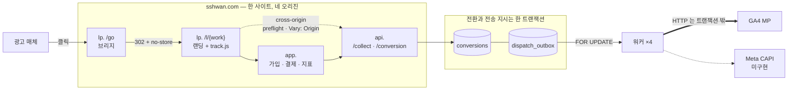

# touchpoint

**광고 유입부터 결제 전환까지를 추적해 매체로 되돌려 보내는 파이프라인.**

> 이건 웹툰 서비스가 아닙니다. 어트리뷰션 파이프라인이고, 도메인(회원·코인·회차)은 **전환을 측정할 대상이 필요해서** 최소한만 두었습니다. 그 도메인은 상상해서 만든 것이 아니라 **공개 자료를 조사해 역추론**했습니다 → [조사 요약](docs/research-method.md)

- **상태**: **파이프라인 관통** — 광고 클릭 → 방문·접점 적재 → 수집(CORS) → 전환 → 아웃박스 → 워커 → **GA4 도달 확인**. GA4 로 **543건 실전송**, Data API 로 되읽어 대조 → **도달률 100% · 반영률 95.2%** (2026-09-14)
- **실측**: 실패 시나리오 **12건 전부 착수(10건 완료 + 2건 부분)**, 계측 문서 **1·2·3·5·6장 실측**. 전부 운영 중인 t3.small 에서 잰 값입니다
- **지표 화면**: `app./metrics` — 채널별로 쪼개고 **도달률과 반영률을 다른 줄로** 냅니다. 뭉치면 "성공률 100%" 가 뜨고 그게 무엇의 100%인지 아무도 모릅니다 → [ADR-019](docs/decisions/ADR-019-metrics-view-over-grafana.md)
- **스택**: PHP 8.2 · **CodeIgniter 3** · MySQL 8.0(프라이머리+복제본) · **OpenResty(Nginx+Lua)** · Docker · AWS EC2 t3.small — 최신 스택이 아니라 **대상 조직과 같은 스택**을 골랐습니다 → [ADR-014](docs/decisions/ADR-014-stack-alignment.md)
- **실행**: `cp .env.example .env && docker compose up -d` → `cli/migrate latest`. 컨테이너 4개로 뜨고 워커는 프로파일로 분리돼 있습니다. 도메인·EC2·TLS·ACME 까지 전 과정 → [docs/setup.md](docs/setup.md)
- **문서**: [로드맵](docs/roadmap.md) · [아키텍처](docs/architecture.md) · [API 규격](docs/api-spec.md) · [데이터 모델](docs/data-model.md) · [막힌 것·배운 것](docs/worklog.md)

## 1. 예상이 틀린 곳 넷 — 읽을 것이 하나라면 여기

| 예상 | 실제 |
|---|---|
| "`204` 를 받았으니 전송은 성공" | **같은 543건의 반영률이 95.2%** 였습니다. 게다가 보내자마자 재면 **1.0%** 로 나와서, 그 숫자를 믿었으면 "매체가 99%를 버린다"를 문서에 박을 뻔했습니다 |
| "301이 위험하다" | **301 자체는 아니었습니다.** `no-store` 붙인 301은 매번 서버에 옵니다. 위험한 건 *영구 캐시를 허용하는* 301이고, 그건 **롤백이 안 됩니다** |
| "`SKIP LOCKED` 를 끄면 처리량이 급감한다" | **안 떨어졌고 오히려 조금 빨랐습니다.** 잠금 구간에 외부 I/O 가 없어 대기가 마이크로초라서입니다. `SKIP LOCKED` 는 처리량 장치가 아니라 보험입니다 |
| "`?return=` 오픈 리다이렉트를 막자" | **그런 파라미터가 없었습니다.** 과녁은 `Host` 헤더였고, 막혀 있긴 했지만 **서버 블록 순서에 기댄 우연**이었습니다 |

넷 다 아래 2·3장에 근거가 있고, 재현 절차와 원문 출력은 [benchmarks.md](docs/benchmarks.md) · [failure-scenarios.md](docs/failure-scenarios.md) 에 있습니다.

## 2. 계측 결과 — 운영 중인 t3.small 에서

| 측정 | 결과 | 읽을 것 |
|---|---|---|
| **워커 동시성** | 워커 4개 · 2000건 · **중복 전송 0** | `SKIP LOCKED` 를 **꺼도** 중복 0이고 처리량도 안 떨어졌습니다 |
| **구간별 시간** | Noop: total 4.9 / db 4.8 · **GA4: total 51.3 / db 6.4 / send 44.9** | 실제 채널을 붙이자 **네트워크가 87%** — 비용의 주인이 바뀝니다 |
| **인덱스** | 분포에 따라 `ix_poll` ↔ PRIMARY | 큐가 밀리면 옵티마이저가 인덱스를 **버리는 쪽이 맞는 판단**이라, "인덱스 걸었더니 빨라졌다" 를 쓸 수 없었습니다. 새 인덱스가 기존 폴링 계획을 흔든 것도 같이 적어 뒀습니다 → [1장](docs/benchmarks.md) |
| **리소스** | MySQL 2대가 메모리 90% · CPU 84% | 부하 중 **swap 증가 0MB**, load average 2.29 / vCPU 2 |
| **복제본 CPU** | 프라이머리 42.2% vs 복제본 **42.1%** | 읽기를 거의 안 받는데도 같은 CPU — **읽기 분산은 공짜가 아닙니다** |
| **GA4 지연 분포** | 워커 1개 p95 **43ms** → 워커 4개 p95 **83ms** | 동시성을 올리면 처리량 1.7배, **꼬리 지연 2배** |
| **지터** | 같은 배치 두 건이 33.894s · 35.908s | 회복한 매체를 다시 넘어뜨리지 않게 흩뿌립니다 |

### 지표는 아직 지표가 아닙니다

| 지표 | 목표 | 실측 | |
|---|---|---|---|
| 워커 중복 전송 | 0 | **0** (9303 시도) | ✅ |
| 중복 전환 차단 | 유실 0 | **동시 8개 → 1행** (3회 반복) | ✅ |
| 어트리뷰션 보존율 | ≥ 95% | 20 / 20 | ◐ 표본 20 |
| **매체 도달률** (`2xx` 응답) | ≥ 99% | GA4 **543 / 543 = 100%** | ✅ |
| **매체 반영률** (보고서에 존재) | ≥ 99% | GA4 **517 / 543 = 95.2%** | **✗ 목표 미달** |

> **지표 하나가 사실 둘이었습니다.** `204` 를 받은 543건을 GA4 Data API 로 되읽어 한 건씩 맞대 보니 매체 보고서에 남은 것은 **517건(95.2%)** 이었습니다. 같은 전송을 두고 **도달률 100% 와 반영률 95.2% 가 동시에 참**입니다 — 이름 하나로 뭉쳐 두면 둘 중 편한 쪽이 화면에 뜹니다. 그래서 `/metrics` 가 두 줄로 냅니다.
>
> 보내자마자 물었을 때는 **1.0%** 였고, 그건 처리 지연이었습니다. 7시간 뒤 93.6%, 꼬리는 **25시간**까지 끌리다 멈췄고 **잔여 26건(약 4.8%)은 영구 유실**로 봅니다. 전송 속도와는 무관합니다 — 가장 빠르게 보낸 무리의 누락률이 오히려 가장 낮았습니다(3.2% vs 6.4%) → [5장](docs/benchmarks.md)
>
> **어트리뷰션 보존율은 정의가 틀려 있었습니다.** 처음 정의(*접점이 남은 방문 ÷ 전체 방문*)로 재면 529/530 = 99.8%가 나오는데, 직접 유입도 `last` 접점을 하나 받기 때문에 뭘 재든 100%에 붙습니다. *광고 유입 방문 중 보존된 비율* 로 고쳐 20/20 입니다. **목표치를 처음부터 넘고 있는 지표는 대개 분모를 잘못 고른 것입니다.**

## 3. 실패 시나리오 — 12건 전부 착수 · 10건 완료 + 2건 부분

재현 절차·`curl` 출력·`EXPLAIN` 원문 → [docs/failure-scenarios.md](docs/failure-scenarios.md)

| 시나리오 | 무엇이 깨지는가 | 어떻게 막았는가 |
|---|---|---|
| **same-site 인데 CORS** | 같은 사이트인 `lp.`→`app.` 이 차단됐습니다. **그런데 서버 로그는 200** — 요청은 이미 처리된 뒤입니다 | 수집은 `api.` 하나만 허용 목록에. 쿠키는 `Lax` 로 세 호스트에 다 갑니다 |
| `Allow-Origin: *` + credentials | 브라우저는 차단, **서버는 기록** → 재시도 시 전환 중복 | 오리진 정확 반향 + `Vary: Origin`, 테스트 16건 |
| `sendBeacon` 의 헤더 제약 | 헤더 불가 + **성공 확인 불가**. 대신 CORS 오설정에도 통과 | 두 경로 모두 구현, `transport` 로 구분 적재 |
| **캐시 헤더 없는 301** | 3회 클릭 → 서버 도달 **1회**. 게다가 **302로 고쳐도 이미 캐시한 브라우저는 안 돌아옵니다**(같은 URL 2회 → 0회) | 302 고정 + `no-store`. 301은 `.env` 스위치로만 재현 |
| **랜딩 URL 공유** | passthru 는 클릭 1회가 **유입 2건**으로. vid 는 건수는 맞지만 **두 사람이 한 방문**이 됨 | 기본값 vid. 둘 다 틀리되 **건수 쪽이 정산에 걸립니다** |
| **오픈 리다이렉트** | 위험한 입력은 `?return=`(없음)이 아니라 **`Host` 헤더** | 목적지를 입력으로 받지 않음. `work` 는 숫자만. 엣지 443에 `default_server` 명시 |
| **워커 중복 실행** | 같은 건이 두 번 전송되면 전환이 부풀려짐 | 선점과 상태 변경을 한 트랜잭션에. **네 조건 모두 중복 0** |
| **매체 장애** | 5xx·타임아웃은 사다리 끝(attempt 6)에서 `dead`, **4xx 는 attempt 1 에서 즉시 `dead`** | `shouldRetry` 가 4xx/5xx/무응답을 가름. 실패 주입 스위치로 재현 |
| **중복 전환** | 같은 `dedup_key` 로 **동시 8개**를 때려도 `conversions` 1행 · `outbox` 1행. 어긋나면 전환 하나가 매체로 여덟 번 나갑니다 | `INSERT IGNORE` + UNIQUE. **먼저 SELECT 해서 막는 방식은 동시 요청에 전부 통과합니다** |
| **복제 지연** | **같은 URL 이 같은 순간에 다른 답**을 줍니다 — 쓴 직후 `rdb1` 1개 / `rdb2` 0개 | 쓴 직후 읽기는 프라이머리. 배정 쿠키 고정은 **완화지 해결이 아닙니다** |
| **보존기간 파기** | 방문·접점은 사라지고 **회원 스냅샷은 남습니다**. 조인은 `NULL`, `signup_pid` 는 그대로 | 스냅샷 비정규화 + `signup_visit_id` 에 **FK 없음** — FK 세 옵션 다 틀린 자리 |

**범위에서 뺀 것**: 서드파티 쿠키 차단과 `SameSite=None` 누락. 등록 도메인이 하나라 브라우저가 그 경로를 차단할 조건 자체가 만들어지지 않습니다. 설계와 이유는 [failure-scenarios A장](docs/failure-scenarios.md)에 남겨 뒀습니다 — **못 한 것과 모르는 것은 다릅니다.**

## 4. 설계 근거는 어디서 나왔나

스키마와 아키텍처는 상상해서 만든 게 아니라 **비로그인 공개 자료를 조사해 역추론**했습니다 → **[docs/research-method.md](docs/research-method.md)**

| | |
|---|---|
| **조사가 바꾼 설계 결정 9개** | 사이트(eTLD+1)와 오리진의 구분, "서드파티 쿠키가 사라진다" 전제 붕괴, 매체 10종 이상 → 채널 어댑터, 약관의 재화 만료 규칙 → 원장, 보존기간 20배 차이 → 테이블 분리, 읽기 복제본 운영 흔적 → 복제 지연 재현 … |
| **대조군에서 얻은 스키마 판단** | 다대다 작가·role, 연재요일 배열, 연령등급 enum, 전역 ID + 순번, 표시용 문자열 날짜의 반면교사 |
| **반박된 전제** | "웹툰이면 조회수·별점이 기본" — **두 플랫폼 모두 조회수 비공개** |
| **버린 것 24개 / 남긴 것 9개** | 범위 축소의 기준 |

> **조사 범위**: 공개 페이지·공개 응답 헤더·공개 약관·공개 API만. 로그인·결제·자동 수집·CAPTCHA 우회는 하지 않았습니다. 조사 대상은 실제 운영 서비스라 `플랫폼 A·B·C`로 표기하고 추적 식별자·서버 주소는 싣지 않았습니다.

## 5. 아키텍처

- **① 사이트는 하나, 오리진은 넷입니다.** CORS는 오리진 기준이라 그대로 걸리고(점선), 쿠키 차단은 사이트(eTLD+1) 기준이라 걸리지 않습니다 → [ADR-018](docs/decisions/ADR-018-single-registered-domain.md)
- **② 전환을 기록하는 트랜잭션 안에서 전송 지시도 같이 적재합니다.** 커밋이 곧 "보내기로 확정됨"이고 롤백되면 둘 다 사라집니다 — *전환은 없는데 전송은 나갔다* 가 구조적으로 불가능해집니다 → [ADR-003](docs/decisions/ADR-003-mysql-outbox.md)
- **③ 외부 HTTP(굵은 선)는 트랜잭션 밖입니다.** 이 선택 때문에 잠금 대기가 마이크로초로 끝나고, 그래서 `SKIP LOCKED` 가 처리량을 벌어 주지 **않습니다** → [D-1](docs/failure-scenarios.md)

흐름은 `lp./go` **302** 브리지(301은 롤백 불가) → `visits` + `touchpoints(first)`(쿠키엔 `visit_uid` 만, 본체는 서버) → `api./collect` **cross-origin** → `app./signup`·`/purchase` *(라우트만 — 7장)* 에서 유입 경로 스냅샷, 코인은 **원장(lot)** → `api./conversion`(신규 `201` · 중복 `200` 멱등) → 아웃박스 → 워커 ×4(지수 백오프+지터, 구간별 계측, 좀비 회수) → 채널 어댑터(**신규 매체 = 클래스 1개 + 설정 1줄**) 입니다.

상세 → [architecture.md](docs/architecture.md) · [api-spec.md](docs/api-spec.md) · [data-model.md](docs/data-model.md) · [outbox-and-channels.md](docs/outbox-and-channels.md)

## 6. 기술 선택 — 채택하지 않은 것 포함

**19개 결정을 ADR로 기록했습니다** → [docs/decisions/](docs/decisions/)

| # | 결정 | 왜 |
|---|---|---|
| [018](docs/decisions/ADR-018-single-registered-domain.md) | **등록 도메인 1개** | [002](docs/decisions/ADR-002-two-registered-domains.md) 철회. 잃는 것은 쿠키 차단 실험 둘뿐 — CORS는 오리진 기준이라 그대로 걸림 |
| [003](docs/decisions/ADR-003-mysql-outbox.md) | Redis·SQS **안 씀** | 전환과 전송 지시를 한 트랜잭션에. 브로커는 정합성 구멍 |
| [004](docs/decisions/ADR-004-skip-locked.md) | `SKIP LOCKED` | 중복 전송을 사후 차단이 아니라 DB가 **예방** |
| [005](docs/decisions/ADR-005-channel-adapter.md) | 채널 어댑터 | 대상 서비스에 매체가 **10종 이상** 붙어 있음 (실측) |
| [006](docs/decisions/ADR-006-coin-ledger.md) | 코인 **원장** | 약관의 유료 5년 / 무료 1년은 잔액 컬럼으로 구현 불가 |
| [009](docs/decisions/ADR-009-no-spa.md) | React·K8s **안 씀** | 백엔드 포지션 + 추적 스니펫은 프레임워크가 없어야 배포됨. 컨테이너는 4개뿐 ([010](docs/decisions/ADR-010-no-kubernetes.md)) |
| [014](docs/decisions/ADR-014-stack-alignment.md) | **스택 정렬** | 최신 스택보다 **대상 조직과 같은 스택**에서 부딪히는 편이 값어치가 큼 |
| [016](docs/decisions/ADR-016-payment-and-notification.md) | PG **2개** + 알림 | 어댑터의 값어치는 구현체가 2개 이상일 때만 증명됨 |
| [017](docs/decisions/ADR-017-ci3-application-structure.md) | CI3 + **PSR-4 병용** | 컨트롤러는 관용구대로, 도메인 로직은 프레임워크 밖으로 빼서 테스트 가능하게 |
| [019](docs/decisions/ADR-019-metrics-view-over-grafana.md) | `/metrics` 는 **HTML 화면** | [012](docs/decisions/ADR-012-observability-scope.md)의 한 항목을 뒤집음. "A 대신 B" 를 정했는데 결과가 "A 도 B 도 없음" 이었음 |

**뒤집힌 결정이 셋입니다** — 002→018(도메인), 012→019(지표 화면), 그리고 `SKIP LOCKED` 의 역할(처리량 → 보험). 앞의 둘은 조사와 재설계로 잡혔고 셋째는 **다시 재 보고 나서야** 잡혔습니다. 그 차이가 이 저장소에 계측 문서가 따로 있는 이유입니다.

## 7. 한계와 다음 단계

| | |
|---|---|
| **신뢰성** | **단일 인스턴스·단일 AZ — 의도적 포기.** t3.small 에 MySQL 2대까지가 한계이고 t3.micro(1GB)에는 올라가지 않습니다 |
| **`/signup` · `/purchase`** | 라우트만 있고 컨트롤러가 없습니다. 그래서 `conversions.user_id` 가 아직 `NULL` 입니다 |
| **결제 웹훅 (D-3)** | `payments` 가 마이그레이션에만 있습니다. **범위 축소가 아니라 아직 안 만든 것**입니다 |
| **`/metrics` 인증** | 없습니다(범위 밖). 대신 화면이 식별자·회원 정보를 내리지 않는 쪽으로 막았습니다 |
| **잔여 4.8% 의 원인** | 반영률 95.2% 까지 확정했지만 남은 26건이 왜 사라지는지는 매체 내부라 밖에서 규명할 수 없습니다 — **규모를 아는 것까지가 우리 몫**입니다 |
| **파기 스케줄러** | `cli/purge` 는 만들었지만 손으로 돕니다. 무인 삭제 전에 `plan` 을 며칠 지켜볼 생각입니다 |

**흉내가 아닌 것**: 읽기 복제본은 **실물**입니다 — GTID 복제 + Lua 가 요청마다 읽기 대상을 배정하고, 지연은 `SOURCE_DELAY` 로 키워 [E-1](docs/failure-scenarios.md)을 재현했습니다([ADR-007](docs/decisions/ADR-007-read-write-split.md)). **GA4 는 실제 전송**입니다 — 543건을 운영 엔드포인트로 보내고 Data API 로 되읽어 대조했습니다.

**아직 없는 것**: **PG 모듈도, Meta 채널도, 결제 알림도 없습니다.** [ADR-016](docs/decisions/ADR-016-payment-and-notification.md)·[ADR-005](docs/decisions/ADR-005-channel-adapter.md)에 설계는 있지만 구현은 `Ga4Channel` 과 `NoopChannel` 둘뿐이고, `payments` 는 마이그레이션에만 있습니다. 그래서 *"신규 매체 = 클래스 1개 + 설정 1줄"* 이라는 [ADR-005](docs/decisions/ADR-005-channel-adapter.md)의 주장은 **아직 검증되지 않았습니다** — 구현체가 둘이어야 증명되는데 하나는 가짜 채널입니다. 콘텐츠 도메인도 전환 측정에 필요한 최소 필드뿐입니다(뷰어·랭킹·검색 없음).

다음 순서는 **아직 모르는 것이 큰 순**입니다: 결제 웹훅(D-3) → 파기 스케줄러 → 커스텀 수집 `/impression`·`/click` → Meta CAPI `event_id` 중복 제거 → **채널 3번째**("변경 파일 2개" 주장의 검증 → [ADR-005](docs/decisions/ADR-005-channel-adapter.md))
