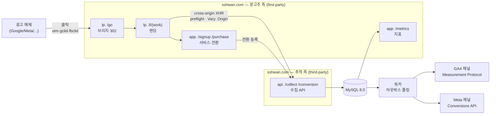
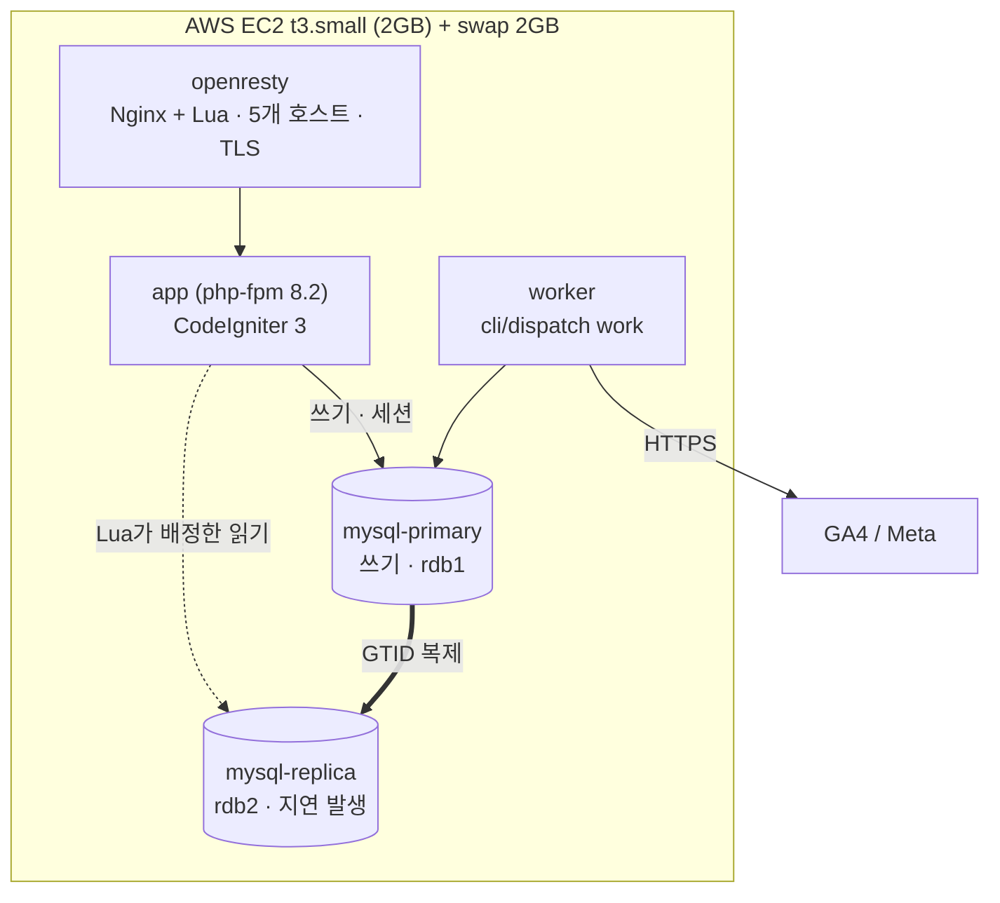
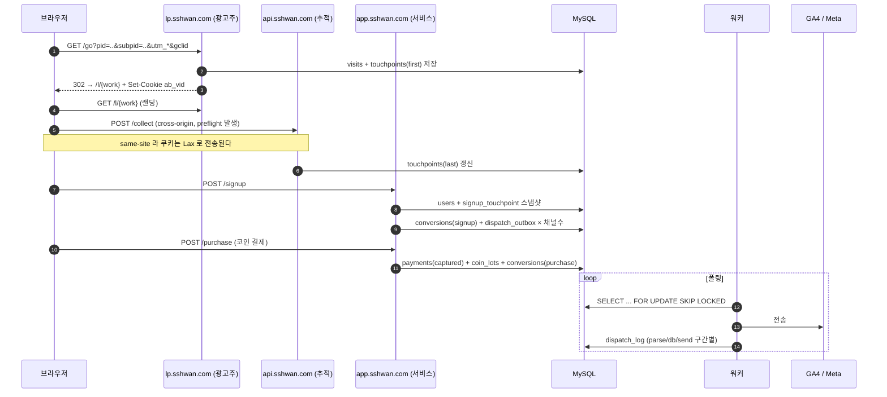
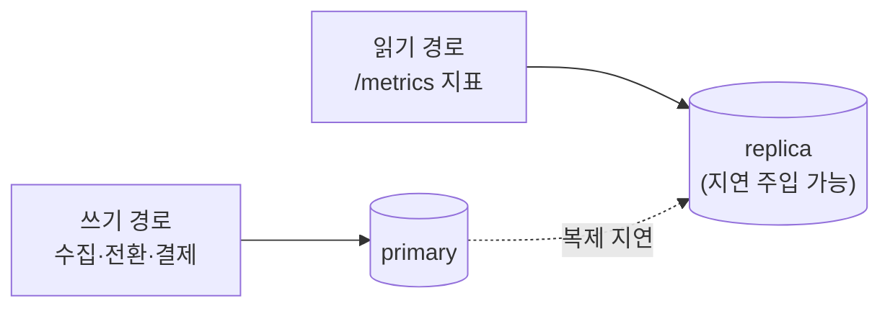
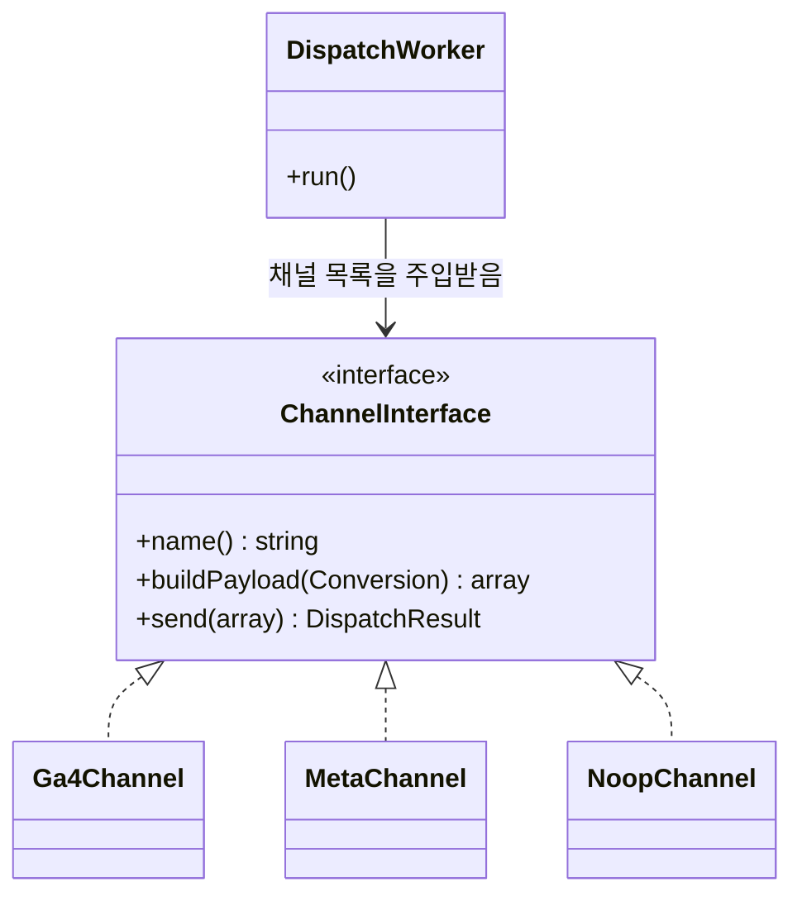

# 아키텍처

> 이 프로젝트는 **웹툰 플랫폼이 아니다.** 광고 유입부터 결제 전환까지를 추적해 매체로 되돌려 보내는 **어트리뷰션 파이프라인**이며, 도메인(회원·코인·회차)은 전환을 측정할 대상이 필요해서 최소한만 두었다.
> 도메인 설계 근거는 전부 [조사 요약](research-method.md)의 공개 자료 조사에서 나왔다.

---

## 1. 한 장 요약

**핵심**: 광고주 도메인과 추적 도메인을 **서로 다른 등록 도메인**으로 갈랐다. 이 결정 하나가 이 프로젝트의 전부다 → [ADR-002](decisions/ADR-002-two-registered-domains.md)

---

## 2. 컨테이너 구성

| 컨테이너 | 역할 | 비고 |
|---|---|---|
| `openresty` | TLS 종단, 5개 호스트네임 라우팅, 302 리다이렉트, **Lua 읽기 복제본 배정** | 대상 조직이 OpenResty 를 쓴다는 것을 응답 헤더로 확인 → [ADR-013](decisions/ADR-013-caddy-over-nginx.md) |
| `app` | CodeIgniter 3 / PHP 8.2-fpm | 서버 렌더. SPA 없음 → [ADR-009](decisions/ADR-009-no-spa.md) |
| `worker` | 아웃박스 폴링 → 매체 전송 | `app`과 **같은 이미지**, 커맨드만 다름. 프로파일로 분리 |
| `mysql-primary` | 쓰기 · 세션 · 읽기 대상 `rdb1`(지연 0) | `FOR UPDATE SKIP LOCKED` → [ADR-004](decisions/ADR-004-skip-locked.md) |
| `mysql-replica` | 읽기 대상 `rdb2`. **실제 복제 지연이 나는 쪽** | `SOURCE_DELAY` 로 지연을 키워 재현 → [ADR-007](decisions/ADR-007-read-write-split.md) |
| `certbot` | 인증서 발급(일회성) | `--profile cert` |

> 상시 기동은 4개다. Kubernetes 를 쓰지 않는 이유 → [ADR-010](decisions/ADR-010-no-kubernetes.md)

### 애플리케이션 내부 경계

CI3 관용구와 PSR-4 를 병용한다. 경계는 하나다 — **`src/` 는 프레임워크를 모른다.**

| 영역 | 방식 | 왜 |
|---|---|---|
| `application/controllers`·`models`·`views` | CI3 관용구 (`$this->load->model()`) | 대상 코드베이스와 같은 관용구 |
| `src/` (`App\` 네임스페이스) | PSR-4 · 생성자 주입 | 인터페이스·다형성·**PHPUnit 단위 테스트** |

경계가 깨지면 어댑터·원장·멱등성 로직의 검증 수단이 통째로 사라지므로, CI 에서 `src/` 안의 CI3 참조를 찾아 실패시킨다 → [ADR-017](decisions/ADR-017-ci3-application-structure.md)

## 3. 데이터 흐름 — 클릭에서 매체 전송까지

### 각 단계에서 벌어지는 일

| # | 단계 | 기술적 쟁점 |
|---|---|---|
| 1~3 | **브리지 리다이렉트** | 302 vs 301 캐시 차이. 파라미터 전달 방식 2가지 비교 → [api-spec](api-spec.md#2-get-lp-go--브리지-리다이렉트) |
| 4~5 | **랜딩 + 크로스사이트 수집** | preflight, `Allow-Credentials`, `Vary: Origin`, `sendBeacon` 트레이드오프 |
| 6~7 | **가입 전환** | 유입 경로를 `users`에 **스냅샷으로 복사** — `touchpoints`는 3개월 후 파기되므로 |
| 8 | **결제 전환** | `captured` 시점에만 발화. 코인은 원장(lot)에 적립 |
| 9~11 | **아웃박스 워커** | `SKIP LOCKED`로 다중 워커 안전, 지수 백오프, 구간별 계측 |

---

## 4. 두 도메인이 만드는 세 가지 상황

| 호출 | 관계 | 무슨 일이 벌어지나 |
|---|---|---|
| `lp.sshwan.com` → `api.sshwan.com` | same-site, **cross-origin** | preflight + `Vary: Origin`. 쿠키는 `Lax` 로 전송 → [ADR-018](decisions/ADR-018-single-registered-domain.md) |
| `lp.sshwan.com` → `app.sshwan.com` | same-site, cross-origin | CORS는 필요, 쿠키는 `Lax`로 전송 |
| `app.sshwan.com` 내부 | same-origin | 아무 제약 없음 |

> **대조군이 있어야 실험이 성립한다.** 서브도메인만 나누면 첫 행이 사라지고, 그러면 이 프로젝트의 존재 이유가 없어진다 → [domains-and-cookies](domains-and-cookies.md)

---

## 5. 읽기/쓰기 커넥션 분리

플랫폼 A에서 `…slave=sdb3` 쿠키를 관측했다 — **읽기 복제본에 세션을 고정**하는 구조다([조사 요약](research-method.md) 3-2).

이 프로젝트는 복제본을 실제로 띄우지는 않되 **커넥션 그룹을 분리**하고, 지연을 인위적으로 주입해 **"방금 기록한 전환이 지표 화면에 안 보인다"** 를 재현한다 → [ADR-007](decisions/ADR-007-read-write-split.md), [failure-scenarios](failure-scenarios.md)

---

## 6. 채널 어댑터

플랫폼 A에 붙어 있는 매체가 **10종 이상**이다(태그 관리 컨테이너 3개, 검색·디스플레이 전환 ID 10개 이상, 소셜 픽셀 2, DSP 2, 글로벌 소셜 2). 매체별 `if` 분기로는 유지가 불가능하다 → [ADR-005](decisions/ADR-005-channel-adapter.md)

**신규 매체 추가 비용 = 어댑터 클래스 1개 + 설정 1줄.** 이걸 README에서 수치로 보여준다.

---

## 7. 환경

| 환경 | 도메인 | 용도 |
|---|---|---|
| 로컬 | `*.localhost` | 개발. 크로스사이트 실험은 불가(same-site) |
| 운영 | `sshwan.com` / `sshwan.com` | **실험은 여기서만 성립** |

> `.example`은 문서용 placeholder다. 실제 구매 도메인으로 치환한다 (`.env`의 `SHOP_DOMAIN` / `TRACK_DOMAIN`).

---

## 8. 의도적으로 하지 않은 것

| 안 한 것 | 이유 |
|---|---|
| 다중 AZ · 자동 페일오버 | 단일 t3.small · 단일 AZ. **Well-Architected 신뢰성 기둥을 의도적으로 포기.** 복제본은 띄우지만 승격은 수동 |
| Kubernetes / ECR | 컨테이너 4개 → [ADR-010](decisions/ADR-010-no-kubernetes.md) |
| Redis / SQS | → [ADR-003](decisions/ADR-003-mysql-outbox.md) |
| SPA / React | → [ADR-009](decisions/ADR-009-no-spa.md) |
| 실제 PG 상용 연동 | **테스트 모듈 2개**를 붙인다. 상용 계약·정산은 범위 밖 → [ADR-016](decisions/ADR-016-payment-and-notification.md) |
| 웹툰 뷰어·랭킹·검색 | 광고 연동과 무관 → [조사 요약](research-method.md) 버린 것 24개 |
