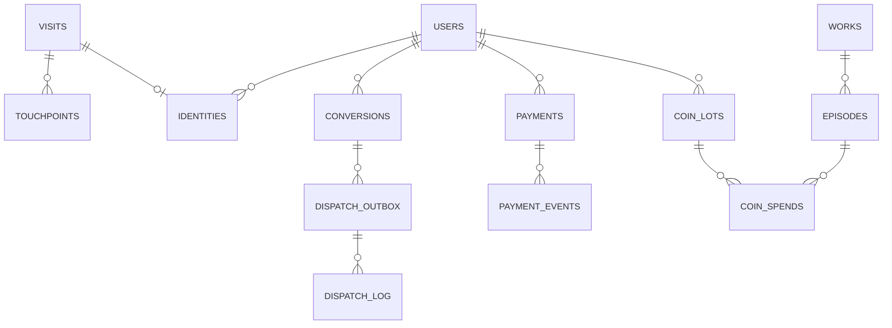

# 데이터 모델

- MySQL **8.0** (확정). `FOR UPDATE SKIP LOCKED` 사용
- 문자셋 `utf8mb4_0900_ai_ci` · 시각 `DATETIME(3)` **UTC** · 금액 **정수 minor unit**
- 모든 컬럼은 [조사 요약](research-method.md)의 근거로 역추적 가능해야 한다

---

## 1. 전체 구조



---

## 2. 어트리뷰션 (보존 3개월)

```sql
CREATE TABLE visits (
  id             BIGINT UNSIGNED AUTO_INCREMENT PRIMARY KEY,
  visit_uid      BINARY(16)   NOT NULL,          -- UUIDv7
  first_seen_at  DATETIME(3)  NOT NULL,          -- UTC
  landing_path   VARCHAR(512) NOT NULL,
  referrer       VARCHAR(512)     NULL,
  ua_hash        VARBINARY(32)    NULL,
  ip_hash        VARBINARY(32)    NULL,          -- 원본 저장 안 함
  country        CHAR(2)          NULL,          -- ISO 3166-1
  lang           CHAR(2)          NULL,          -- ISO 639-1
  UNIQUE KEY uq_visit_uid (visit_uid),
  KEY ix_purge (first_seen_at)                   -- 3개월 파기 배치용
) ENGINE=InnoDB;

CREATE TABLE touchpoints (
  id          BIGINT UNSIGNED AUTO_INCREMENT PRIMARY KEY,
  visit_id    BIGINT UNSIGNED NOT NULL,
  position    ENUM('first','last') NOT NULL,
  pid         VARCHAR(64)  NULL,                 -- 매체·파트너
  subpid      VARCHAR(128) NULL,                 -- 캠페인·소재
  channel     VARCHAR(32)  NULL,                 -- search|display|social
  utm_source  VARCHAR(128) NULL,
  utm_medium  VARCHAR(128) NULL,
  utm_campaign VARCHAR(128) NULL,
  utm_content VARCHAR(128) NULL,
  utm_term    VARCHAR(128) NULL,
  gclid       VARCHAR(255) NULL,
  fbclid      VARCHAR(255) NULL,
  occurred_at DATETIME(3)  NOT NULL,
  UNIQUE KEY uq_visit_position (visit_id, position),
  KEY ix_purge (occurred_at)
) ENGINE=InnoDB;
```

| 결정 | 근거 |
|---|---|
| `pid` / `subpid` / `channel` 3단 | 플랫폼 A `pid_join` 쿠키 실측 ([조사 요약](research-method.md) 3-5) |
| `position` first/last 분리 | 플랫폼 A `pid_join` / `pid_last` 2벌 구조 |
| `UNIQUE (visit_id, position)` | **first는 한 번만 생성**(보존), last는 UPSERT로 갱신 |
| `ip_hash` (원본 아님) | 어트리뷰션에 IP 원본은 불필요 — 데이터 최소화 |
| `KEY ix_purge` | 3개월 파기 배치 없이는 이 테이블이 무한히 자란다 |

---

## 3. 회원 · 전환 (보존 5년)

```sql
CREATE TABLE users (
  id            BIGINT UNSIGNED AUTO_INCREMENT PRIMARY KEY,
  user_uid      BINARY(16)   NOT NULL,
  email         VARCHAR(255) NOT NULL,
  password_hash VARCHAR(255)     NULL,           -- Argon2id
  provider      ENUM('local','google') NOT NULL DEFAULT 'local',
  provider_uid  VARCHAR(128)     NULL,
  lang          CHAR(2)      NOT NULL DEFAULT 'ko',
  country       CHAR(2)          NULL,

  -- 가입 경로 스냅샷 (touchpoints 파기 후에도 남아야 함)
  signup_pid       VARCHAR(64)  NULL,
  signup_subpid    VARCHAR(128) NULL,
  signup_channel   VARCHAR(32)  NULL,
  signup_utm_source   VARCHAR(128) NULL,
  signup_utm_medium   VARCHAR(128) NULL,
  signup_utm_campaign VARCHAR(128) NULL,
  signup_visit_id  BIGINT UNSIGNED NULL,

  created_at    DATETIME(3)  NOT NULL,
  UNIQUE KEY uq_user_uid (user_uid),
  UNIQUE KEY uq_email (email),
  UNIQUE KEY uq_provider (provider, provider_uid)
) ENGINE=InnoDB;
```

> **`signup_*` 스냅샷이 이 모델의 핵심이다.** 플랫폼 A 개인정보처리방침이 "가입 경로"를 수집 항목으로 명시했다 = 어트리뷰션 결과가 **회원 레코드에 5년 남는다**. 원본 `touchpoints`는 3개월 후 사라지므로 **비정규화 복사가 정당화된다.**

```sql
CREATE TABLE identities (
  visit_id  BIGINT UNSIGNED NOT NULL,
  user_id   BIGINT UNSIGNED NOT NULL,
  linked_at DATETIME(3) NOT NULL,
  PRIMARY KEY (visit_id, user_id)
) ENGINE=InnoDB;

CREATE TABLE conversions (
  id             BIGINT UNSIGNED AUTO_INCREMENT PRIMARY KEY,
  conversion_uid BINARY(16)  NOT NULL,
  user_id        BIGINT UNSIGNED NULL,           -- 비회원 전환 허용
  visit_id       BIGINT UNSIGNED NULL,
  type           VARCHAR(32) NOT NULL,           -- signup|purchase|subscribe
  value_minor    BIGINT          NULL,           -- 정수
  currency       CHAR(3)         NULL,           -- ISO 4217
  dedup_key      VARCHAR(64) NOT NULL,
  occurred_at    DATETIME(3) NOT NULL,
  UNIQUE KEY uq_dedup (dedup_key),               -- 중복 전환 차단
  UNIQUE KEY uq_conv_uid (conversion_uid),
  KEY ix_type_time (type, occurred_at)
) ENGINE=InnoDB;
```

---

## 4. 결제 · 코인 원장

```sql
CREATE TABLE payments (
  id              BIGINT UNSIGNED AUTO_INCREMENT PRIMARY KEY,
  payment_uid     BINARY(16)  NOT NULL,
  user_id         BIGINT UNSIGNED NOT NULL,
  pg              VARCHAR(32) NOT NULL DEFAULT 'stub',
  channel         ENUM('web','ios','android') NOT NULL DEFAULT 'web',
  status          VARCHAR(24) NOT NULL,
  amount_minor    BIGINT      NOT NULL,
  currency        CHAR(3)     NOT NULL,
  idempotency_key VARCHAR(64) NOT NULL,
  created_at      DATETIME(3) NOT NULL,
  captured_at     DATETIME(3)     NULL,
  UNIQUE KEY uq_idem (idempotency_key),          -- 이중결제 방지
  KEY ix_user_time (user_id, created_at)
) ENGINE=InnoDB;

CREATE TABLE payment_events (                    -- append-only 감사 추적
  id          BIGINT UNSIGNED AUTO_INCREMENT PRIMARY KEY,
  payment_id  BIGINT UNSIGNED NOT NULL,
  from_status VARCHAR(24) NULL,
  to_status   VARCHAR(24) NOT NULL,
  source      ENUM('api','webhook','admin') NOT NULL,
  raw_payload JSON NULL,
  created_at  DATETIME(3) NOT NULL,
  KEY ix_payment (payment_id, id)
) ENGINE=InnoDB;
```

### 코인은 잔액이 아니라 원장이다

```sql
CREATE TABLE coin_lots (
  id         BIGINT UNSIGNED AUTO_INCREMENT PRIMARY KEY,
  user_id    BIGINT UNSIGNED NOT NULL,
  kind       ENUM('paid','free') NOT NULL,       -- 만료 규칙이 갈리는 축
  source     VARCHAR(32) NOT NULL,               -- purchase|event|attendance
  channel    ENUM('web','ios','android') NOT NULL DEFAULT 'web',
  amount     INT NOT NULL,
  remaining  INT NOT NULL,
  payment_id BIGINT UNSIGNED NULL,
  granted_at DATETIME(3) NOT NULL,
  expires_at DATETIME(3) NOT NULL,               -- paid=+5y, free=+1y
  KEY ix_spend_order (user_id, remaining, expires_at, kind)
) ENGINE=InnoDB;

CREATE TABLE coin_spends (
  id         BIGINT UNSIGNED AUTO_INCREMENT PRIMARY KEY,
  user_id    BIGINT UNSIGNED NOT NULL,
  lot_id     BIGINT UNSIGNED NOT NULL,
  amount     INT NOT NULL,
  episode_id BIGINT UNSIGNED NULL,
  spent_at   DATETIME(3) NOT NULL,
  KEY ix_user_time (user_id, spent_at)
) ENGINE=InnoDB;
```

> **왜 `users.coin_balance INT`가 아닌가**
> 플랫폼 A 이용약관: **유료 코인 5년 / 무료·이벤트 코인 1년.** 만료가 다른 재화를 한 숫자로 합치면 **어느 코인이 언제 만료되는지 알 수 없다.** 이 규칙은 UI 어디에도 없고 약관에만 있다.
>
> **소진 순서**: 만료 임박 → 무료 우선 (사용자에게 유리, 분쟁 최소). `ix_spend_order` 인덱스가 이 순서를 지원한다.

---

## 5. 매체 전송 (아웃박스)

```sql
CREATE TABLE dispatch_outbox (
  id            BIGINT UNSIGNED AUTO_INCREMENT PRIMARY KEY,
  conversion_id BIGINT UNSIGNED NOT NULL,
  channel       VARCHAR(24) NOT NULL,            -- ga4|meta|...
  payload       JSON NOT NULL,
  status        ENUM('pending','sent','failed','dead') NOT NULL DEFAULT 'pending',
  attempt       SMALLINT UNSIGNED NOT NULL DEFAULT 0,
  next_retry_at DATETIME(3) NOT NULL,
  last_error    VARCHAR(512) NULL,
  sent_at       DATETIME(3)  NULL,
  UNIQUE KEY uq_conv_channel (conversion_id, channel),
  KEY ix_poll (status, next_retry_at, id)        -- 인덱스 실습 대상
) ENGINE=InnoDB;

CREATE TABLE dispatch_log (
  id          BIGINT UNSIGNED AUTO_INCREMENT PRIMARY KEY,
  outbox_id   BIGINT UNSIGNED NOT NULL,
  channel     VARCHAR(24) NOT NULL,
  attempt     SMALLINT UNSIGNED NOT NULL,
  http_status SMALLINT UNSIGNED NULL,
  parse_ms    INT NOT NULL,                      -- 구간 분리
  db_ms       INT NOT NULL,
  send_ms     INT NOT NULL,
  total_ms    INT NOT NULL,
  created_at  DATETIME(3) NOT NULL,
  KEY ix_channel_time (channel, created_at)
) ENGINE=InnoDB;
```

### 폴링 쿼리 — 인덱스 실습의 본체

```sql
SELECT * FROM dispatch_outbox
WHERE status = 'pending' AND next_retry_at <= NOW(3)
ORDER BY id
LIMIT 100
FOR UPDATE SKIP LOCKED;
```

| 단계 | `EXPLAIN` 기대값 |
|---|---|
| 인덱스 없음 | `type: ALL` — 풀스캔 |
| `(status, next_retry_at, id)` 추가 | `type: range`, `Using index condition` |

> **컬럼 순서 근거**: `status`는 등호, `next_retry_at`은 범위, `id`는 정렬. **등호 → 범위 → 정렬** 순서가 규칙이다. 범위 조건 뒤의 컬럼은 인덱스로 정렬에 쓸 수 없으므로 `id`가 마지막에 온다.

| 이중 방어 | 역할 |
|---|---|
| `UNIQUE (conversion_id, channel)` | 채널당 **적재**를 1건으로 |
| `FOR UPDATE SKIP LOCKED` | 워커 다중 실행 시 **처리**를 1회로 |
| `conversions.dedup_key UNIQUE` | 애초에 중복 전환이 안 들어옴 |

> 초안은 `dedup_key`로 **사후 차단**했다. 여기서는 DB가 **예방**한다 → [ADR-004](decisions/ADR-004-skip-locked.md)

### 재시도 정책

| attempt | 대기 | 누적 |
|---|---|---|
| 1 | 즉시 | 0s |
| 2 | 30s | 30s |
| 3 | 2m | 2.5m |
| 4 | 10m | 12.5m |
| 5 | 1h | ~1.2h |
| 6+ | `dead` 처리 | |

> **간격은 실험으로 정하고 근거를 `benchmarks.md`에 기록한다.** 값을 먼저 정하고 이유를 붙이지 않는다.

---

## 6. 콘텐츠 (전환 대상 최소 집합)

```sql
CREATE TABLE works (
  id              BIGINT UNSIGNED AUTO_INCREMENT PRIMARY KEY,
  work_uid        BINARY(16) NOT NULL,
  title           VARCHAR(255) NOT NULL,
  lang            CHAR(2) NOT NULL,
  age_rating_code VARCHAR(16) NOT NULL,          -- enum, boolean 아님
  status          ENUM('ongoing','finished','rest') NOT NULL,
  wait_free_hours SMALLINT UNSIGNED NULL,        -- 12h / 3h — 작품 속성
  synopsis        TEXT NULL,
  UNIQUE KEY uq_work_uid (work_uid)
) ENGINE=InnoDB;

CREATE TABLE episodes (
  id           BIGINT UNSIGNED AUTO_INCREMENT PRIMARY KEY,  -- 전역 회차 ID
  work_id      BIGINT UNSIGNED NOT NULL,
  seq          INT NOT NULL,                     -- 작품 내 순번
  subtitle     VARCHAR(255) NOT NULL,
  is_charged   BOOLEAN NOT NULL DEFAULT 0,
  published_at DATETIME(3) NOT NULL,             -- UTC. 문자열 금지
  UNIQUE KEY uq_work_seq (work_id, seq)
) ENGINE=InnoDB;

CREATE TABLE work_publish_days (                 -- 배열이므로 별도 테이블
  work_id     BIGINT UNSIGNED NOT NULL,
  day_of_week TINYINT UNSIGNED NOT NULL,         -- 1=월 … 7=일
  PRIMARY KEY (work_id, day_of_week)
) ENGINE=InnoDB;

-- 유료 회차 열람 권한.
-- 접근통제는 뷰 플래그가 아니라 이 테이블로 판정하고, 판정 시점은 이미지 서빙 시점이다.
-- 뷰 플래그로 하면 URL만 바꿔 유료 회차가 열린다 — 웹툰에서 가장 비싼 버그.
CREATE TABLE entitlements (
  id            BIGINT UNSIGNED AUTO_INCREMENT PRIMARY KEY,
  user_id       BIGINT UNSIGNED NOT NULL,
  episode_id    BIGINT UNSIGNED NOT NULL,
  kind          ENUM('own','rent') NOT NULL,     -- 소장 / 대여
  granted_at    DATETIME(3) NOT NULL,
  expires_at    DATETIME(3) NULL,                -- 대여만 만료. 소장은 NULL
  coin_spend_id BIGINT UNSIGNED NULL,            -- 어떤 코인 소비로 얻었는지
  UNIQUE KEY uq_user_episode_kind (user_id, episode_id, kind),
  KEY ix_check (user_id, episode_id, expires_at) -- 열람 판정 경로
) ENGINE=InnoDB;

CREATE TABLE locales (
  slug   VARCHAR(8)  PRIMARY KEY,                -- 'kr','esp','zh-hant' (URL)
  lang   CHAR(2)     NOT NULL,                   -- ISO 639-1
  script VARCHAR(4)  NULL,                       -- ISO 15924: Hans/Hant
  region CHAR(2)     NULL,                       -- ISO 3166-1
  bcp47  VARCHAR(20) NOT NULL,                   -- 'zh-Hant' (hreflang)
  is_active BOOLEAN NOT NULL DEFAULT 1
) ENGINE=InnoDB;
```

| 결정 | 근거 |
|---|---|
| 회차가 **전역 ID + 작품 내 순번** 둘 다 | 플랫폼 A `code`/`ep`, 네이버 `contentsNo`/`no` 양쪽에서 확인 |
| `age_rating_code`가 **enum** | 네이버 `RATE_15`. boolean은 국가별 등급 대응 불가 |
| `work_publish_days` 별도 테이블 | `publishDayOfWeekList`가 **배열** (주 2회 연재) |
| **조회수·별점 컬럼 없음** | 플랫폼 A·B **모두 조회수 비공개** ([조사 요약](research-method.md) 3-1) |
| `locales` 매핑 테이블 | URL 슬러그 ≠ ISO 코드. 두 서비스에서 독립 재현된 문제 |
| `published_at`이 `DATETIME` | 표시용 문자열 날짜(`"20.11.01"`)가 반면교사 |
| **`entitlements` 로 접근통제** | 뷰 플래그는 UI 힌트일 뿐이다. **판정은 서빙 시점에 서버가 한다** ([조사 요약](research-method.md)) |

### 열람 판정 쿼리

```sql
-- 이 회차를 볼 수 있는가. 무료 회차이거나, 유효한 권한이 있거나.
SELECT 1 FROM episodes e
LEFT JOIN entitlements ent
       ON ent.episode_id = e.id
      AND ent.user_id    = ?
      AND (ent.expires_at IS NULL OR ent.expires_at > NOW(3))
WHERE e.id = ?
  AND (e.is_charged = 0 OR ent.id IS NOT NULL)
LIMIT 1;
```

> **이 판정을 어디서 하느냐가 전부다.** 페이지 렌더 시점에만 하면 이미지 URL을 직접 치는 순간 뚫린다. `ENFORCE_EPISODE_ENTITLEMENT=false` 로 두면 그 상태를 재현할 수 있다.

---

## 7. 보존정책

| 테이블 | 보존 | 근거법 |
|---|---|---|
| `visits`, `touchpoints`, `dispatch_log` | **3개월** | 통신비밀보호법 (웹사이트 방문기록) |
| `users`(+스냅샷), `conversions`, `payments`, `payment_events`, `coin_lots`, `coin_spends` | **5년** | 전자상거래법 · 전자금융거래법 |
| `dispatch_outbox` | 전송 완료 후 90일 | 운영 판단 |

```sql
-- 파기 배치 (일 1회)
DELETE FROM touchpoints WHERE occurred_at   < NOW() - INTERVAL 3 MONTH LIMIT 10000;
DELETE FROM visits      WHERE first_seen_at < NOW() - INTERVAL 3 MONTH LIMIT 10000;
```

> **보존기간이 20배 차이 나는 데이터를 같은 테이블에 두면 파기가 불가능해진다.** 여기서 정규화의 이유는 성능이 아니라 **법**이다. 한 줄 `DELETE`로 끝나는 것이 그 증거다.

---

## 8. 타입 결정 요약

| 용도 | 타입 | 이유 |
|---|---|---|
| 내부 PK | `BIGINT UNSIGNED AUTO_INCREMENT` | InnoDB 클러스터드 인덱스 삽입 효율 |
| 외부 노출 ID | `BINARY(16)` UUIDv7 | 시간 정렬 + 열거 방지 |
| 언어 / 국가 / 통화 | `CHAR(2)` / `CHAR(2)` / `CHAR(3)` | ISO 639-1 / 3166-1 / 4217 |
| **금액** | **`BIGINT` minor unit** | KRW·JPY는 소수 0자리. `FLOAT` 금지 |
| 시각 | `DATETIME(3)` UTC | `TIMESTAMP`의 2038·타임존 의존 회피 |
| 상태(확장 예상) | `VARCHAR` + 앱 상수 | `ENUM` 값 추가는 DDL이 필요 |
| IP | `VARBINARY(32)` 해시 | 원본 불필요 |
| 문자셋 | `utf8mb4_0900_ai_ci` | MySQL의 `utf8`은 3바이트 — 이모지 깨짐 |
