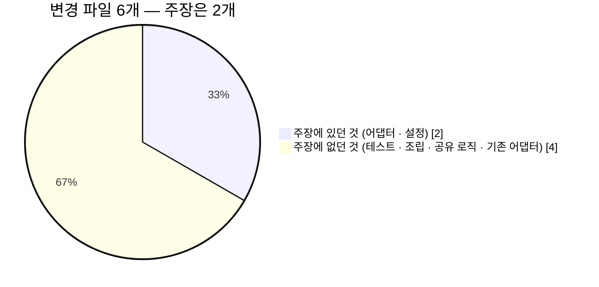
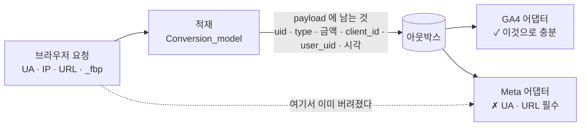
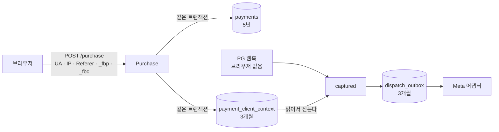

# ADR-005 · 매체 전송을 채널 어댑터로

**상태**: 확정 (2026-09-07) · **검증 — 주장 일부 수정 (2026-09-14)** · **브라우저 맥락 보존 결정 (2026-09-15)**

## 배경

전환을 GA4와 Meta에 보낸다. 두 개뿐이면 `if ($channel === 'ga4') ... else ...` 로 충분해 보인다.

## 관측

플랫폼 A에 실제로 붙어 있는 매체를 실측했다.

| 계층 | 매체 |
|---|---|
| 태그 관리 | GTM **컨테이너 3개** |
| 분석 | GA4 |
| 검색·디스플레이 | Google Ads **전환 ID 10개 이상** |
| 소셜 | Meta Pixel, X Ads |
| 국내 전용 분석 | 1 |
| DSP·리타게팅 | 2 |
| 글로벌 소셜 (한 매체는 픽셀 3개) | 2 |

→ [조사 요약](../research-method.md)

**매체가 10종 이상이고 계정은 더 많다.** 그리고 전환 ID가 10개 넘는다는 건 **캠페인·계정이 계속 추가된다**는 뜻이다. "광고 매체 연동"의 실체는 일회성 구축이 아니라 **매체 추가·교체가 상시 발생하는 운영**이다.

## 결정

공통 인터페이스 하나와 매체별 어댑터 구현으로 나눈다.

```php
interface ChannelInterface {
    public function name(): string;
    public function send(array $conversion): DispatchResult;   // 변환과 전송을 어댑터 안에서
}
```

> 처음 적은 인터페이스에는 `buildPayload(Conversion)` 이 따로 있었다. 실제 코드는 `send()` 하나로 합쳤고 이 문서만 남아 있었다 — 2026-09-14 검증하면서 발견해 고쳤다. 변환이 매체마다 private 메서드로 들어가서 워커가 알 이유가 없었다.

| 클래스 | 역할 |
|---|---|
| `Ga4Channel` | Measurement Protocol. `client_id` 필요 |
| `MetaChannel` | Conversions API. `event_id`로 픽셀과 중복 제거 |
| `NoopChannel` | 테스트용. 전송 없이 성공 반환 |

워커는 인터페이스만 알고 구현을 모른다. 활성 채널은 설정에서 주입한다.

## 근거

**신규 매체 추가 비용 = 어댑터 클래스 1개 + 설정 1줄.** 워커·아웃박스·재시도·계측 코드는 건드리지 않는다.

이건 취향이 아니라 **관측에 근거한 요구사항**이다. 매체가 2개면 과한 설계지만, 실제 환경은 10개 이상이고 계속 늘어난다.

## 기각한 대안

| 대안 | 기각 사유 |
|---|---|
| `switch` 분기 | 매체가 늘 때마다 워커 코드를 고쳐야 한다. 매체 하나 추가에 회귀 위험 |
| GTM에 전부 위임(클라이언트 태그) | 광고 차단기·브라우저 차단에 그대로 노출. 서버사이드 전송의 이점이 사라짐 |
| 매체별 워커 프로세스 분리 | 컨테이너가 매체 수만큼 늘어난다. t3.small에서 불가능 |
| 외부 CDP/태그 서버 도입 | 비용. 그리고 **직접 구현해봤다는 증명**이 사라진다 |

## 결과

- **얻음**: ~~README에 "신규 매체 추가 시 변경 파일 수 = 2"를 수치로 제시할 수 있다~~ → 실측 6, 이후 매체는 4. 아래 「검증」
- **감수**: 매체 2개만 구현하는 시점에서는 인터페이스가 과해 보인다. **ADR이 그 이유를 설명한다**
- **확장 지점**: `payload` 스키마가 매체마다 크게 달라 공통 DTO를 억지로 만들지 않는다. 어댑터의 `send()` 가 매체별 변환을 전담한다

---

## 검증 (2026-09-14) — 두 번째 실매체를 붙여 봤다

주장은 **"클래스 1개 + 설정 1줄, 변경 파일 2개"** 였다. Meta Conversions API 어댑터를 붙이고 그 커밋(`62cf131`)의 `git diff --stat` 을 셌다.



| 파일 | 줄 | 주장에 있었나 | 왜 필요했나 |
|---|---:|---|---|
| `src/Channel/MetaChannel.php` | +261 | ✓ 클래스 1개 | |
| `.env.example` | +1 | ✓ 설정 1줄 | Graph API 버전. 자격 증명 3줄은 미리 있었다 |
| `tests/Channel/MetaChannelTest.php` | +176 | ✗ | 테스트 없는 어댑터를 "붙였다" 고 할 수 없다. **처음부터 셌어야 했다** |
| `application/libraries/Channels.php` | +28 | △ "1줄" 이라 했지만 | match 1줄 + **자격 증명을 읽는 조립 메서드** 25줄. 매체마다 설정 모양이 달라 공통화가 안 된다 |
| `src/Channel/MinorUnits.php` | +38 | ✗ | 통화 소수 자릿수 변환이 GA4 안에 있었다. 복사하면 통화 추가 때 한쪽을 빠뜨린다 |
| `src/Channel/Ga4Channel.php` | +1 −27 | ✗ **기존 어댑터를 고쳤다** | 위 변환을 꺼낸 자리 |

### 맞은 것

**워커·아웃박스·재시도·계측 코드는 한 줄도 바뀌지 않았다.** 주장의 핵심은 이것이었고, 이건 성립했다. 330개 테스트가 그대로 통과한다.

### 틀린 것 — 셋

**① 파일 수는 2가 아니라 6이다.** 테스트와 조립 코드를 세지 않은 채 주장을 만들었다. 두 번째 매체부터는 공유 로직이 드러나 기존 어댑터까지 건드린다. 세 번째 매체부터는 `MinorUnits` 가 이미 있으므로 **4개(어댑터·테스트·조립·설정)** 가 현실적인 값이다.

**② "재시도 정책은 공통" 이 틀렸다.** 공통 `BackoffPolicy` 는 HTTP 상태만 본다(429·5xx 재시도, 나머지 4xx 포기). Graph API 는 레이트리밋을 **HTTP 400 + 오류 코드(4·17·32·613·80004)** 로 준다. 그대로 쓰면 *기다리면 들어갈 전송을 영구 실패로 버린다.* 어댑터가 본문의 오류 코드를 먼저 봐야 했다. 워커는 안 바뀌었지만 **"재시도 판정은 워커 몫" 이라는 암묵 전제가 틀렸다.**

**③ 어댑터는 전송을 격리하지만 데이터 수집은 격리하지 못한다.** 이게 가장 크다.



Meta 는 `action_source=website` 이벤트에 **`event_source_url` 과 원문 `client_user_agent`(해시 금지)** 를 요구한다. 우리 아웃박스 payload 는 GA4 에 맞춰 얼려 둔 모양이라 둘 다 없다. 어댑터가 아무리 잘 짜여 있어도 **적재 시점에 버린 값은 전송 시점에 만들 수 없다.**

그래서 지금 어댑터는 이 경우 요청을 보내지 않고 `dead` 에 이유를 적는다. `system_generated` 로 바꾸면 통과는 하겠지만, 그 값의 정의는 *자동 결제 갱신 같은 사람 없는 전환* 이라 **사용자가 직접 한 결제를 거짓으로 분류**하게 된다. 지어내지 않았다.

### 실매체로 눌러 봤다 (2026-09-14 저녁, `test_event_code`)

문서만 믿지 않고 실제 자격 증명으로 네 건을 보냈다. 운영 `CHANNELS` 는 `ga4` 그대로 두고 일회성 컨테이너에서 돌렸다.

| | 보낸 것 | 응답 |
|---|---|---|
| A | 지금 아웃박스 payload → 어댑터 | **요청 안 나감.** `dead` + "event_source_url, client_user_agent 없음" |
| B1 | 어댑터 우회 · URL·UA **둘 다 없음** | **HTTP 200** `events_received: 1` |
| B2 | 어댑터 우회 · UA 만 없음 | **HTTP 200** `events_received: 1` |
| B3 | 어댑터 우회 · URL 만 없음 | **HTTP 200** `events_received: 1` |
| C | 브라우저 맥락 넣은 payload → 어댑터 | `sent` · HTTP 200 · 124ms |

**"필수" 필드가 빠져도 Meta 는 200 에 `events_received: 1` 을 준다.** GA4 운영 엔드포인트가 틀린 페이로드에 204 를 주던 것과 같은 모양이다. 받았다는 것은 **처리했다는 뜻이 아니다** — 이 프로젝트에서 두 번째로 만난 "접수 ≠ 반영" 이다.

**Events Manager 테스트 이벤트 탭 (전송 후 약 20분, 사용자 확인):** B1·B2·B3·C **네 건 모두 `구매 · 처리됨 · 서버 · 직접 설정`**. 목록의 경고(⚠) 열은 네 건 모두 비어 있다. 즉 필수 필드가 없어도 **접수뿐 아니라 테스트 처리 단계까지 통과**했다. 행을 펼친 상세도 경고가 없다. **보낸 것을 그대로 되비출 뿐이다.**

| | URL | 사용자 데이터 키 |
|---|---|---|
| B1 | — | 외부 ID |
| B2 | ✓ | 외부 ID |
| B3 | — | 외부 ID, 사용자 에이전트 |
| C | ✓ | 외부 ID, IP 주소, 사용자 에이전트 |

즉 **테스트 도구는 형식을 확인하지 쓸모를 확인하지 않는다.** 네 건 중 무엇이 광고 최적화에 쓰일 수 있는지는 이 화면에 없다. 그 척도는 운영 이벤트에만 매겨지는 이벤트 매칭 품질(EMQ)과 진단 탭이고, 둘 다 테스트 이벤트로는 잴 수 없다.

그리고 B1 이 사실상 **매칭될 수 없는 이벤트**라는 것은 구조에서 나온다. 외부 ID 는 픽셀이 같은 값을 보냈을 때만 사람과 이어지는데, 이 사이트에는 픽셀이 없다. `sent` 행이 쌓여도 매체 입장에서는 누구의 구매인지 모르는 구매다 — GA4 에서 본 "도달 100%" 와 같은 함정의 매체판이다.

그래서 어댑터의 사전 거절(A)을 **풀지 않는다.** 푸는 조건은 "Meta 가 받아 준다" 가 아니라 "받은 이벤트가 사람과 이어진다" 여야 하고, 그건 브라우저 맥락(UA·IP·`_fbp`)을 보존하는 아래 결정이 먼저다.

### 이 발견이 드러낸 결정

payload 를 넓히면 끝나는 문제가 아니다. **개인정보 결정과 충돌한다.**

| 경로 | 브라우저 맥락 | 충돌 |
|---|---|---|
| `/conversion` (브라우저가 직접 부름) | 요청에 있다 | 원문 UA·IP 를 아웃박스에 넣어야 한다. 그런데 `visits` 는 **해시만 저장**하기로 했고([data-model 2장](../data-model.md)), `dispatch_outbox` 는 **(당시) 파기 대상이 아니었다** — 원문이 기한 없이 남는다 |
| 결제 웹훅 (PG 서버가 부름) | **없다** | PG 요청에는 사용자 브라우저가 없다. `/purchase` 시점에 남겨야 하는데, `payments` 는 5년 보존 테이블이다 |
| 기본 `Referer` | 오리진만 온다 | `lp.` → `api.` 는 크로스오리진이라 브라우저 기본 정책(`strict-origin-when-cross-origin`)이 경로를 잘라낸다. 페이지 URL 이 필요하면 본문으로 받아야 한다 |

처음 검토한 선택지:

1. **전송 후 지운다** — payload 에 원문을 넣고, `sent`/`dead` 가 되는 순간 그 필드를 비운다. 원문 보존 기간 = 재시도 창(백오프 합계 약 4시간 42분). 웹훅 경로는 여전히 못 푼다
2. **Meta 는 브라우저 픽셀로만** — 서버 전송을 포기한다. 광고 차단기에 그대로 노출된다(이 ADR 이 기각한 대안 2)
3. **결제 전환은 CAPI 로 보내지 않는다** — `/conversion` 경로만 1번으로. 가장 중요한 전환(결제)이 빠진다

처음 권고는 1번이었다. **실무에서 보편적인 방식을 확인하고 바꿨다.**

- 서버 전송을 붙이는 흔한 구성(커머스 플랫폼 연동, 서버 측 태그 컨테이너)은 **결제를 시작하는 시점에 브라우저 맥락을 주문과 함께 저장**하고, 결제 확정 때 꺼내 보낸다. 웹훅 경로가 이것으로 풀린다
- "보내고 즉시 지운다" 는 드물다. 재시도·사후 대조의 근거가 사라지기 때문이다. **짧은 기한을 정해 보관**하는 쪽이 일반적이다

### 결정 (2026-09-15) — 별도 테이블 · 3개월 · `/purchase` 에서 수집



| 판단 | 이유 |
|---|---|
| **별도 테이블** `payment_client_context` | `payments` 는 5년, 이 값은 방문기록과 같은 3개월. 보존기간이 다른 데이터를 한 테이블에 두면 파기가 한 줄 `DELETE` 로 끝나지 않는다 → [data-model 7장](../data-model.md) |
| **FK CASCADE** | `payments.visit_id` 에는 FK 를 걸지 않았다(부모 `visits` 가 먼저 사라진다). 여기는 **자식이 먼저 사라지므로** FK 가 파기를 막지 않는다 |
| **`visits` 는 해시 그대로** | 어트리뷰션에 원문이 필요 없다는 판단은 여전히 맞다. 원문은 **매체 전송이라는 다른 목적**으로, 기한을 정해 여기에만 둔다 |
| **URL 은 우리 도메인 https 만, 쿼리·조각은 버린다** | 결제 페이지 쿼리에 이메일·토큰이 실리는 일이 흔하고, 그걸 광고 매체로 넘기면 안 된다 |
| **형식이 틀린 `_fbp`·`_fbc` 는 받지 않는다** | 매체는 틀린 값을 거절하지 않는다(위 실측). 틀린 값을 보내느니 안 보낸다 |
| **`dispatch_outbox` 도 3개월 파기** | 원문이 payload 로 복사된다. 마이그레이션 주석이 "전송 완료 90일 뒤" 라고 약속만 해 두고 파기 배치에 없던 자리이기도 했다 |
| **픽셀은 코드만, 기본 꺼짐** (`META_PIXEL_BROWSER=false`) | 켜면 `_fbp` 가 생겨 매칭이 강해지지만 쿠키 고지·처리방침(행태정보·국외이전) 문구가 먼저다. PageView 와 쿠키 발급만 하고 **전환은 서버만 보낸다** — 결제 확정은 웹훅이라 브라우저가 그 시점의 `event_id` 를 모르고, 합칠 키 없는 이중 전송이 된다 |
| **Origin 이 우리 도메인일 때만 싣는다** | `/purchase` · `/conversion` 모두 서버 간 호출로도 불린다. 그때의 UA·IP 는 서버의 것이라, 사용자 브라우저라고 보내면 지어낸 값이다 |

**`/conversion` 도 싣는다 (09-15).** 크로스오리진이라 `Referer` 에 경로가 없어(위 표) **본문 `page_url`** 로 받는다. 틀린 `page_url` 은 422 가 아니라 버린다 — 광고 부가 정보 때문에 전환을 잃지 않는다. 검증 규칙은 두 경로가 `src/Attribution/ClientContext` 하나를 쓴다.

### 종단 실측 (2026-09-15 00:13 KST, 운영 서버)

`CHANNELS=meta` 로 앱만 잠시 바꿔 **실제 HTTP 경로**를 한 번 관통시켰다. 끝나면 `trap` 으로 `ga4` 로 되돌렸다.

```
POST app./purchase     UA "Mozilla/5.0 (e2e-probe)" · Referer …/coins/checkout?email=…#frag
                       Cookie _fbp=fb.1.1757900000000.1234567890; _fbc=not-valid
  → payment_client_context
       client_user_agent  Mozilla/5.0 (e2e-probe) touchpoint
       client_ip_address  (있음)
       event_source_url   https://app.<도메인>/coins/checkout      ← 쿼리·조각 제거됨
       fbp                fb.1.1757900000000.1234567890
       fbc                NULL                                      ← 형식 불일치로 거절됨
cli/pg send … captured → 200 applied
  → dispatch_outbox(meta) payload 키
       fbp · type · currency · user_uid · client_id · value_minor · conversion_uid
       event_source_url · occurred_at_unix · client_ip_address · client_user_agent
MetaChannel(같은 payload) → sent · HTTP 200 · 468ms
cli/purge plan → payment_client_context · dispatch_outbox 두 대상 모두 쿼리 정상
```

> **이 실측에서는 워커로 보내지 않고 어댑터를 직접 불렀다** (같은 날 아침 워커로 다시 관통 — 아래). 워커 컨테이너가 `profiles: ["worker"]` 뒤에 있어 09-12 22:49 이후 떠 있지 않았고, 대기 행이 9건(`noop` 3 · `ga4` 6, 전부 실험 트래픽) 쌓여 있었다. 워커를 켜면 그 9건이 운영 GA4 로 나가거나 `어댑터 없음` 으로 dead 가 된다. 어댑터와 payload 는 워커가 쓰는 것과 같다.

### 수정된 주장

> **신규 매체 = 어댑터 + 테스트 + 조립 메서드 + 설정. 워커·아웃박스·재시도 루프는 건드리지 않는다.**
> **단, 매체가 요구하는 데이터를 적재 시점에 이미 버렸다면 어댑터로 해결되지 않는다 — 그건 수집 계약의 변경이다.**

### 워커로 관통 (2026-09-15 07:36 KST)

워커를 되살린 뒤(아래) 세 경로를 **실제 워커**로 흘렸다. `CHANNELS=meta` 로 두고 끝나면 `ga4,meta` 로 바꿨다.

| 경로 | 요청 | 결과 |
|---|---|---|
| `/purchase` → 웹훅 | 브라우저 (`Origin` · `Referer …?token=secret` · `_fbp`) | 맥락 저장(쿼리 제거) → **sent** · 200 · 924ms |
| `/purchase` → 웹훅 | 서버 간 (`Origin` 없음, UA `backoffice-server/1.0`) | 맥락 **저장 안 함** → **dead** · 요청 안 나감 · "event_source_url, client_user_agent 없음" |
| `/conversion` | 브라우저 (`Origin` · `page_url …/works/8733?utm_source=meta#top` · `_fbp`) | `https://lp.<도메인>/works/8733` 로 저장 → **sent** · 200 · 1314ms |

두 번째 줄이 의도한 결과다. 서버의 UA 를 사용자 것이라고 보내지 않았고, 왜 안 보냈는지가 행에 남았다.

**운영 전송으로 전환했다 (2026-09-15 07:57 KST).** `META_TEST_EVENT_CODE` 를 비우고 app·worker 를 재생성했다(엣지 resolver 수정 뒤라 무중단). 이제 Meta 로 가는 이벤트는 테스트 탭이 아니라 데이터 세트에 집계되고, 매칭 품질(EMQ)은 **실제 전환이 쌓인 뒤에야** 잴 수 있다 — 전환 직후의 빈 화면으로 판정하지 않는다.
