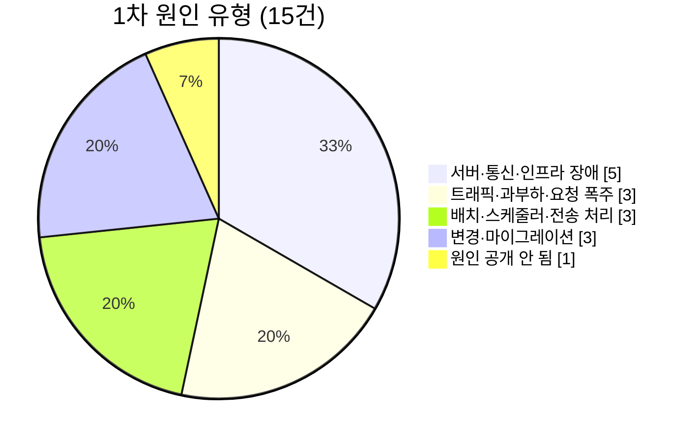

# 결제·이체 불일치 실제 사고 조사

> 조사일 2026-09-16 · 공개 기사·규제기관 발표로 확인한 것만 적었다.
> "돈은 나갔는데 받는 쪽에 안 들어감", 이중 출금, 입금 지연·누락처럼 **출금과 입금이 어긋난** 사고를 모았다.

## 먼저 적어 둘 것

- **"큐가 넘쳐서" 를 원인으로 공식 발표한 공개 사례는 찾지 못했다.** 가장 가까운 것은 요청 폭주로 중앙 시스템이 막힌 UPI(3), 배치가 밀려 처리가 쌓인 RBS·HSBC(9·10)다.
- **"출금됐는데 상대가 못 받음" 이 기사로 직접 확인된 것**은 카카오페이(4)와 UPI 의 구조(3)다. 나머지는 지연·중복·잔액 불일치로 같은 계열이다.
- 원인은 **발표된 표현 그대로** 옮겼다. 원인이 공개되지 않은 사고는 "공개 안 됨" 으로 적었다.

## 한눈에

| # | 사고 | 날짜 | 유형 | 무엇이 어긋났나 |
|---|---|---|---|---|
| 1 | 네이버페이 DB 과부하 | 2026-02-19 | 트래픽 | 결제·포인트·가맹점 승인 실패 |
| 2 | 우리은행 앱 월급날 폭주 | (보안뉴스 보도) | 트래픽 | 앱 먹통 |
| 3 | 인도 UPI 상태 조회 폭주 | 2025-04-12 | 트래픽·요청 폭주 | 성공률 약 50%, 출금 후 미입금 구조 |
| 4 | 카카오페이 데이터센터 화재 | 2022-10-15 | 인프라 | **출금됐는데 수취인 미입금** |
| 5 | Visa 유럽 스위치 부분 고장 | 2018-06-01 | 인프라 | 520만 건 처리 실패, **중복 승인** |
| 6 | 일본 전은 시스템 중계기 교체 | 2023-10-10 | 인프라·변경 | 타행 이체 이틀 중단 |
| 7 | FIS 정전 → Capital One 외 26개 은행 | 2025-01-15 | 인프라(외부 처리사) | 입금·결제 최대 5일 지연 |
| 8 | Barclays 메인프레임 OS 결함 | 2025-01-31 | 인프라 | 결제 시도의 56% 실패 |
| 9 | RBS·NatWest 배치 스케줄러 업그레이드 | 2012-06 | 배치 | 1,200만 계좌 반영 중단 |
| 10 | HSBC Bacs 전송 결함 | 2015-08-28 | 전송 처리 | 급여 등 27.5만 건 보류 |
| 11 | Bank of America Zelle 지연 | 2023-01 | 전송 처리 | 이체 지연·잔액 오표시 |
| 12 | 토스 자동이체 중복 출금 | 2026-06-01 | 변경 | **2만 1천 건 이중 출금 · 21억 원** |
| 13 | Santander UK 예약 이체 중복 | 2020-12-25 | 변경(스케줄링) | **7.5만 건 이중 지급 · £1.3억** |
| 14 | TSB 코어뱅킹 이전 | 2018-04 | 변경(마이그레이션) | 거래 누락·틀린 잔액·타인 정보 노출 |
| 15 | Wells Fargo 급여 입금 누락 | 2023-03 · 08 | 공개 안 됨 | 급여 미반영·잔액 오표시 |

참고: Cash App 카드 이중 청구(2023-06, 원인 공개 안 됨).

---

## A. 트래픽·과부하

### 1. 네이버페이 — 포인트 이벤트로 DB 과부하 (2026-02-19)

- **현상** 정오부터 몇 시간 동안 결제·주문·포인트 조회 실패. 오프라인 가맹점의 포인트·머니 결제와 머니카드 승인도 막혔다.
- **원인** 포인트 적립 이벤트가 DB 서버에 과부하를 일으켰다. 금감원은 프로그램 변경 때 **성능 검토와 부하 테스트를 하지 않았다**고 지적했다.
- **교훈** 이벤트성 트래픽은 "평소 부하" 가 아니다. 변경과 트래픽이 겹치는 날 사고가 난다.

### 2. 우리은행 앱 — 월급날 접속 몰림

- **현상** 25일 월급날 앱 먹통.
- **원인** 접속 몰림으로 보도됐다(공식 원인 발표는 확인하지 못했다).

### 3. 인도 UPI — "거래 상태 확인" 요청 폭주 (2025-04-12)

- **현상** 11:40~16:40 약 5시간, 거래 성공률 약 50%.
- **원인** 일부 은행이 "Check Transaction Status" API 를 **응답을 기다리지 않고** 과도하게 호출해 NPCI 서버가 혼잡해졌다.
- **조치** NPCI 가 첫 상태 조회는 원 거래 **90초 뒤**, **최대 3회**(가급적 2시간 안)로 제한.
- **구조적 배경** UPI 에는 "출금됐는데 수취인 미입금" 을 **T+1일 안에 원복**하고, 늦으면 **하루 ₹100 자동 보상**하는 RBI 규정이 있다. 그만큼 이 불일치가 흔하다.
- **교훈** 결과를 모르는 쪽의 재조회·재시도가 장애를 키운다. 재시도에는 **간격과 상한**이 있어야 한다.

## B. 서버·통신·인프라 장애

### 4. 카카오페이 — 데이터센터 화재 후 재해복구 전환 (2022-10-15~17)

- **현상** 계좌에서 출금은 됐는데 **송금 내역에도 없고 수취인도 받지 못한** 사례가 이틀간 신고됐다.
- **원인** SK C&C 판교 데이터센터 화재. 주 전산센터에서 재해복구센터(가산)로 넘어가는 과정의 처리 공백.
- **대응** 당시 카카오페이는 피해 규모를 "파악하지 못했다" 고 했다. 금감원은 16일 19시께 대부분 정상화됐다고 밝혔다.
- **교훈** 출금과 송금 기록이 **다른 시점·다른 시스템**에 남으면, 그 사이에 끊겼을 때 **대사(reconciliation) 없이는 피해 규모조차 모른다.**

### 5. Visa 유럽 — 데이터센터 스위치 부분 고장 (2018-06-01)

- **현상** 약 10시간. 유럽 전체 5,120만 건 중 **520만 건 처리 실패**(영국 2,760만 건 중 240만 건).
- **원인** 주 데이터센터의 스위치 부품이 **부분 고장**나 예비 스위치가 넘겨받지 못했다.
- **2차 피해** 사용자가 다시 결제하면서 **같은 결제가 여러 번 승인 대기로 잡혀** 수백 파운드가 묶였다.
- **교훈** 완전 고장보다 부분 고장이 위험하다(절체가 안 일어난다). 그리고 **실패 응답 뒤 재시도가 중복을 만든다** — 멱등 키가 필요한 이유.

### 6. 일본 전은(全銀) 시스템 — 중계 컴퓨터 교체 후 오류 (2023-10-10~11)

- **현상** MUFG 등 11개 대형 은행의 타행 이체 이틀간 중단. 100만 명 이상 영향.
- **원인** 은행과 중앙망을 잇는 **중계 컴퓨터(RC)를 교체한 뒤** 은행 간 수수료 계산 처리에서 오류.
- **규모** 전은 시스템은 하루 650만 건 · 약 810억 달러를 처리한다. **1973년 가동 이후 첫 장애.**
- **대응** 보상 결정.
- **교훈** 50년 무사고여도 **교체 한 번**에 멈춘다. 금액 계산 로직은 교체 전후로 같은 답을 내는지 검증해야 한다.

### 7. FIS 정전 → Capital One 외 26개 은행 (2025-01-15~19)

- **현상** 입금·결제·이체 지연 최대 5일. 문의의 **90% 가 입금**. 급여일과 겹쳐 월급을 못 받았다.
- **원인** 결제·코어뱅킹 외부 처리사 FIS 의 **국지 정전과 하드웨어 고장**.
- **교훈** 외부 처리사 하나가 수십 개 은행을 동시에 멈춘다(제3자 위험).

### 8. Barclays — 메인프레임 운영체제 모듈 결함 (2025-01-31~02-02)

- **현상** 로그인한 사용자의 17% 가 결제를 시도했고 **그중 56% 실패**. 최대 3일.
- **원인** "UK 메인프레임 운영체제의 핵심 모듈 소프트웨어 문제"(하원 재무위원회에 제출한 CEO 서한).
- **시점** 급여일이자 자진신고 세금 마감일 — 임금 미수령·월세 미납.
- **후속** 재무위원회가 9개 은행에 자료를 요구해, 2년간 **최소 803시간**의 계획 외 장애가 드러났다.

## C. 배치·스케줄러·전송 처리

### 9. RBS · NatWest · Ulster — 야간 배치 스케줄러 업그레이드 (2012-06)

- **현상** 1,200만 계좌. 결제 처리가 멈추고, 일부 고객은 **1주일 넘게** 잔액이 수작업으로 맞춰졌다.
- **원인** 계좌 반영을 돌리는 **CA-7 배치 스케줄러**를 업그레이드. 문제를 보고 **테스트 없이 제거(롤백)** 해 더 꼬였다.
- **제재** FCA £4,200만 + PRA £1,400만.
- **교훈** 배치가 하룻밤 밀리면 다음 날 배치 위에 쌓인다. **롤백도 변경이다** — 검증 없이 되돌리면 두 번째 사고다.

### 10. HSBC — Bacs 전송 방식 결함 (2015-08-28)

- **현상** **27.5만 건 보류.** 연휴 직전 금요일 급여가 안 들어왔고, 다른 은행 고객도 영향.
- **원인** HSBC 가 영국 자동이체망 **Bacs 로 데이터를 전송하는 방식**의 문제. Bacs 자체는 정상.
- **교훈** 상대 시스템이 멀쩡해도 **보내는 쪽 형식·전송 결함**으로 전체가 멈춘다.

### 11. Bank of America · Zelle — 이체 지연 (2023-01-14~17 거래분)

- **현상** 이체 반영 지연, 잔액 오표시. 은행은 "사라진 게 아니라 지연" 이라고 공지.
- **원인** Zelle 은 BoA 내부 문제라고 했다(구체 원인 공개 안 됨).
- **교훈** 고객에게 **지연과 유실은 구분되지 않는다.** 시스템은 둘을 구분해 말할 수 있어야 한다.

## D. 변경·마이그레이션 결함

### 12. 토스 — 자동이체 중복 출금 (2026-06-01)

- **현상** 여러 금융사 간 자동이체를 걸어 둔 고객 약 **1만 5천 명**, **2만 1천 건**이 두 번 출금 · **21억 4천만 원**.
- **원인** 자동이체 처리 전산 오류. 금감원은 **프로그램 변경에 제3자 검증과 충분한 사전 테스트가 없었다**고 지적.
- **대응** 신청 없이 **선지급 반환**, 재발 방지 조치.
- **교훈** 예약·반복 작업은 "한 번만 실행됐는가" 를 실행하는 쪽이 보장해야 한다.

### 13. Santander UK — 예약 이체 중복 실행 (2020-12-25)

- **현상** 기업 고객 2,000곳의 예약 이체 **7.5만 건이 두 번** 나가 **£1.3억** 이중 지급(급여를 두 번 받은 직원, 대금을 두 번 받은 공급자).
- **원인** 스케줄링 오류.
- **대응** 은행 자금으로 나갔고, 수취 은행과 협조해 회수.

### 14. TSB — 코어뱅킹 플랫폼 이전 (2018-04)

- **현상** 고객 520만 명 중 상당수: **거래 누락·틀린 잔액·타인 계좌 정보 노출**. 지점·전화·인터넷·모바일 전 채널 장애.
- **원인** 데이터 이전은 됐으나 새 플랫폼이 즉시 기술 장애. 규제기관은 이전 프로그램 관리와 **외부 공급사 위험 관리 실패**를 지적.
- **제재·보상** 벌금 £4,865만, 고객 보상 £3,270만.

### 15. Wells Fargo — 급여 입금 누락 표시 (2023-03 · 2023-08)

- **현상** 급여가 계좌에 반영되지 않고 잔액이 틀리게 보였다. **한 해에 두 번.**
- **원인** "기술적 문제"(구체 원인 공개 안 됨). 수수료 환불.

---

## 공통 패턴

1. **재시도가 사고를 키운다** — Visa 의 중복 승인, UPI 의 조회 폭주. → 멱등 키, 재시도 간격·상한.
2. **출금과 입금이 다른 곳에 기록된다** — 카카오페이, UPI, 전은. → 사후 대사, 자동 원복 기한.
3. **트래픽보다 변경이 계기인 사고가 많다** — 1차 분류와 별개로 RBS·전은·TSB·토스·네이버페이 5건이 업그레이드·교체·이전·프로그램 변경에서 시작했고, 전부 테스트·검증·롤백 절차가 빠져 있었다.
4. **몰리는 날에 터진다** — 급여일, 연휴 직전, 세금 마감, 이벤트.
5. **"사라짐" 과 "늦음" 을 고객은 구분하지 못한다** — Zelle, Wells Fargo, FIS.

→ 이 중 이 프로젝트의 테스트 코드로 재현·검증할 수 있는 것: [testable-cases.md](testable-cases.md)

## 출처

- Visa — [FinTech Futures](https://www.fintechfutures.com/paytech/visa-reveals-over-5m-payments-affected-by-june-outage) · [Computer Weekly](https://www.computerweekly.com/news/252443325/Visa-reveals-rare-datacentre-switch-fault-as-root-cause-of-June-2018-outage) · [MoneySavingExpert](https://www.moneysavingexpert.com/news/2018/06/visa-customers-hit-with-multiple-transactions-on-their-card-after-outage---heres-what-to-do-/)
- TSB — [FCA](https://www.fca.org.uk/news/press-releases/tsb-fined-48m-operational-resilience-failings) · [Bank of England](https://www.bankofengland.co.uk/news/2022/december/tsb-fined-for-operational-resilience-failings)
- Santander — [Banking Dive](https://www.bankingdive.com/news/santander-finds-itself-in-a-citi-moment-with-175m-error/616690/) · [NBC News](https://www.nbcnews.com/business/business-news/bank-accidentally-deposits-176-million-peoples-accounts-christmas-day-rcna10538)
- Capital One / FIS — [American Banker](https://www.americanbanker.com/news/capital-ones-five-day-outage-highlights-third-party-risk) · [NBC News](https://www.nbcnews.com/business/business-news/capital-one-acknowledges-outage-users-report-issues-accessing-deposits-rcna187966)
- Barclays — [CEO 서한 (UK Parliament)](https://committees.parliament.uk/publications/46937/documents/242221/default/) · [Treasury Committee](https://committees.parliament.uk/committee/158/treasury-committee/news/205611/more-than-one-months-worth-of-it-failures-at-major-banks-and-building-societies-in-the-last-two-years/)
- UPI — [Inc42](https://inc42.com/buzz/upi-outage-npci-directs-banks-to-limit-check-transaction-api-usage/) · [Business Standard](https://www.business-standard.com/finance/news/npci-directs-upi-members-to-follow-new-api-guidelines-to-avoid-disruptions-125042801443_1.html) · [RBI TAT 정리 (Paytm)](https://paytm.com/blog/payments/upi/upi-money-deducted-not-received-recovery-guide/)
- 카카오페이 — [뉴스프라임](https://www.newsprime.co.kr/news/article/?no=582427)
- 토스 · 네이버페이 · 카카오페이(2026) — [머니투데이](https://www.mt.co.kr/finance/2026/06/24/2026062408391385217) · [SBS Biz](https://biz.sbs.co.kr/article/20000314046) · [서울경제](https://www.sedaily.com/article/20051249)
- 네이버페이 — [서울신문](https://m.go.seoul.co.kr/news/economy/2026/02/19/20260219500237?cp=en) · [전자신문](https://www.etnews.com/20260219000254)
- 우리은행 — [보안뉴스](https://m.boannews.com/html/detail.html?idx=110967)
- RBS — [FCA](https://www.fca.org.uk/news/press-releases/fca-fines-rbs-natwest-and-ulster-bank-ltd-%C2%A342-million-it-failures) · [Wikipedia](https://en.wikipedia.org/wiki/2012_RBS_Group_computer_system_problems)
- HSBC — [PYMNTS](https://www.pymnts.com/news/2015/hsbcs-technology-glitch-halts-275000-payments/) · [ITV News](https://www.itv.com/news/story/2015-08-29/hsbc-says-all-delayed-payments-now-processed/)
- 전은 — [The Japan Times](https://www.japantimes.co.jp/business/2023/10/18/companies/payments-clearing-system-glitch-compensation/) · [UPI.com](https://www.upi.com/amp/Top_News/World-News/2023/10/10/Japan-electronic-clearing-network-glitch-hits-banks/5951696940757/)
- Bank of America Zelle — [TIME](https://time.com/6248246/bank-of-america-zelle-missing-money/) · [NPR](https://www.npr.org/2023/01/18/1149807625/bank-of-america-zelle-customers-problems)
- Wells Fargo — [NBC News](https://www.nbcnews.com/business/business-news/wells-fargo-says-technical-issue-causing-customers-report-missing-depo-rcna74419) · [CNN](https://www.cnn.com/2023/08/05/business/wells-fargo-says-bank-deposit-glitch-is-resolved/index.html)
- Cash App — [FOX 9](https://www.fox9.com/news/cash-app-card-double-charge-issue-negative-account-balance)
