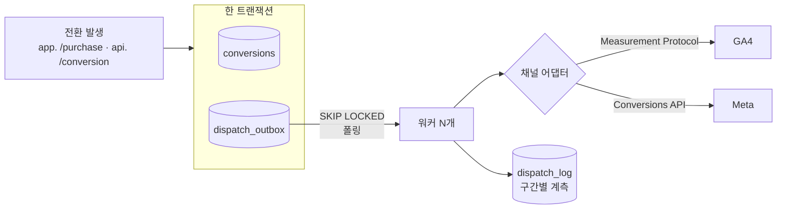

# 아웃박스와 채널 어댑터 — 만들고 적용하기

> 전환을 매체로 되돌려 보내는 구간의 구현 안내서.
> 결정의 근거는 [ADR-003](decisions/ADR-003-mysql-outbox.md) · [ADR-004](decisions/ADR-004-skip-locked.md) · [ADR-005](decisions/ADR-005-channel-adapter.md) 에 있고, 여기서는 **무엇을 어떤 순서로 만드는지**를 적는다.

---

## 1. 만들 것



**규칙 하나로 요약하면**: 전환을 기록하는 트랜잭션 안에서 **외부 HTTP 를 부르지 않는다.**

---

## 2. 왜 아웃박스인가 — 오늘 얻은 근거

[ADR-003](decisions/ADR-003-mysql-outbox.md) 의 원래 근거는 *"매체가 느리면 결제 트랜잭션이 같이 길어지고, 매체가 죽으면 결제가 같이 실패한다"* 였다. 맞는 말이지만 반쯤이다.

2026-09-12 의 [B-2·B-3 실측](failure-scenarios.md)이 나머지 반을 줬다.

| 실측 | 뜻 |
|---|---|
| CORS 로 차단된 `fetch` 요청이 **서버에는 기록돼 있었다** | 클라이언트는 실패로 아는데 서버는 성공이다 |
| 스크립트가 받은 것은 `TypeError: Failed to fetch` 뿐 | **왜 실패했는지 알 수 없다** |
| `sendBeacon` 의 반환값은 "큐에 넣었다" 이지 "받았다" 가 아니다 | **성공했는지 알 수 없다** |

> **클라이언트 전송은 어느 경로든 결과를 확인할 수 없다.**
> 그래서 "브라우저가 매체로 직접 보낸다" 는 구조에는 재시도를 붙일 수가 없다 — 무엇을 재시도할지 모르기 때문이다.
> 서버 큐는 **재시도할 대상이 행으로 남아 있다.** 이것이 아웃박스의 본질이고, 서드파티 쿠키 폐지 여부와는 무관하다.

---

## 3. 트랜잭션 경계 — 지켜야 할 선

```php
$this->db->trans_begin();

// 전환 기록
$conversionId = $this->conversion_model->create($payload);

// 보낼 것 적재 — 채널 수만큼 행이 생긴다
foreach ($this->channels->names() as $channel)
{
    $this->outbox_model->enqueue($conversionId, $channel, $payload);
}

$this->db->trans_commit();

// ★ 외부 HTTP 는 여기 밖에서. 워커가 한다.
```

| 안에 두면 안 되는 것 | 왜 |
|---|---|
| 매체 API 호출 | 상대가 느리면 잠금이 그만큼 길어진다. 상대가 죽으면 결제가 같이 실패한다 |
| 알림 발송(SMS·푸시) | 같은 이유. 그리고 롤백해도 이미 나간 문자는 돌아오지 않는다 |
| 이미지 업로드 | 같은 이유 |

**커밋이 곧 "보내기로 확정됨" 이다.** 롤백되면 아웃박스 행도 함께 사라지므로 "전환은 없는데 전송은 나갔다" 가 구조적으로 불가능해진다.

---

## 4. 이미 있는 것

새로 만들 필요가 없다. 확인만 한다.

| 것 | 어디 | 상태 |
|---|---|---|
| `dispatch_outbox` · `dispatch_log` 테이블 | `application/migrations/20260909000500_*` | 적용됨 |
| 폴링 인덱스 `(status, next_retry_at, id)` | `application/migrations/20260909000700_*` | 별도 마이그레이션 — 있음/없음 비교용 |
| 재시도 간격·지터 | `src/Dispatch/BackoffPolicy.php` | 단위 테스트 있음 |
| 워커 진입점과 선점 쿼리 | `application/controllers/cli/Dispatch.php` | **골격만.** 전송이 비어 있다 |
| 워커 컨테이너 | `docker-compose.yml` 의 `worker` 프로파일 | `--scale worker=4` 가능 |

```bash
docker compose exec app php public/index.php cli/migrate current
grep -n "TODO(Phase 1)" application/controllers/cli/Dispatch.php
```

---

## 5. 만들 순서

의존 순서대로다. 각 단계가 끝나면 그 자리에서 검증할 수 있게 배치했다.

### 5-1. 채널 계약 (`src/Channel/`) — 프레임워크 비의존

```
src/Channel/ChannelInterface.php   보낼 수 있는 것의 계약
src/Channel/DispatchResult.php     성공 여부 · HTTP 상태 · 소요 시간 · 오류 원문
src/Channel/HttpClient.php         인터페이스. 테스트에서 갈아끼운다
src/Channel/CurlHttpClient.php     운영용 구현
src/Channel/NoopChannel.php        아무 데도 안 보낸다. 파이프라인만 검증할 때
```

```php
interface ChannelInterface
{
    /** 매체 코드. dispatch_outbox.channel 에 들어가는 값 */
    public function name(): string;

    /** 전환 payload 를 매체 규격으로 바꿔 보낸다 */
    public function send(array $payload): DispatchResult;
}
```

> **`HttpClient` 를 인터페이스로 두는 것이 핵심이다.** 이게 없으면 GA4 페이로드 매핑을 확인하려고 매번 구글에 실제 요청을 보내게 된다. 가짜 클라이언트를 끼우면 **무엇을 보내려 했는지**를 단위 테스트로 못박을 수 있다.

### 5-2. GA4 어댑터 (`src/Channel/Ga4Channel.php`)

페이로드 매핑이 전부다. 규격은 아래 7장.

### 5-3. CI3 브리지 (`application/libraries/Channels.php`)

```php
class Channels
{
    public function all();     // .env 의 CHANNELS=ga4,meta 를 읽어 어댑터 배열
    public function names();   // 아웃박스 적재용 이름 목록
}
```

DI 컨테이너를 넣지 않는다. 어댑터가 3~4개다 → [ADR-017](decisions/ADR-017-ci3-application-structure.md) ②

### 5-4. 아웃박스 모델 (`application/models/Outbox_model.php`)

```
enqueue($conversionId, $channel, $payload)      INSERT — 중복은 UNIQUE 가 막는다
claim($limit)                                   SELECT ... FOR UPDATE SKIP LOCKED + 상태 변경
markSent / markFailed / markDead
reclaimZombies($olderThanSeconds)               sending 에 멈춘 행을 pending 으로
```

### 5-5. 워커 완성 (`application/controllers/cli/Dispatch.php`)

골격의 `TODO(Phase 1)` 자리를 채운다.

---

## 6. 워커 루프 — 순서가 중요하다

```
① 트랜잭션 시작
② SELECT ... FOR UPDATE SKIP LOCKED LIMIT N
③ 그 자리에서 status = 'sending', attempt + 1
④ 커밋                       ← 잠금을 여기서 푼다
⑤ 외부 HTTP 전송             ← 트랜잭션 밖
⑥ 결과에 따라 sent / failed(next_retry_at) / dead
⑦ dispatch_log 에 구간별 시간 기록
```

| 왜 이 순서인가 | |
|---|---|
| ③을 ②와 같은 트랜잭션에 | 잠금을 풀고 나서 상태를 바꾸면 그 틈에 다른 워커가 같은 행을 집는다 |
| ⑤를 커밋 뒤에 | 외부 HTTP 를 잠금 안에 두면 상대가 느린 만큼 잠금이 길어진다 |
| `sending` 상태를 따로 | 워커가 ⑤에서 죽으면 행이 `sending` 에 남는다. **좀비 회수 배치**가 일정 시간 지난 것을 `pending` 으로 되돌린다 |

> **⑤에서 죽는 경우를 설계에 넣어야 한다.** 넣지 않으면 그 행은 영원히 `sending` 이고 아무도 다시 보내지 않는다. 조용히 사라지는 종류의 실패다.

### 재시도와 포기

`src/Dispatch/BackoffPolicy.php` 가 이미 정한다. 판정만 옮겨 적으면 된다.

| 응답 | 판정 |
|---|---|
| 2xx | `sent` |
| 408 · 429 · 5xx · 타임아웃 | 재시도 (백오프 + 지터) |
| 그 외 4xx | **즉시 `dead`.** 다시 보내도 같은 답이 온다 |
| `MAX_ATTEMPTS` 초과 | `dead` |

지터를 섞는 이유: 매체가 잠시 죽었다 살아나면 실패한 전송이 전부 같은 시각에 재시도되어 **막 회복한 매체를 다시 넘어뜨린다.**

---

## 7. GA4 Measurement Protocol — 규격과 함정

> 아래 URL 과 동작은 2026-09-12 에 [공식 문서](https://developers.google.com/analytics/devguides/collection/protocol/ga4/validating-events)에서 확인했다. 기억으로 쓰지 않는다.

### 엔드포인트

```
운영   POST https://www.google-analytics.com/mp/collect?measurement_id=G-XXXX&api_secret=YYYY
검증   POST https://www.google-analytics.com/_debug_/mp/collect?measurement_id=G-XXXX&api_secret=YYYY
```

**검증 경로는 `/_debug_/mp/collect` 다.** 언더스코어가 앞뒤로 붙는다 — `/debug/mp/collect` 가 아니다.

### 가장 중요한 함정

> "The Google Analytics Measurement Protocol does not return `HTTP` error codes, even if an event is malformed or missing required parameters."
> — 공식 문서, *Validating events*

**운영 엔드포인트는 페이로드가 틀려도 2xx 를 준다.** 그래서

- HTTP 상태만 보고 `sent` 로 넘기면 **틀린 페이로드가 조용히 버려진다**
- "전송 성공률 99%" 같은 지표가 아무것도 보장하지 않게 된다

대응은 넷이다.

1. `.env` 의 `GA4_DEBUG=true` 면 **검증 엔드포인트**로 보내고 `validationMessages` 를 본다
2. 검증 메시지가 비어 있지 않으면 **`dead`** 로 보낸다. 재시도해도 같은 답이다
3. 운영 전환 전에 각 이벤트 타입을 한 번씩 검증 경로로 통과시킨다
4. 최종 확인은 GA4 **실시간 보고서**와 **DebugView** 로 한다 — HTTP 응답이 아니라 **데이터가 도착했는지**를 본다

검증 응답 모양:

```json
{
  "validationMessages": [
    {
      "fieldPath": "events",
      "description": "Event at index: [0] has invalid name [_badEventName].",
      "validationCode": "NAME_INVALID"
    }
  ]
}
```

### 페이로드

```json
{
  "client_id": "1234567890.1700000000",
  "user_id": "01a08c02db59781d9a4425880d006636",
  "timestamp_micros": 1757673600000000,
  "non_personalized_ads": false,
  "events": [{
    "name": "purchase",
    "params": {
      "transaction_id": "01J8XKP2M4",
      "currency": "KRW",
      "value": 9900,
      "engagement_time_msec": 1,
      "session_id": "1757673600"
    }
  }]
}
```

| 필드 | 비고 |
|---|---|
| `client_id` | **웹 스트림의 필수값.** gtag 가 만든 `_ga` 쿠키에서 뽑는다 |
| `user_id` | 로그인 사용자. 우리는 `user_uid` 를 쓴다 |
| `timestamp_micros` | **마이크로초**다. 밀리초를 넣으면 1970년으로 간다 |
| `engagement_time_msec` · `session_id` | 없으면 실시간 보고서에 안 잡히는 경우가 있다 |
| `value` | 정수 minor unit 을 그대로 넣지 않는다. KRW 는 소수 0자리라 그대로여도 맞지만, **통화별로 갈리므로 변환 지점을 한 곳에 둔다** |

### 한도 (문서 확인값)

| 항목 | 한도 |
|---|---|
| 요청당 이벤트 | 25 |
| 이벤트당 파라미터 | 25 |
| 이벤트 이름 길이 | 40자 |
| 파라미터 이름 / 값 | 40자 / 100자 |
| 본문 크기 | 130 KB |
| 소급 기록 | **72시간** |

> **72시간 제한이 재시도 정책과 맞물린다.** 백오프 누적이 72시간을 넘으면 그 건은 보내도 집계되지 않는다. `BackoffPolicy` 의 누적이 약 1.2시간이라 여유가 있지만, `dead` 판정 시각을 로그에 남겨 두면 나중에 이 한도에 걸린 건인지 구분할 수 있다.

### `client_id` — 이 프로젝트의 실제 난제

GA4 는 `client_id` 로 사용자를 잇는다. 그 값은 **gtag 가 광고주 도메인에 심은 `_ga` 쿠키**에 있다.

| 방법 | 판정 |
|---|---|
| 서버가 `_ga` 쿠키를 직접 읽는다 | **채택.** `Domain=.sshwan.com` 이라 `api.` 에서도 읽힌다 |
| `track.js` 가 읽어 본문에 담는다 | 보조. `_ga` 는 `HttpOnly` 가 아니라 읽을 수 있다 |
| 없으면 `visit_uid` 로 대체 | **마지막 수단.** 세션이 갈려 신규 사용자로 잡힌다 |

**세 번째를 쓴 건은 그렇게 했다고 기록한다.** 나중에 GA4 수치가 내부 수치와 안 맞을 때 원인을 찾는 단서가 된다.

---

## 8. GA4 속성 만들기 (한 번만)

1. [analytics.google.com](https://analytics.google.com) → 좌하단 **관리**
2. **속성 만들기** → 이름 아무거나, 시간대 `(GMT+09:00) 서울`, 통화 `KRW`
   (보고서 표시에만 영향을 준다. 저장은 계속 UTC 다)
3. **웹** 선택 → 데이터 스트림 만들기 → URL `https://lp.sshwan.com`
4. 스트림 세부정보 우상단 **측정 ID** `G-XXXXXXXXXX` → `.env` 의 `GA4_MEASUREMENT_ID`
5. 같은 화면 아래 **Measurement Protocol API 보안 비밀** → 만들기 → `.env` 의 `GA4_API_SECRET`

```bash
sed -i 's/^GA4_MEASUREMENT_ID=.*/GA4_MEASUREMENT_ID=G-XXXXXXXXXX/' .env
sed -i 's|^GA4_API_SECRET=.*|GA4_API_SECRET=<복사한 값>|' .env
docker compose up -d --force-recreate app
```

> **API secret 은 서버 전용이다.** `track.js` 에 절대 넣지 않는다. 넣으면 누구나 우리 속성에 아무 이벤트나 쏠 수 있다.

---

## 9. 멱등성 — 같은 전환이 두 번 가지 않게

세 겹이다. 겹치는 것이 의도다.

| 겹 | 무엇을 막는가 |
|---|---|
| `conversions.dedup_key` UNIQUE | **중복 전환이 애초에 안 들어온다** |
| `dispatch_outbox` UNIQUE `(conversion_id, channel)` | 채널당 **적재**가 1건 |
| `FOR UPDATE SKIP LOCKED` | 워커가 여럿이어도 **처리**가 1회 |

여기에 매체 쪽 중복이 하나 더 있다.

> **브라우저 픽셀과 서버 전송이 같은 전환을 두 번 보낸다.**
> Meta 는 `event_id` 를 양쪽에 같은 값으로 넣으면 합쳐 준다. GA4 는 `transaction_id` 가 그 역할을 한다.
> 우리는 `conversion_uid` 를 그 값으로 쓴다 — **한 군데서 나온 값이어야 합쳐진다.**

---

## 10. 계측 — `dispatch_log` 에 무엇을 남기는가

```
parse_ms   페이로드를 매체 규격으로 바꾸는 데 걸린 시간
db_ms      선점·상태 변경에 걸린 시간
send_ms    외부 HTTP 왕복
total_ms   합계
trace_id   엣지에서 이어받은 상관 ID
```

**구간을 나누는 이유**: `total_ms` 하나만 남기면 느릴 때 어디가 느린지 모르고, **"매체가 느리다" 와 "우리 DB 가 느리다" 를 구분하지 못한다.** 구분하지 못하면 고칠 곳을 못 찾는다.

수치는 [benchmarks.md](benchmarks.md) 에 옮겨 적는다. 값을 먼저 정하고 이유를 붙이지 않는다.

---

## 11. 테스트 전략

| 무엇 | 어디 | 어떻게 |
|---|---|---|
| GA4 페이로드 매핑 | `tests/Channel/Ga4ChannelTest.php` | 가짜 `HttpClient` 로 **보내려 한 본문**을 검사 |
| 재시도 판정 | `tests/Dispatch/BackoffPolicyTest.php` | 이미 있음 |
| 한도 초과 처리 | `tests/Channel/Ga4ChannelTest.php` | 이벤트 이름 40자 초과, 파라미터 25개 초과 |
| 워커 동시성 | 수동 | `--scale worker=4` 로 중복 전송 0 확인 |

```php
$http = new FakeHttpClient(204, '{"validationMessages":[]}');
$ga4  = new Ga4Channel($http, 'G-TEST', 'secret', TRUE);   // debug = TRUE

$ga4->send($conversion);

self::assertStringContainsString('/_debug_/mp/collect', $http->lastUrl);
self::assertSame('purchase', $http->lastJson()['events'][0]['name']);
self::assertSame(9900, $http->lastJson()['events'][0]['params']['value']);
```

---

## 12. 검증 체크리스트

```bash
# ② 워커 하나로 전송되는가 (GA4_DEBUG=true 상태에서)
docker compose --profile worker up -d
docker compose logs -f worker

# ③ 워커 넷으로도 중복이 없는가
docker compose --profile worker up -d --scale worker=4

# ⑤ 인덱스가 실제로 쓰이는가
docker compose exec mysql-primary sh -c \
  'mysql -uroot -p"$MYSQL_ROOT_PASSWORD" -D "$MYSQL_DATABASE" -e "EXPLAIN SELECT id FROM dispatch_outbox WHERE status = 0x70656E64696E67 AND next_retry_at <= NOW(3) ORDER BY id LIMIT 100\G"'
```

| # | 완료 조건 |
|---|---|
| 1 | 전환 1건 → 채널 수만큼 `pending` 행 |
| 2 | 워커가 집어 `sent` 로. 검증 엔드포인트가 `validationMessages: []` |
| 3 | 워커 4개에서 **중복 전송 0** — `dispatch_log` 의 `(outbox_id, attempt)` 가 유일 |
| 4 | 실패가 백오프 간격대로 재시도되고 결국 `dead` |
| 5 | `EXPLAIN` 이 `type: range`, `key: ix_poll` |
| 6 | GA4 실시간 보고서에 이벤트가 보인다 |

> **5번은 데이터가 적으면 실패한다.** 행이 몇 개뿐이면 옵티마이저가 풀스캔이 더 싸다고 판단해 `PRIMARY` 를 고른다. 수만 건을 먼저 적재하고 재라. 이건 인덱스가 안 먹는 게 아니라 **옵티마이저가 맞는 판단을 한 것**이다.

---

## 13. 자주 막히는 곳

| 증상 | 원인 | 대응 |
|---|---|---|
| 전송은 2xx 인데 GA4 에 안 보임 | **운영 엔드포인트는 틀려도 2xx 다** | `GA4_DEBUG=true` 로 `validationMessages` 확인 |
| 1970년 데이터로 들어감 | `timestamp_micros` 에 밀리초를 넣음 | ×1000 |
| 실시간 보고서에만 안 보임 | `engagement_time_msec`·`session_id` 누락 | 둘 다 넣는다 |
| 사용자가 전부 신규 | `client_id` 를 매번 새로 만듦 | `_ga` 쿠키에서 뽑는다 |
| 워커를 늘렸더니 중복 전송 | 선점과 상태 변경이 다른 트랜잭션 | 6장 순서대로 |
| 행이 `sending` 에 영원히 남음 | 워커가 전송 중 죽음 | 좀비 회수 배치 |
| 72시간 지난 건이 집계 안 됨 | GA4 소급 한도 | `dead` 시각을 로그에 남겨 구분 |

---

## 14. 이 문서가 다루지 않는 것

- **Meta Conversions API** — 채널 어댑터의 두 번째 구현. 계약이 같으므로 [ADR-005](decisions/ADR-005-channel-adapter.md) 의 *"신규 매체 = 클래스 1개 + 설정 한 줄"* 주장을 검증하는 자리다
- **알림 어댑터(SMS·웹푸시)** — 같은 패턴의 세 번째 적용 → [ADR-016](decisions/ADR-016-payment-and-notification.md)
- **전환 화면·지표** — [api-spec.md](api-spec.md) 7장
