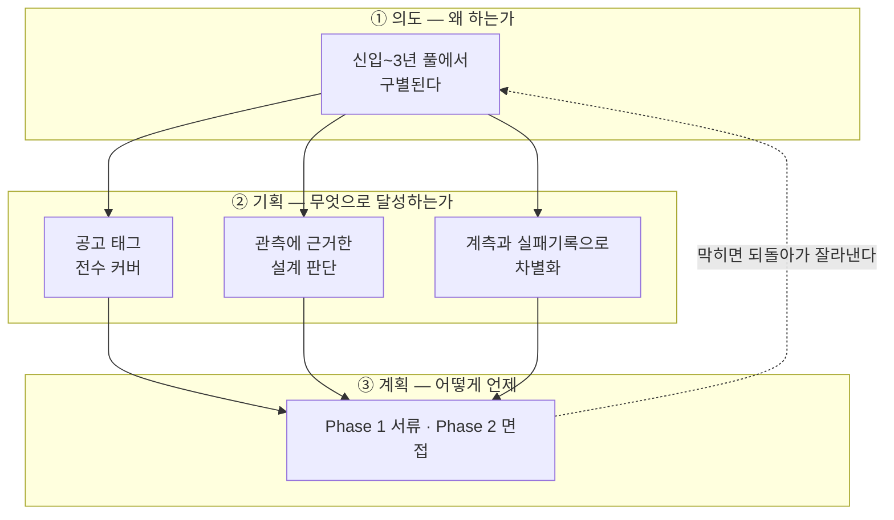
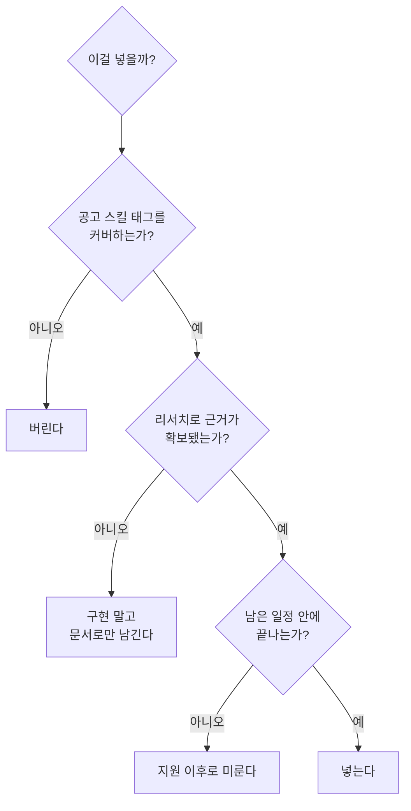
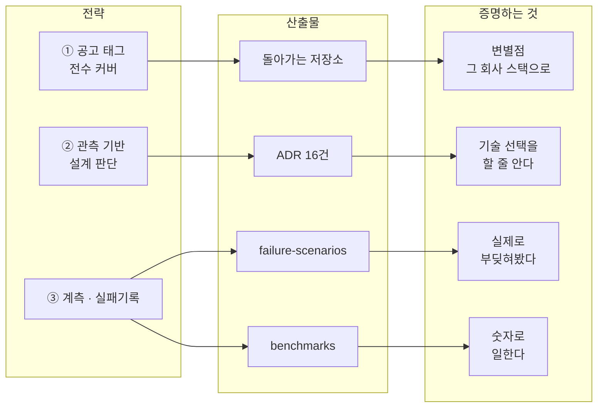
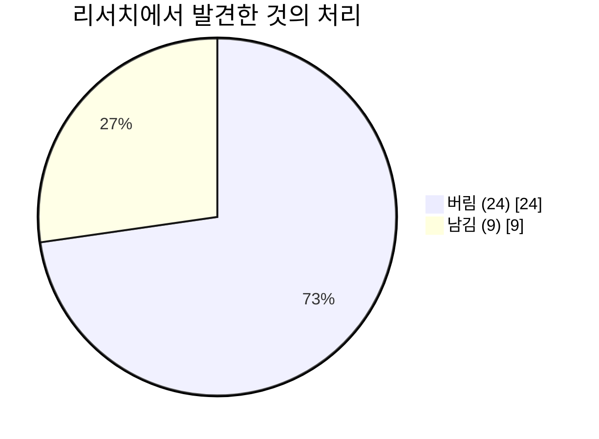
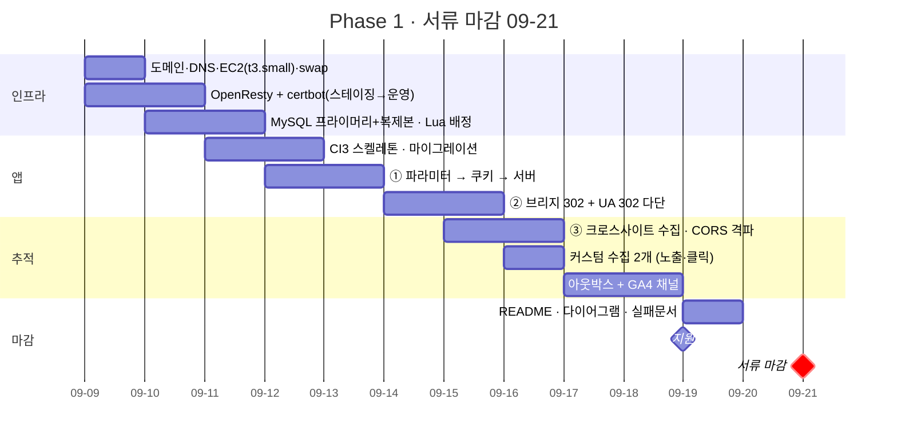

# 로드맵

> **개정 2026-09-08 · 서류 마감 2026-09-21 · 남은 13일**
>
> 이 문서는 세 층으로 되어 있다. 위층이 아래층을 정당화하고, 아래층은 위층을 배신하지 않는다.
> 판단이 갈릴 때는 **항상 위층으로 올라가서** 결정한다.

---

# ① 의도 — 왜 하는가

## 한 문장

> **이 포트폴리오는 신입~3년 지원자 풀에서 구별되기 위한 도구다.**

### 정정 (2026-09-08)

이 문장은 원래 *"서류에서 'PHP 실무 경험 없음'으로 걸러지는 것을 막는다"* 였다. 공고 원문을 확인하고 **전제가 틀렸음을 알았다.**

| 확인된 것 | 결과 |
|---|---|
| 경력 요건이 **"신입 혹은 3년 이하"** | PHP 실무가 없는 것은 **애초에 결격이 아니다** |
| PHP·CodeIgniter는 **필수가 아니라 우대사항** | 필수는 HTTP·Cookie·URL Parameter·SQL·Git |

막아야 할 결격이 없다. **문제는 탈락이 아니라 매몰이다** — 비슷한 조건의 지원자 사이에서 구별되지 않는 것.
그래서 판단 기준이 바뀐다. *"이게 없으면 떨어지나?"* 가 아니라 ***"이걸 다른 지원자도 들고 오나?"*** 를 묻는다.

## 이것이 뜻하는 바

| | |
|---|---|
| **합격을 만드는 것** | 기존 실무 경험(C#·Node·성능개선·계측). 이건 이미 갖고 있다 |
| **이 프로젝트가 하는 일** | 그 경험을 말할 **기회 자체를 얻는 것** |
| **따라서 목표는** | 완성도가 아니라 **변별점 + 대화 소재** |

**포트폴리오로 문을 열고, 실무 이야기로 설득한다.** 이 순서가 뒤집히면 안 된다.

## 지원 대상 — 공고가 셋이다

같은 개발실에 웹개발자 공고가 세 개 있다. 전부 09-21 마감, 전부 1년 계약직(만료 시 근무 평가로 정규직 전환 결정), **복수 지원 가능**.

| # | 공고 | 이 프로젝트와의 관계 |
|---|---|---|
| **1** | 플랫폼 개발 및 **광고 매체 연동** | **주 타깃.** 업무 문장이 이 프로젝트와 거의 일치 |
| 2 | 콘텐츠 플랫폼 | 지원 안 함 |
| **3** | **서비스&인프라 운영** | **부 타깃.** 같은 저장소로 강조점만 바꿔 지원 |

#1 공고의 업무 문장 하나가 이렇다.

> "**도메인·Redirect 등 다양한 유입 환경에서의 사용자 및 전환 추적 기능 개발**"

등록 도메인 2개를 고집한 근거가 공고 본문에 있었다.

**#3 대응 범위는 [ADR-012](decisions/ADR-012-observability-scope.md)로 못박았다** — 어트리뷰션은 건드리지 않고, 이미 있던 계측을 운영 관점(구조화 로그·`/health`·`/metrics`·장애 탐지 경로)으로 승격시키는 선에서 멈춘다. 자체 지표 화면을 버리고 그 시간을 여기 쓰므로 일정 순증은 0.5일이다.

### 두 지원서를 잇는 축

방향(애드테크냐 인프라냐)은 아직 정하지 않았다. 그래도 "왜 이 포지션인가"는 양쪽 면접에서 나오므로 **공통 축**을 하나 잡는다.

> **"안 보이는 것을 숫자로 만드는 일을 해왔습니다."**
> 어트리뷰션은 유입이 어디서 새는지를 재고, 모니터링은 시스템이 어디서 느려지는지를 잰다.
> 둘 다 측정이고, 기존 경력(응답을 7단계로 쪼개 병목 특정, 인식률 68%→92.6%)도 측정이다.

이 축이 있으면 두 곳 지원이 "아무 데나"가 아니라 **"같은 관심사의 두 갈래"** 가 된다.

## 이것이 아닌 것 (Not-goals)

- ❌ 웹툰 플랫폼을 만드는 것
- ❌ 기술 스택의 폭을 자랑하는 것
- ❌ 프로덕션 수준의 완성도
- ❌ 프론트엔드 실력을 보여주는 것 — **지원 포지션이 아니다**

## 성공/실패 판정

| | 기준 |
|---|---|
| **성공** | 마감 전 지원 완료 + 저장소가 `docker compose up` 한 줄로 돌아감 + 면접에서 꺼낼 카드 5개 |
| **실패** | **완성도를 기다리다 마감을 놓치는 것.** 이게 최악이다 |
| 부분 성공 | 기능이 덜 됐어도 **문서와 근거가 남아 있으면** 충분하다 |

## 판단 규칙 — 갈릴 때 이걸로 결정한다

| # | 규칙 | 근거 |
|---|---|---|
| 1 | **공고 스택을 그대로 베낀다** | 창의성을 발휘할 자리가 아니다. "저는 이 스택을 씁니다"의 증명 |
| 2 | **없는 걸 채워 넣지 않는다** | 면접에서 "왜 넣었냐"에 답 못 하면 감점. **안 쓴 이유를 준비하는 편이 강하다** |
| 3 | **부딪혀서 배운다** | CORS·SameSite는 책이 아니라 막혀봐야 안다 |
| 4 | **숫자로 말한다** | 대상 조직에 품질 지표 파이프라인이 별도로 있다. 그 언어를 쓴다 |

---

# ② 기획 — 무엇으로 달성하는가

## 전략 3축

### 축 ① — 공고 스킬 태그를 빠뜨리지 않되, **그 회사 스택으로** 채운다

| 태그 | 어디서 커버되는가 |
|---|---|
| `PHP` `CodeIgniter` | **CI 3** — 대상의 CI 2.x와 관용구 동일 |
| `MySQL` | 스키마 · 인덱스 · `SKIP LOCKED` · **실물 복제 + Lua 배정** |
| `Cookie` `Domain` | 등록 도메인 2개 + 쿠키 정책표 |
| `CORS` | 크로스사이트 수집 API |
| `Redirect` | 브리지 302 + **UA 302 다단** |
| `API` `SDK` | 채널 어댑터 + `track.js` |
| `Google Analytics` | GA4 Measurement Protocol |
| `Meta Pixel` | Conversions API |
| `Linux` | Docker · **OpenResty** · EC2 |
| `Git` | 기능 단위 커밋 이력 |

### 축 ② — 설계 판단마다 관측 근거를 붙인다

상상해서 만든 스키마와 **조사해서 역추론한 스키마**는 면접에서 다르게 읽힌다.

| 설계 | 근거 |
|---|---|
| 등록 도메인 2개 | same-site는 eTLD+1 기준 — 서브도메인으로는 실험이 성립하지 않음 |
| 채널 어댑터 | 대상 서비스에 매체 **10종 이상** 실측 |
| 코인 원장 | 약관의 **유료 5년 / 무료 1년** — 잔액 컬럼으로 구현 불가 |
| 보존기간 테이블 분리 | 방문 3개월 / 결제 5년 — **법적 이유의 정규화** |
| 읽기/쓰기 분리 | 복제본 세션 고정 쿠키 관측 |

→ [research-method.md](research-method.md)

### 축 ③ — 계측과 실패기록이 진짜 차별점

**코드는 누구나 쓴다.** 지원자 대부분이 내지 않는 것은 이 둘이다.

- `failure-scenarios.md` — 25개 시나리오를 **재현하고 어떻게 막았는지**
- `benchmarks.md` — `EXPLAIN` before/after, 구간별 시간, 백오프 값을 **실험으로 결정**

## 범위 원칙 — 버린 것이 남긴 것보다 많다

버린 것 24개 · 남긴 것 9개 → [research-method.md](research-method.md) 6장

## 리스크와 완화

| 리스크 | 영향 | 완화 |
|---|---|---|
| **범위 확대(+5일) 대비 13일** | 전체 | **Phase 1/2 분할.** 서류에 필요한 것만 09-19까지 |
| **조기 마감** | 치명적 | 게이트 2 통과 즉시 지원. 이후 계속 다듬는다 |
| CI3 첫 경험 + PHP 8.2 비호환 | M2 지연 | CI4보다 단순하다. 부딪힌 것은 worklog에 기록 |
| **OpenResty Lua 디버깅** | M1 지연 | 하루 넘게 막히면 순수 Nginx로 내리고 배정을 앱 레이어로 |
| certbot 발급 실패 | 초반 전체 | 스테이징 선검증. TLS와 Lua를 분리해 진행 |
| t3.small 메모리 | 기동 불가 | MySQL 2대 + OpenResty + PHP-FPM. swap 2GB 필수 |

---

# ③ 계획 — 어떻게, 언제

## 마감이 둘이다

이 구분이 계획 전체를 결정한다.

| 마감 | 날짜 | 필요한 것 |
|---|---|---|
| **서류** | **2026-09-21 (절대)** | 돌아가는 저장소 + 설계 근거 |
| **면접** | 서류 통과 후 1~2주 | 여기서 보여줄 것은 **그때까지 만들면 된다** |

서류 심사자는 저장소를 깊이 보지 않는다. README와 문서 구조로 판단한다.
그러니 **Phase 1은 기능 개수가 아니라 "확실히 돌아가는 것"** 을 목표로 하고, 나머지는 면접 전까지 채운다.
README에 진행 중 로드맵이 있으면 오히려 **살아 있는 프로젝트**로 읽힌다.

```mermaid
flowchart LR
    M0["M0 · 설계·정렬<br/>✅ 완료"] --> P1
    subgraph P1["Phase 1 · 09-08~19 · 서류용"]
        A["정렬 스택<br/>OpenResty+Lua+CI3+복제"] --> B["여정 ①②③"] --> C["커스텀 수집 2개<br/>+ GA4"]
    end
    P1 --> APPLY["지원<br/>09-19~20"]
    APPLY --> P2
    subgraph P2["Phase 2 · 09-21~면접"]
        D["S3 + CloudFront"] --> E["PG 테스트 + 웹훅"] --> F["웹푸시 + SMS"] --> G["Meta CAPI · 인덱스 실측"]
    end
    style M0 fill:#1f3d2b,stroke:#3d7a52
    style APPLY fill:#3d2b1f,stroke:#7a5a3d
```

---

## Phase 1 — 서류 마감까지 (09-08 ~ 09-19)

### 마일스톤 완료 조건

| M | 기간 | 완료 조건 |
|---|---|---|
| **M1** 정렬 인프라 | 09-09~11 | 호스트 4개 HTTPS · **Lua가 복제본을 배정하고 쿠키로 고정** · 복제 동작 확인 |
| **M2** 앱·여정 | 09-11~15 | CI3 기동 · `utm/gclid/pid` 파싱 → 적재 · **302 두 단(UA + 브리지) 통과** |
| **M3** 크로스사이트 | 09-15~17 | preflight 관측 · `Allow-Origin:*` 실패 재현 · **브라우저별 차단 매트릭스 실측** |
| **M4** 수집·전송 | 09-16~19 | **노출/클릭 커스텀 수집 동작** · 아웃박스 → GA4 전송 · 워커 4개에서 중복 0 |

### 커스텀 수집 2개 — 정렬도가 가장 높은 항목

대상 조직이 실제로 쓰는 두 엔드포인트를 그대로 재현한다.

| 재현 대상 | 이 프로젝트 | 무엇을 배우는가 |
|---|---|---|
| `POST /index/banner_exposure_save` | `POST /impression` — 한 페이지의 노출 N건을 **배치 전송** | 노출과 클릭을 분리 저장해야 CTR이 나온다 |
| `GET /index/bannerTracking?s&d&i&t&u&sd` | `GET /click` — 기록 후 **302로 목적지 이동** | 집계 기준일(`sd`)을 URL에 박는 이유. 일자별 롤업 |

> **`GET /click`은 RFC 9110의 safe method 규약 위반이다.** GET인데 서버 상태를 바꾼다.
> 그런데 클릭 트래킹은 리다이렉트가 필요해 업계 관행이 GET이다. **이 트레이드오프를 알고 완화책(봇 UA 필터·`sd` 기준 중복 제거·`no-store`)을 붙이는 것**이 이 항목의 핵심이다.

---

## Phase 2 — 면접 대비 (09-21 ~)

지원 후에도 계속 만든다. 순서는 **면접에서 물어볼 확률** 순이다.

| 순위 | 항목 | 왜 이 순서인가 |
|---|---|---|
| 1 | **S3 + CloudFront** | 대상 조직이 S3+CDN을 쓴다. **미경험 영역이라 학습 가치가 가장 크다** → [ADR-015](decisions/ADR-015-image-pipeline-cdn.md) |
| 2 | **PG 테스트 연동 + 웹훅** | 결제가 전환의 원천. 스텁에서 실물 테스트 연동으로 → [ADR-016](decisions/ADR-016-payment-and-notification.md) |
| 3 | **웹 푸시 + SMS 알림** | 알림도 채널 어댑터가 된다. 매체 어댑터와 같은 패턴을 두 번째로 증명 |
| 4 | Meta CAPI | 채널 어댑터의 세 번째 구현. "변경 파일 2개" 주장 검증 |
| 5 | 인덱스 `EXPLAIN` 실측 | `benchmarks.md` 채우기 |
| 6 | 이미지 서명 URL·워터마크 | 시간이 남으면 |

> **CDN을 Phase 2로 미룬 이유**: 이미지가 있어야 CDN이 의미가 있고, 이미지는 S3가 있어야 한다. 셋이 한 묶음이라 쪼개면 어중간해진다. 면접까지 시간이 있으니 그때 제대로 한다.

---

## 게이트

```mermaid
flowchart TD
    G1{"게이트 1 · 09-11 밤<br/>HTTPS 4호스트 + Lua 배정 동작?"}
    G1 -->|예| M2X["M2 진행"]
    G1 -->|아니오| ALT["Lua 포기, 순수 Nginx<br/>배정을 앱 레이어로"]
    ALT --> M2X
    M2X --> G2{"게이트 2 · 09-17 밤<br/>①②③ 다 도는가?"}
    G2 -->|예| M4X["커스텀 수집 + GA4"]
    G2 -->|아니오| CUT["④ 컷<br/>①②③만으로"]
    CUT --> FIN
    M4X --> FIN["README · 문서 마감"]
    FIN --> G3{"게이트 3 · 09-19"}
    G3 --> SUBMIT["지원한다"]
    style SUBMIT fill:#3d2b1f,stroke:#7a5a3d
```

> **게이트 3에 '아니오' 경로가 없는 것은 의도다.** 09-19에는 상태와 무관하게 지원한다.
> Phase 2가 있으므로 **미완성으로 내는 부담이 이전보다 작다.**

## 컷 순서 — Phase 1이 밀리면

| 순위 | 버리는 것 | 어디로 |
|---|---|---|
| 1 | GA4 전송 | Phase 2 |
| 2 | 커스텀 수집 중 1개 (클릭만 남김) | Phase 2 |
| 3 | 아웃박스 워커 | Phase 2 |
| 4 | 실물 복제본 → 지연 주입 시뮬레이션 | 정렬 후퇴. 최후 수단 |
| 5 | **Lua 배정 → 앱 레이어** | 정렬 후퇴. 최후 수단 |

**절대 버리지 않는 것**: ③ 크로스사이트 실험, 그리고 **OpenResty 자체**.
스택 정렬을 버리면 [ADR-014](decisions/ADR-014-stack-alignment.md)의 존재 이유가 사라진다.

## 의존성 — 리드타임이 있는 것

```mermaid
flowchart LR
    DOM["도메인 2개 구입"] --> DNS["DNS 전파"] --> TLS["certbot 발급"]
    AWS["AWS 계정<br/>t3.small"] --> EC2["EC2 + swap"] --> TLS
    TLS --> ORES["OpenResty + Lua"]
    ORES --> CI3["CI3 + 마이그레이션"]
    CI3 --> J["여정 ①②③ + 수집"]
    GA4["GA4 속성 + API secret"] --> J
    SMS["SMS 발신번호 사전등록"] -.->|Phase 2| N["알림"]
    style DOM fill:#3d1f1f,stroke:#7a3d3d
    style AWS fill:#3d1f1f,stroke:#7a3d3d
    style GA4 fill:#3d1f1f,stroke:#7a3d3d
    style SMS fill:#3d1f1f,stroke:#7a3d3d
```

> 빨간 것 넷이 **내가 통제할 수 없는 대기 시간**을 포함한다. SMS 발신번호 사전등록은 Phase 2용이지만 심사에 며칠 걸리므로 **미리 걸어둔다.**

## 작업 방식

| 항목 | 결정 | 이유 |
|---|---|---|
| **Git** | 기능 브랜치 → PR → 머지 | 초안의 "Git 약점 보완" 목표. **PR 본문에 ADR 링크**를 달면 의사결정 이력이 남는다 |
| **테스트** | 단위(`src/`) + **엔드투엔드 시나리오 스크립트** | 재현 절차가 자동화되면 `failure-scenarios.md` 채우기가 쉬워진다. 순증은 +1일이 아니라 **약 +0.5일** — 재현 절차는 어차피 필요하다 |

**단위 테스트 대상 넷** — 규칙이 복잡해 테스트가 실제로 값을 하는 곳만:
어트리뷰션 first/last 판정 · 코인 원장 소진 순서(만료 임박 → 무료 우선) · 멱등키 · 백오프 계산.

**엔드투엔드 시나리오**는 여정 전체를 한 번에 훑는다:
광고 클릭 → UA 302 → 브리지 302 → 랜딩 → 가입 → 코인 결제 → 유료 회차 열람.

---

## 오늘 (09-08) 할 일

- [ ] **도메인 2개 등록** → ICANN 인증 메일 즉시 처리
- [ ] AWS 계정 확인 — **t3.small** 기준 (t3.micro로는 MySQL 2대 불가)
- [ ] GA4 속성 → `measurement_id` + API secret
- [ ] GitHub 저장소 생성 후 push
- [ ] **SMS 발신번호 사전등록 신청** (Phase 2용, 리드타임 대비)
- [ ] 공고 조기 마감 여부 확인

---

## 부록 · 층위별 문서 지도

| 층 | 문서 |
|---|---|
| **의도** | 이 문서 ①장 |
| **기획** | [research-method.md](research-method.md) · [decisions/](decisions/) |
| **계획** | 이 문서 ③장 · [setup.md](setup.md) · [domain-setup.md](domain-setup.md) |
| 설계 | [architecture.md](architecture.md) · [domains-and-cookies.md](domains-and-cookies.md) · [api-spec.md](api-spec.md) · [data-model.md](data-model.md) |
| 검증 | [failure-scenarios.md](failure-scenarios.md) · [benchmarks.md](benchmarks.md) |
| **기록** | [worklog.md](worklog.md) — 한 일 · 막힌 것 · 결정한 것 |
