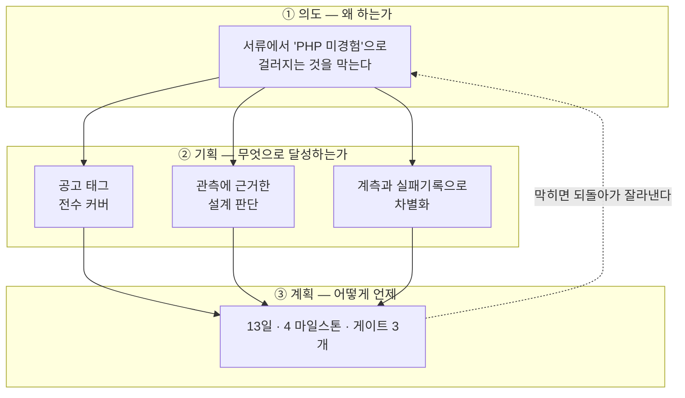
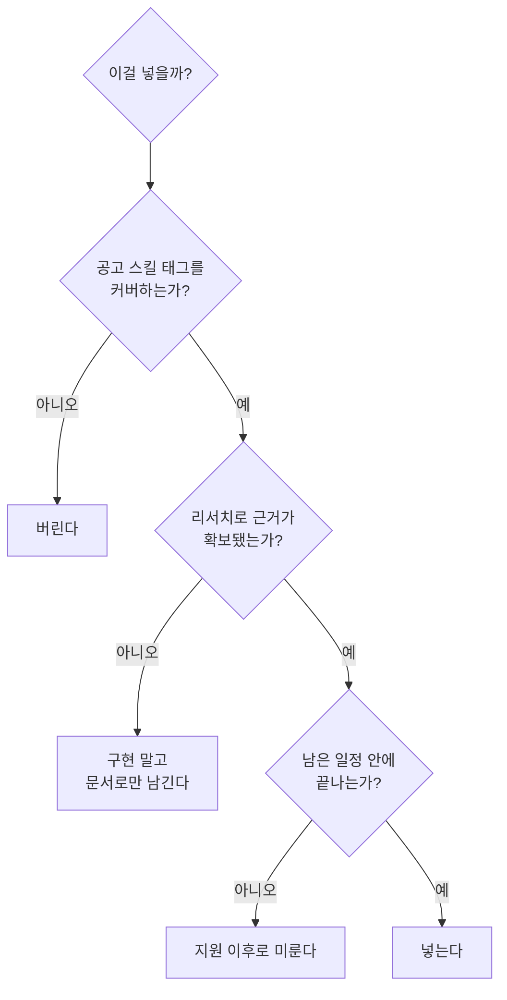
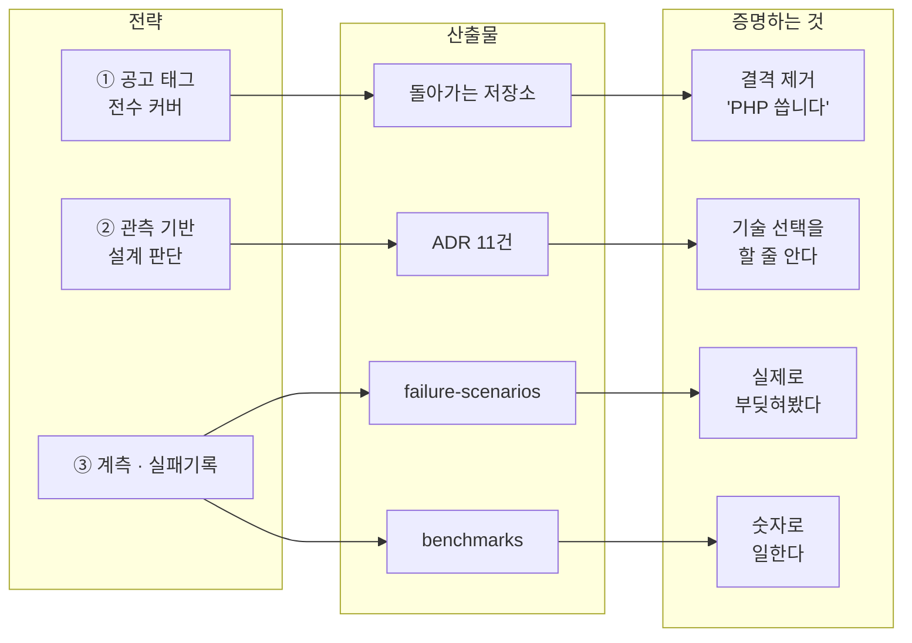
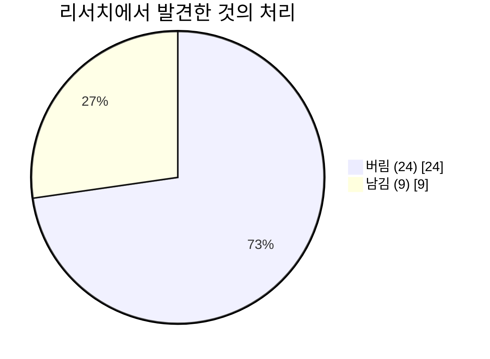
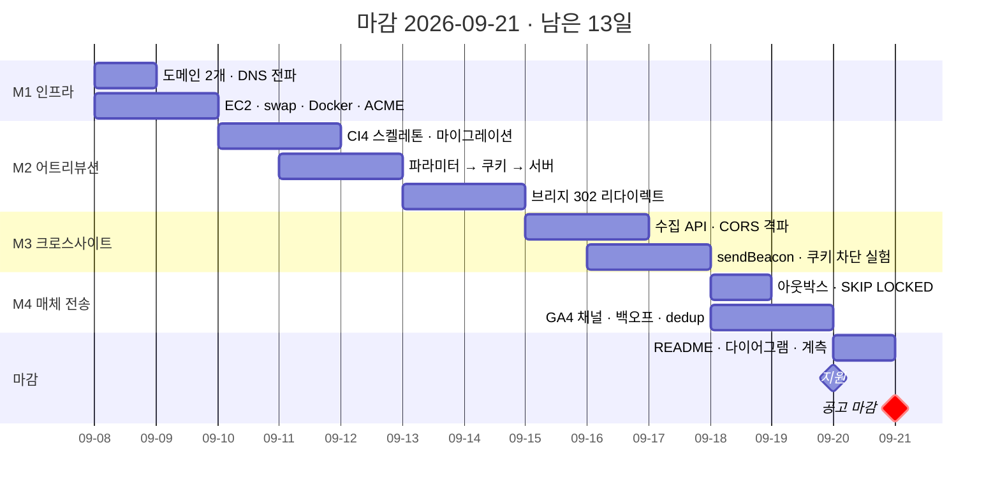

# 로드맵

> **작성 2026-09-07 · 마감 2026-09-21 · 남은 13일**
>
> 이 문서는 세 층으로 되어 있다. 위층이 아래층을 정당화하고, 아래층은 위층을 배신하지 않는다.
> 판단이 갈릴 때는 **항상 위층으로 올라가서** 결정한다.

---

# ① 의도 — 왜 하는가

## 한 문장

> **이 포트폴리오는 신입~3년 지원자 풀에서 구별되기 위한 도구다.**

### 정정 (2026-09-08)

이 문장은 원래 *"서류에서 'PHP 실무 경험 없음'으로 걸러지는 것을 막는다"* 였다. 공고 원문을 확인하고 **전제가 틀렸음을 알았다.**

| 확인된 것 | 결과 |
|---|---|
| 경력 요건이 **"신입 혹은 3년 이하"** | PHP 실무가 없는 것은 **애초에 결격이 아니다** |
| PHP·CodeIgniter는 **필수가 아니라 우대사항** | 필수는 HTTP·Cookie·URL Parameter·SQL·Git |

막아야 할 결격이 없다. **문제는 탈락이 아니라 매몰이다** — 비슷한 조건의 지원자 사이에서 구별되지 않는 것.
그래서 판단 기준이 바뀐다. *"이게 없으면 떨어지나?"* 가 아니라 ***"이걸 다른 지원자도 들고 오나?"*** 를 묻는다.

## 이것이 뜻하는 바

| | |
|---|---|
| **합격을 만드는 것** | 기존 실무 경험(C#·Node·성능개선·계측). 이건 이미 갖고 있다 |
| **이 프로젝트가 하는 일** | 그 경험을 말할 **기회 자체를 얻는 것** |
| **따라서 목표는** | 완성도가 아니라 **결격 제거 + 대화 소재 제공** |

**포트폴리오로 문을 열고, 실무 이야기로 설득한다.** 이 순서가 뒤집히면 안 된다.

## 지원 대상 — 공고가 셋이다

같은 개발실에 웹개발자 공고가 세 개 있다. 전부 09-21 마감, 전부 1년 계약직(만료 시 근무 평가로 정규직 전환 결정), **복수 지원 가능**.

| # | 공고 | 이 프로젝트와의 관계 |
|---|---|---|
| **1** | 플랫폼 개발 및 **광고 매체 연동** | **주 타깃.** 업무 문장이 이 프로젝트와 거의 일치 |
| 2 | 콘텐츠 플랫폼 | 지원 안 함 |
| **3** | **서비스&인프라 운영** | **부 타깃.** 같은 저장소로 강조점만 바꿔 지원 |

#1 공고의 업무 문장 하나가 이렇다.

> "**도메인·Redirect 등 다양한 유입 환경에서의 사용자 및 전환 추적 기능 개발**"

등록 도메인 2개를 고집한 근거가 공고 본문에 있었다.

**#3 대응 범위는 [ADR-012](decisions/ADR-012-observability-scope.md)로 못박았다** — 어트리뷰션은 건드리지 않고, 이미 있던 계측을 운영 관점(구조화 로그·`/health`·`/metrics`·장애 탐지 경로)으로 승격시키는 선에서 멈춘다. 자체 지표 화면을 버리고 그 시간을 여기 쓰므로 일정 순증은 0.5일이다.

### 두 지원서를 잇는 축

방향(애드테크냐 인프라냐)은 아직 정하지 않았다. 그래도 "왜 이 포지션인가"는 양쪽 면접에서 나오므로 **공통 축**을 하나 잡는다.

> **"안 보이는 것을 숫자로 만드는 일을 해왔습니다."**
> 어트리뷰션은 유입이 어디서 새는지를 재고, 모니터링은 시스템이 어디서 느려지는지를 잰다.
> 둘 다 측정이고, 기존 경력(응답을 7단계로 쪼개 병목 특정, 인식률 68%→92.6%)도 측정이다.

이 축이 있으면 두 곳 지원이 "아무 데나"가 아니라 **"같은 관심사의 두 갈래"** 가 된다.

## 이것이 아닌 것 (Not-goals)

- ❌ 웹툰 플랫폼을 만드는 것
- ❌ 기술 스택의 폭을 자랑하는 것
- ❌ 프로덕션 수준의 완성도
- ❌ 프론트엔드 실력을 보여주는 것 — **지원 포지션이 아니다**

## 성공/실패 판정

| | 기준 |
|---|---|
| **성공** | 마감 전 지원 완료 + 저장소가 `docker compose up` 한 줄로 돌아감 + 면접에서 꺼낼 카드 5개 |
| **실패** | **완성도를 기다리다 마감을 놓치는 것.** 이게 최악이다 |
| 부분 성공 | 기능이 덜 됐어도 **문서와 근거가 남아 있으면** 충분하다 |

## 판단 규칙 — 갈릴 때 이걸로 결정한다

| # | 규칙 | 근거 |
|---|---|---|
| 1 | **공고 스택을 그대로 베낀다** | 창의성을 발휘할 자리가 아니다. "저는 이 스택을 씁니다"의 증명 |
| 2 | **없는 걸 채워 넣지 않는다** | 면접에서 "왜 넣었냐"에 답 못 하면 감점. **안 쓴 이유를 준비하는 편이 강하다** |
| 3 | **부딪혀서 배운다** | CORS·SameSite는 책이 아니라 막혀봐야 안다 |
| 4 | **숫자로 말한다** | 대상 조직에 품질 지표 파이프라인이 별도로 있다. 그 언어를 쓴다 |

---

# ② 기획 — 무엇으로 달성하는가

## 전략 3축

### 축 ① — 공고 스킬 태그를 하나도 빠뜨리지 않는다

| 태그 | 어디서 커버되는가 |
|---|---|
| `PHP` `CodeIgniter` | 애플리케이션 전체 |
| `MySQL` | 스키마 · 인덱스 · `SKIP LOCKED` · 읽기/쓰기 분리 |
| `Cookie` `Domain` | 등록 도메인 2개 + 쿠키 정책표 |
| `CORS` | 크로스사이트 수집 API |
| `Redirect` | 브리지 302 |
| `API` `SDK` | 채널 어댑터 + `track.js` |
| `Google Analytics` | GA4 Measurement Protocol |
| `Meta Pixel` | Conversions API |
| `Linux` | Docker · Caddy · EC2 |
| `Git` | 기능 단위 커밋 이력 |

### 축 ② — 설계 판단마다 관측 근거를 붙인다

상상해서 만든 스키마와 **조사해서 역추론한 스키마**는 면접에서 다르게 읽힌다.

| 설계 | 근거 |
|---|---|
| 등록 도메인 2개 | same-site는 eTLD+1 기준 — 서브도메인으로는 실험이 성립하지 않음 |
| 채널 어댑터 | 대상 서비스에 매체 **10종 이상** 실측 |
| 코인 원장 | 약관의 **유료 5년 / 무료 1년** — 잔액 컬럼으로 구현 불가 |
| 보존기간 테이블 분리 | 방문 3개월 / 결제 5년 — **법적 이유의 정규화** |
| 읽기/쓰기 분리 | 복제본 세션 고정 쿠키 관측 |

→ [research-method.md](research-method.md)

### 축 ③ — 계측과 실패기록이 진짜 차별점

**코드는 누구나 쓴다.** 지원자 대부분이 내지 않는 것은 이 둘이다.

- `failure-scenarios.md` — 25개 시나리오를 **재현하고 어떻게 막았는지**
- `benchmarks.md` — `EXPLAIN` before/after, 구간별 시간, 백오프 값을 **실험으로 결정**

## 범위 원칙 — 버린 것이 남긴 것보다 많다

버린 것 24개 · 남긴 것 9개 → [research-method.md](research-method.md) 6장

## 리스크와 완화

| 리스크 | 영향 | 완화 |
|---|---|---|
| **일정이 20일→13일로 압축** | 전체 | 아래 **컷 순서**를 미리 정해둔다 |
| **조기 마감** | 치명적 | **게이트 2 통과 즉시 지원.** 이후 계속 다듬는다 |
| PHP·CI4 첫 경험 | M2 지연 | 지연 시 ④(매체 전송)를 잘라내고 ③(CORS)을 살린다 |
| 인프라에서 막힘 | 초반 전체 | ACME 스테이징 선검증. 실패 시 로컬 `.test` 2도메인으로 우회 |
| t3.micro 메모리 | 기동 불가 | swap 2GB 필수 |

---

# ③ 계획 — 어떻게, 언제

## 현재 위치

**M0 완료분**: 리서치 6문서 + 표준 부록 11 + 설계 문서 8 + ADR 11 + 인프라 구성 9파일

## 일정

## 마일스톤 완료 조건 (DoD)

| M | 기간 | 완료 조건 | 산출 |
|---|---|---|---|
| **M1 인프라** | 09-08~09 | 호스트 3개가 **자물쇠 표시**로 열림 · 쿠키 속성이 정책표와 일치 | [setup.md](setup.md) 6장 8항목 |
| **M2 어트리뷰션** | 09-10~14 | `utm/gclid/pid` 파싱 → `visits`·`touchpoints` 적재 · **302 브리지** 동작 | ①② |
| **M3 크로스사이트** | 09-15~17 | preflight 관측 · `Allow-Origin:*` 실패 재현 · **브라우저별 차단 매트릭스 실측** | ③ + 실패문서 본체 |
| **M4 매체 전송** | 09-18~19 | 아웃박스 → GA4 전송 성공 · 워커 4개에서 **중복 0** | ④(GA4) |

## 게이트 — 여기서 진행/중단을 판정한다

```mermaid
flowchart TD
    G1{"게이트 1 · 09-09 밤<br/>HTTPS 3호스트 뜨는가?"}
    G1 -->|예| M2X["M2 진행"]
    G1 -->|아니오| ALT["로컬 .test 2도메인으로 전환<br/>공개 URL 포기, 실험은 유지"]
    ALT --> M2X
    M2X --> G2{"게이트 2 · 09-17 밤<br/>①②③ 다 도는가?"}
    G2 -->|예| APPLY1["즉시 지원 준비<br/>M4는 증분으로"]
    G2 -->|아니오| CUT1["④ 전체 컷<br/>①②③만으로 지원"]
    CUT1 --> APPLY1
    APPLY1 --> G3{"게이트 3 · 09-20<br/>README 완성됐는가?"}
    G3 -->|예| SUBMIT["지원"]
    G3 -->|아니오| SUBMIT
    style SUBMIT fill:#3d2b1f,stroke:#7a5a3d
```

> **게이트 3에 '아니오' 경로가 없는 것이 의도다.** 09-20에는 상태와 무관하게 지원한다. 완성도를 기다리다 마감을 놓치는 것이 유일한 실패 조건이기 때문이다.

## 컷 순서 — 밀리면 이 순서로 버린다

| 순위 | 버리는 것 | 남는 것 |
|---|---|---|
| 1 | 지표 화면(`/metrics`) | 데이터는 쌓임. SQL로 보여주면 됨 |
| 2 | Meta CAPI | GA4 하나로 채널 어댑터는 증명됨 |
| 3 | 코인 원장·결제 스텁 | 설계 문서에 남아 있음 |
| 4 | 인덱스 `EXPLAIN` 실측 | `benchmarks.md`에 방법만 남김 |
| 5 | **④ 매체 전송 전체** | ①②③ + 아웃박스 설계 문서 |

**절대 버리지 않는 것**: ③ 크로스사이트 실험. 이게 이 프로젝트의 존재 이유다.

## 의존성 — 무엇이 무엇을 막는가

```mermaid
flowchart LR
    DOM["도메인 2개 구입"] --> DNS["DNS 전파"] --> TLS["ACME 발급"]
    AWS["AWS 계정"] --> EC2["EC2 + swap"] --> TLS
    TLS --> CI4["CI4 + 마이그레이션"]
    CI4 --> ATTR["① 쿠키·파라미터"] --> BRIDGE["② 브리지"]
    BRIDGE --> CORS["③ 크로스사이트"]
    CORS --> OUTBOX["④ 아웃박스"]
    GA4["GA4 속성 + API secret"] --> OUTBOX
    style DOM fill:#3d1f1f,stroke:#7a3d3d
    style AWS fill:#3d1f1f,stroke:#7a3d3d
    style GA4 fill:#3d1f1f,stroke:#7a3d3d
```

> **빨간 것 3개가 리드타임이 있는 준비물이다.** 도메인 구입·AWS 계정·GA4 속성은 **오늘 걸어둔다.** 하나라도 늦으면 뒤가 통째로 밀린다.

## 오늘(09-07) 할 일

- [ ] **도메인 2개 구입** → DNS 전파 시작
- [ ] AWS 계정 확인 (없으면 카드 등록·본인인증 반나절)
- [ ] GA4 속성 생성 → `measurement_id` + **API secret**
- [ ] GitHub 저장소 생성 후 push
- [ ] 공고 조기 마감 여부 확인

---

## 부록 · 층위별 문서 지도

| 층 | 문서 |
|---|---|
| **의도** | 이 문서 ①장 |
| **기획** | [research-method.md](research-method.md) · [decisions/](decisions/) |
| **계획** | 이 문서 ③장 · [setup.md](setup.md) · [domain-setup.md](domain-setup.md) |
| 설계 | [architecture.md](architecture.md) · [domains-and-cookies.md](domains-and-cookies.md) · [api-spec.md](api-spec.md) · [data-model.md](data-model.md) |
| 검증 | [failure-scenarios.md](failure-scenarios.md) · [benchmarks.md](benchmarks.md) |
| **기록** | [worklog.md](worklog.md) — 한 일 · 막힌 것 · 결정한 것 |
